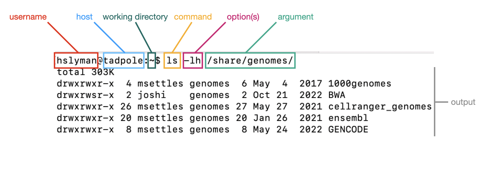

# Prerequisites: Command Line Interface

A basic understanding of the command line interface (CLI) is recommended for success in this course. We will briefly review the small number of commands necessary for this course on the first morning. Beginners without any previous knowledge will be able to complete this course, but may wish to consider reaching out to a collaborator or service provider for assistance with the data reduction phase of their experiments.

Additional materials on the use of the command line for bioinformatics can be found in our [Introduction to the Command Line for Bioinformatics](https://ucdavis-bioinformatics-training.github.io/2022-Jan-Introduction-to-the-Command-Line-for-Bioinformatics/){:target="_blank"} course.

## Outline:
1. What is the command line?
2. Syntax of a command
3. Logging into the cluster
4. Command line basics
5. Shell scripts
6. Interacting with a scheduler

## What is the command line?

The command line interface (CLI) is a powerful text-based interface that
* Allows the user to efficiently navigate the filesystem
* Interact easily with large files of the types common in bioinformatics
* Execute commands (interactively or in the background), creating and removing files as needed

In general, the only input to the command line is the keyboard. Point and click functionality is typically not available.

## Syntax of a command

When you open a terminal, you will see a *prompt*. This is composed of the username, host (tadpole), and working directory. Commands are run by typing the name of the command, any options or arguments.

## Command line basics

This brief introduction will cover only the minimum required to perform the necessary data reduction steps for a single cell RNA-seq experiment. Because the data reduction phase of an scRNA-seq experiment is relatively straightforward, we will be moving swiftly through this prerequisites section, and covering essential commands only.

In this course, we will be using the following commands:
* ssh
* pwd, cd, and ls
* mkdir, cp, and ln
* less, zless, cat, zcat, head, tail, and wc
* export, and module load
* scp

### Loggining in

The data reduction component of this course will be performed on the Genome Center computing cluster. Before the workshop, you should have been prompted to create a username and password that will allow you access to the cluster for the duration of the course. We'll be using these credentials to log in:

    ssh username@tadpole.genomecenter.ucdavis.edu # don't forget to replace "username" with your username!

When you press enter, you'll be asked for your password, but as you type, you won't be able to see anything. This is normal! Please type carefully, and, when your password is complete, press enter.

### Navigation: pwd, cd, and ls

When working on the command line, it is essential to know "where" you are operating from at any given moment. The files on your computer-- everything from your sequence fastqs to the software you're about to run-- is organized into a hierarchy of directories (sometimes referred to as "folders" on your desktop computer) that can be imagined as a tree. By default, commands will operate on the "present working directory," which you can think of as your location within this tree.

#### pwd: present working directory

    pwd

This command returns the present working directory represented as a series of directories descending from the "root," and separated by "/" characters.

#### cd: change directory

Your present working directory can be changed using the cd command.

    cd /share/workshop/
    pwd

The location of any directory can be represented in one of two ways:
- the absolute path, which begins from the root
- the relative path, which begins from the present working directory

    cd ..
    pwd

In a relative path, the ".." refers to the directory one level above the present location. To specify a directory two levels above the present working directory, use "../..", and so on.

The absolute path will always begin with a "/" character. When in doubt, use the absolute path.

#### ls: list directory contents

    ls

By default, files within the present working directory are displayed. The ls command can also take a path as an argument, returning the content of that directory instead.

    ls /share/genomes/

Many commands, including ls, have numerous options that can be specified using a "-" character. The "-lh" in the example below provides an extended output with human-readable file sizes.

    ls -lh /usr/bin

### Creating files: mkdir, cp, and ln

In the course of our single cell experiment, we will need to create directories (to organize our project) and files, including scripts.

#### mkdir: make directory

The -p option here creates any missing intermediate directories and silences any error messages generated by attempting to create a directory that already exists.

    mkdir -p /share/workshop/scrna_workshop/$USER/cli
    cd /share/workshop/scrna_workshop/$USER/cli
    pwd

#### cp: copy

The cp command copies files, or, when using the -r option, directories. This command should be used with caution, as creating many copies of large files, such as sequencing data or genomes is often unnecessary.

    cp /share/workshop/scrna_workshop/Scripts/template.sh .
    ls

#### ln: link

Instead of duplicating raw data and other large files, it is typical to create symbolic links. The resulting symbolic link can be treated as a copy of the file.

    ln -s /share/workshop/scrna_workshop/Data/example.sam .
    ln -s /share/workshop/scrna_workshop/Data/example.fastq.gz
    ls -lh

### Reading files: less, zless, cat, zcat, head, tail, and wc

A number of commands are available to inspect the content of a file.

#### less and zless: paged reading

The less command provides a paged reader view of the specified file. Advance through the file with the spacebar, or the down arrow, and move backwards by pressing "b" or the up arrow. The -S option prevents line wrapping.

    ls -S example.sam

Take a few minutes to get comfortable with the less reader interface. To exit the reader view, press "q". Further options and tools for navigating within less are provided by the manual, which can be accessed using the man command: `man less`

Compressed files are not human-readable. To view a gzipped file in a paged reader, use zless instead. This reader uses the same controls as less.

    zless example.fastq.gz

#### cat and zcat: print output to screen

The cat command prints the content of any file(s) provided as arguments to the screen, concatenating them if more than one is present. As with less/zless above, zcat is designed to operate on gzipped files, printing uncompressed data without uncompressing the file itself.

    cat example.sam
    zcat example.fastq.gz

Why would this be useful? The output of one command can be sent to another command as input using the "pipe" character, as you'll see below. Sometimes commands that may seem pointless in isolation are unexpectedly powerful when linked together with pipes.

#### head and tail: display specified lines

Sometimes viewing just the beginning or end of a file is sufficient. In those cases, you can use head or tail. By default, these commands print the first (head) or last (tail) ten lines of the provided file(s). To learn more about the options available for these two commands, use `man head`.

    head example.sam
    tail example.sam
    zcat example.fastq.gz | head
    zcat example.fastq.gz | head --lines 4 | tail --lines 1

#### wc: word count

Word count (wc) calculates the number of characters, space-delimited words, and newline-delimited lines within a file. The character count includes whitespace characters such as spaces, tabs, and newlines.

    wc example.sam
    zcat example.fastq.gz | head --lines 4 | tail --lines 1 | wc -c

### Modifying environment variables: echo, export, and module load

When a command is typed on the command line, the operating system searches for an executable file with a matching name within a specified series of directories known as the path. The content of the path is stored within an automatically generated variable called $PATH.

    echo $PATH

The path can be modified in a number of ways.

    export $PATH
    echo $PATH

The module command also modifies the path, adding directories containing the executables associated with user-installed software to the path temporarily.

    module load cellranger
    echo $PATH

### Downlaoding files: scp

The s in scp stands for "secure." For this section, we you will need to work on your local computer instead of tadpole. Open a fresh terminal.

    scp username@tadpole.genomecenter.ucdavis.edu:/share/workshop/scrna_workshop/Scripts/template.sh .

You will be prompted to input your password. Don't forget to replace "username" with your username.

## Shell scripts

Often it's useful to define a whole string of commands to run on some input, so that (1) you can be sure you're running the same commands on all data, and (2) so you don't have to type the same commands in over and over. Let's use the 'nano' text editor program that's pretty reliably installed on most linux systems.

    nano template.sh

The nano text editor now occupies the whole screen; commands to find, replace, edit, save changes, and exit the editor appear at the bottom of the window.

The "#!" at the beginning of a script tells the shell what language to use to interpret the rest of the script. In our case, we will be writing "bash" commands, so we specify the full path of the bash executable after the "#!".

The rest of the lines contain either executable code or comments. Any text after a "#" is ignored by the interpreter. Make any changes you like to the code, hit Cntl-O and then enter to save the file, and then Cntl-X to exit nano.

Though there are ways to run the commands in test.sh right now, it's generally useful to give yourself (and others) 'execute' permissions for test.sh, really making it a shell script. Note the characters in the first (left-most) field of the file listing:

    ls -lh template.sh

-rw-rw-r-- 1 msettles biocore 79 Aug 19 15:05 template.sh

The first '-' becomes a 'd' if the 'file' is actually a directory. The next three characters represent **r**ead, **w**rite, and e**x**ecute permissions for the file owner (you), followed by three characters for users in the owner's group, followed by three characters for all other users. Run the 'chmod' command to change permissions for the 'test.sh' file, adding execute permissions ('+x') for the user (you) and your group ('ug'):

    chmod ug+x template.sh
    ls -lh template.sh

-rwxr-xr-- 1 msettles biocore 79 Aug 19 15:05 template.sh

The first 10 characters of the output represent the file and permissions.
The first character is the file type, the next three sets of three represent the file permissions for the user, group, and everyone respectively.
- r = read
- w = write
- x = execute

Run the script. We have to provide a relative reference to the script './' because its not on our path.

    ./test.sh

## Interacting with a scheduler

Many institutions maintain computing clusters for bioinformatics and other forms of data analysis. A cluster is typically a shared resource consisting of one or more head nodes, and a large number of compute nodes.

![figures/cluster_diagram.png]

Users log into a head node (like tadpole) to perform simple operations and to submit more complex, resource intensive jobs, which will be run on the compute nodes. **It is important to avoid running large tasks that may take a great deal of memory or CPU power on a head node**; using head node resources for running jobs prevents other users from successfully performing simply operations like changing directories, editing scripts, and submitting jobs.

A computing cluster like the one we're using for this workshop is commonly administered by a scheduler, which balances the demands on the cluster to allocate resources to competing jobs as efficiently as possible.

The cluster we will be using for this workshop (called lssc0) runs on a scheduling system called [Slurm](https://slurm.schedmd.com/).

In this section, we will go through examples of the commands we will be using to interact with the cluster:
* sbatch
* squeue
* scancel

There are several more commands available to interact with Slurm, each of which has many options. To find out more, visit [this summary page](https://slurm.schedmd.com/pdfs/summary.pdf).

### sbatch: submit a batch job

['sbatch'](https://slurm.schedmd.com/sbatch.html) is used to submit jobs (or arrays of jobs) to run on the cluster non-interactively.

While it is possible to specify options for sbatch on the command line, we typically include them within the script instead. This practice is both convenient and repeatable, as it saves any parameters given to the scheduler along with the code run.

Lines beginning with "#SBATCH" will be passed as arguments to the sbatch command. Examine the template script template.slurm to see the following example:

<pre class="prettyprint"><code class="language-sh" style="background-color:333333">
#!/bin/bash
# options for sbatch
#SBATCH --job-name=name # Job name
#SBATCH --nodes=1 # should never be anything other than 1
#SBATCH --ntasks=1 # number of cpus to use
#SBATCH --time=10 # Acceptable time formats include "minutes", "minutes:seconds", "hours:minutes:seconds", "days-hours", "days-hours:minutes" and "days-hours:minutes:seconds".
#SBATCH --mem=500 # Memory pool for all cores (see also --mem-per-cpu)
#SBATCH --partition=production # cluster partition
#SBATCH --account=workshop # cluster account to use for the job
#SBATCH --reservation=workshop # cluster account reservation
#SBATCH --array=1 # Task array indexing, see https://slurm.schedmd.com/job_array.html
#SBATCH --output=template-%A-%a.out # File to which STDOUT will be written
#SBATCH --error=template-%A-%a.err # File to which STDERR will be written
#SBATCH --mail-type=END # when to email user: END, FAIL, ALL, and others. See https://slurm.schedmd.com/sbatch.html
#SBATCH --mail-user=myemail@email.com # edit to receive email from the scheduler

# for calculating the amount of time the job takes and echo the hostname
begin=`date +%s`
echo $HOSTNAME

# Sleep for 5 minutes
sleep 300

# getting end time to calculate time elapsed
end=`date +%s`
elapsed=`expr $end - $begin`
echo Time taken: $elapsed
</code></pre>

The first line tells sbatch what scripting language (bash here) the rest of the file is in. Any line that begins with a "#" symbol is ignored by the bash interpreter, those lines that begin with "#SBATCH" are used by the slurm controller. Those lines are for specifying sbatch options without having to type them on the command-line every time. In this script, on the next set of lines, we've put some code for calculating the time elapsed for the job and then we simply wait for 5 minutes (300 seconds) and exit. Lets try running it

    cd /share/workshop/intro_scrnaseq/$USER
    cp /share/workshop/intro_scrnaseq/Software/Scripts/template.slurm .
    cat template.slurm
    sbatch template.slurm

After finishing you will see two new files in the directory where stdout and stderr were redirected to.

### squeue: view queued jobs

['squeue'](https://slurm.schedmd.com/squeue.html) is used to list currently queued and running jobs.

A number of options allow users to filter the results; the most useful of these is "-u", which narrows the results to jobs associated with the provided user ID. The output is a table containing a summary of all jobs meeting the specified criteria.

The columns are:
* job ID
* partition (different queues for different types of machines)
* job name
* ID of user who submitted the job
* state of the job (R for running, PD for pending)
* length of time the job has been running
* the number of nodes the job is using
* node name where the job is running or a reason why the job is waiting

    squeue -u $USER

msettles@tadpole:/share/workshop/intro_scrnaseq/msettles$ squeue -u $USER
             JOBID PARTITION     NAME     USER ST       TIME  NODES NODELIST(REASON)
          29390121 productio     name msettles  R       0:06      1 drove-13

You can see the job has been running (ST=R) for 6 seconds (TIME=0:06) on node drove-12. The jobid (here 29390121) can be used to cancel the job later, or get additional job information.

### scancel: cancel queued or running jobs

The 'scancel' command is used to cancel specified jobs (either running or queued).

Jobs may be specified by ID number, or if you use the "-u" option with your username, you can cancel all of your jobs at once.

    scancel 29390121 # cancels the job if still running
    scancel $USER # cancels all of your jobs

## Quiz 1

<button id="submit1">Submit Quiz</button>

