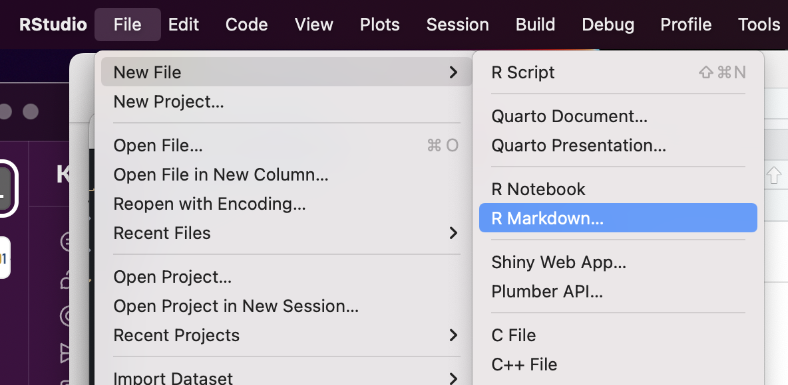
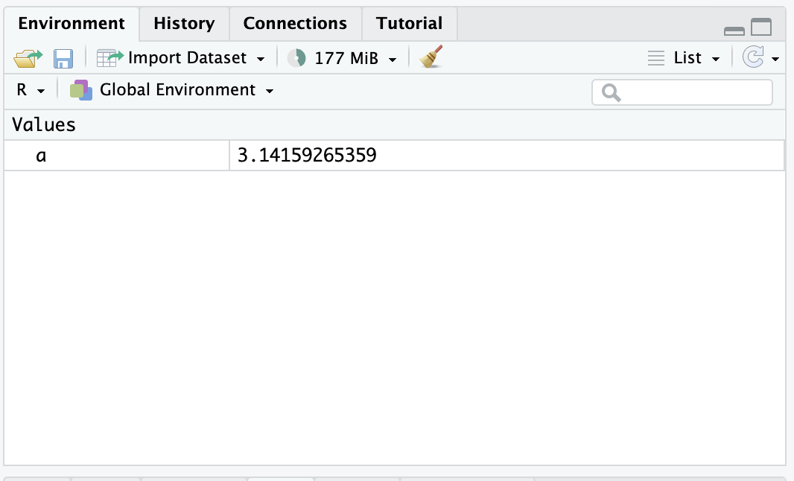

# R and RStudio Prerequisites

The analyses in this course are done in R, using the RStudio environment. Some familiarity with R will help you make the most of your time. While we will provide R code that can be run even if you have never used R before, we find that participants who have spent some time exploring R before the course get the maximum value out of our workshops. There is not be enough time to provide full instruction in introductory R, and still get through all of the material we need to cover.

Beginners without any previous knowledge will be able to complete this course, and achieve a more thorough understanding of the techniques and analyses covered, but may not be able to conduct an experiment on their own without further work in R.

## Outline

1. What are R and RStudio?
2. Exploring the RStudio interface
3. R basics

## What are R and RStudio?

[R](http://r-project.org/) is a language and environment for statistical computing and graphics. R is a popular choice for bioinformatics data analysis because it:

* is free and open source
* compiles and runs on Linux, Windows and MacOS
* has a large and active user community
* is easily extensible
* produces publication-quality plots, including mathematical symbols and formulae where needed
* provides thorough documentation

[RStudio](http://rstudio.org/) is a full-featured integrated development environment (IDE) for R. Its features include:

* syntax highlighting
* code completion
* smart indentation
* workspace browser and data viewer
* embedded plots
* package management in the form of "projects"

RStudio and its team have contributed to many R packages, including the tidyverse family of packages, which we will be using in this workshop.

## Exploring the RStudio interface

**1. Launch RStudio**

Your window should look something like this:


**2. Open a new R Markdown document**

Using the menu at the top of the screen, select File -> New File -> R Markdown.



**3. Save the new document as r_prerequisites.Rmd.**

### Editor

The top left panel of the RStudio window is (typically) the editor. This is where your r_prerequisites.Rmd document is open. In this window, you can make changes to files, including R scripts and R Markdown documents.

#### R Markdown

Your new r_prerequisites.Rmd file is an R Markdown document. This file format is a way of keeping all of your code and notes on a topic together. Then, when you are finished with your work, you can use the "Knit" button at the top to generate an HTML report that contains the code, any results produced, links to citations, and plain text explanations all in one nicely formatted document.

Anything you type inside of the gray code boxes will be executable. You can run the code one "chunk" at a time by pressing on the green triangle at the top right of the code box. Characters typed outside of the gray code boxes will appear as markdown-formatted text. The "#" character can be used to created headings, the "*" character to create italicized and bold text, and links can be created with a combination of "[" and "(" characters. The template Rmd document created above contains a few examples.

For more detail, pull up the R Markdown cheat sheet by clicking on "Markdown Quick Reference" under the Help menu.


### Console

Below the editor is the console. The console offers an interactive interface for R, and mimics the way we would run R on the command line. Like the CLI, it is a text-only interface, where commands are run by pressing enter. The prompt character in R is ">" (as opposed to the "$" we saw in bash). A "+" character will appear at the beginning of the line when R anticipates more input. This is a common result of accidentally omitting a close parenthesis. Either control-C (to cancel) or completing the command will result in the return of the prompt.

### Environment

In the top right is the environment browser. This panel shows the saved objects available in the R environment. We will return to this section during "R basics."

### File browser and help

Finally, in the lower right, the file browser and help documentation allow users to navigate the filesystem and look up the help statements for functions, respectively. Again, we will be using these repeatedly in the rest of the workshop, beginning with the "R basics" section.

## R basics

As with the CLI prerequisites portion of the course, this section is brief by necessity. However, we will be spending the rest of the course working in R and will be covering the functions most relevant to single cell RNA-Seq analysis in greater depth as we go. In this quick introduction, we will cover

* assignment, environment, and objects
* basic data types
* basic data structures
* a few useful exploratory functions

### Assignment, environment, and objects

*Assignment* is the process of storing information for later use. In R, there are two assignment operators available: "=" and "->", which are interchangeable for most purposes. Standard R practice is to use "->" in most cases, and "=" exclusively for assignment within functions.


```r
a <- 3.14159265359
```

Assignment creates an *object* that can be evaluated later, either on its own, or within a function. An object is simply stored information that can be looked up by name.


```r
a
```

```
## [1] 3.141593
```

```r
a - 1
```

```
## [1] 2.141593
```

Notice that when the assignment occurred, "a" appeared in the environment browser panel.



This is because the newly-created object a is now available for R to use. The collection of values and functions accessible to R at any given moment is called the *environment*.


The assignment operator(s) will overwrite an object if re-run.


```r
b <- 2
a <- a - b
a
```

```
## [1] 1.141593
```

R can have a very large number of simple objects like this in the environment before performance is negatively impacted. However, with extremely large objects, such as entire single cell RNA-seq experiments, you may begin to see R slowing down as the number of objects increases. If it becomes necessary, for performance, or simply to avoid confusion, objects can be removed from the environment with the `rm()` function.


```r
rm(a, b)
```

### Basic data types

R classifies data into a number of different types. Some operations are only possible on certain types of data.

#### Numeric

The numeric data class is fairly straightforward, and exactly what it sounds like: numbers. Numeric encompasses both integers and floating-point numbers containing decimals.


```r
a <- 1
class(a)
```

```
## [1] "numeric"
```

```r
a + 1
```

```
## [1] 2
```

Most mathematical operators and functions expect numeric values as input.

#### Logical

Objects of the logical data class can take on two values: TRUE or FALSE.


```r
a <- TRUE
class(a)
```

```
## [1] "logical"
```

Logical values may be generated as output from comparison operators, as well as many functions.


```r
1 > 2  # greater than
```

```
## [1] FALSE
```

```r
1 <= 2 # less than or equal to
```

```
## [1] TRUE
```

```r
2 == 4 # equal to
```

```
## [1] FALSE
```

```r
0 != 1 # not equal to 
```

```
## [1] TRUE
```

```r
is.logical(3)
```

```
## [1] FALSE
```

#### Character

The character class is the least constrained.


```r
a <- "Bioinformatics"
b <- "Hello, world!"
```

While any collection of printable characters can be stored as a character value, including numbers or logical values, character class objects can't reliably be used for mathematical or logical operations. For example, the following would produce an error:


```r
a <- "1"
a + 1
```

#### Coercion

In some cases, operators and functions can be forced to treat data of one class as though it belonged to another class. This can have unexpected results, and should be used with care.

TRUE and FALSE are both easily coerced to numeric, as well as any character values that are valid representations of non-imaginary numbers. Other character strings result in missing values.

Run the code in this section to explore coercion.

```r
as.numeric(TRUE)
as.numeric(FALSE)
as.numeric("1")
as.numeric("-2.5")
as.numeric("TRUE")
as.numeric("a")
```

While any number can be coerced to logical, converting numbers other than 0 and 1 results in the loss of information.


```r
as.logical(1)
as.logical(0)
as.logical(2)
as.logical(-1)
as.logical(1.0)
```

Similarly, the `as.logical()` function is able to recognize TRUE and FALSE represented a number of ways using the character class, coercion on any other character value produces missing values.


```r
as.logical("TRUE")
as.logical("T")
as.logical("True")
as.logical("true")
as.logical("t")
as.logical("FALSE")
as.logical("F")
as.logical("False")
as.logical("false")
as.logical("f")
as.logical("hello")
```

Coercion to character is straightforward, since character values are unconstrained.


```r
as.character(TRUE)
as.character(-2.5)
```

To summarize, logical values can be converted to numeric or character, and numeric values can be converted to character, without difficulty. Any other coercion may generated unforeseen issues, depending on the value of the objects.

### Basic data structures

R objects can be far more complex than the simple values seen above. In this section, we will go over some of the most common data structures seen in single cell RNA-Seq analysis. Each of these data structures can be created manually, read in from a file, or produced as the output of another function.

#### Vector

A vector is an ordered collection of values of the same type. Vectors are formed with the `c()` function.


```r
a <- c(1, 10, 2, 4, 15, 8, 7, 5, 6, 4, 2, 10) # create vector using c()
b <- a > 5 # create vector with logical operation
c <- c("Treatment", "Control", "Treatment", "Control")
a
```

```
##  [1]  1 10  2  4 15  8  7  5  6  4  2 10
```

```r
b
```

```
##  [1] FALSE  TRUE FALSE FALSE  TRUE  TRUE  TRUE FALSE  TRUE FALSE FALSE  TRUE
```

```r
c
```

```
## [1] "Treatment" "Control"   "Treatment" "Control"
```

Vectors can only contain data of a single class. When more than one class is present, coercion will be applied.


```r
d <- c(a, b)    # logical coerced to numeric
e <- c(a, b, c) # logical and numeric coerced to character
d
```

```
##  [1]  1 10  2  4 15  8  7  5  6  4  2 10  0  1  0  0  1  1  1  0  1  0  0  1
```

```r
e
```

```
##  [1] "1"         "10"        "2"         "4"         "15"        "8"        
##  [7] "7"         "5"         "6"         "4"         "2"         "10"       
## [13] "FALSE"     "TRUE"      "FALSE"     "FALSE"     "TRUE"      "TRUE"     
## [19] "TRUE"      "FALSE"     "TRUE"      "FALSE"     "FALSE"     "TRUE"     
## [25] "Treatment" "Control"   "Treatment" "Control"
```
Individual elements within a vector can be access by *index* (their placement within the vector) or by name, when the vector has names. The indexing operator is the square bracket "[]". Unlike most other programming languages, R is 1-indexed, meaning that the first element is accessed with the numeral 1 (rather than 0, as is the standard for most languages).


```r
a[2] # second element of a
```

```
## [1] 10
```

```r
letters[a] # look up the contents of built-in vector letters using a
```

```
##  [1] "a" "j" "b" "d" "o" "h" "g" "e" "f" "d" "b" "j"
```

```r
names(a) <- letters[a]
a["j"]
```

```
##  j 
## 10
```

#### Matrix

A matrix is a "rectangular" data stucture (with rows and columns) composed of data of a single class. This can be generated by the `matrix()` function.


```r
a <- matrix(data = 1:20, nrow = 4, ncol = 5)
a
```

```
##      [,1] [,2] [,3] [,4] [,5]
## [1,]    1    5    9   13   17
## [2,]    2    6   10   14   18
## [3,]    3    7   11   15   19
## [4,]    4    8   12   16   20
```

```r
dim(a) # dimensions of matrix (row x column)
```

```
## [1] 4 5
```

Each column of the matrix can be imagined as a vector. In a matrix, all columns must have the same data type. As with vector formation, coercion will occur to make this possible, if necessary.


```r
b <- matrix(data = c(b, c), nrow = 8, ncol = 2)
b # logical coerced to character
```

```
##      [,1]    [,2]       
## [1,] "FALSE" "TRUE"     
## [2,] "TRUE"  "FALSE"    
## [3,] "FALSE" "FALSE"    
## [4,] "FALSE" "TRUE"     
## [5,] "TRUE"  "Treatment"
## [6,] "TRUE"  "Control"  
## [7,] "TRUE"  "Treatment"
## [8,] "FALSE" "Control"
```

```r
dim(b)
```

```
## [1] 8 2
```
Matrices, like vectors, can be accessed using the "[]" operator. Because is multi-dimensional, the content of each cell is specified by the index of each dimension. When one dimension is left blank, the operator behaves as though all indices were specified for that dimension.


```r
a[2,3] # row 2, column 3
```

```
## [1] 10
```

```r
a[1,]  # row 1
```

```
## [1]  1  5  9 13 17
```

```r
a[,1]  # column 1
```

```
## [1] 1 2 3 4
```

When rows and columns are named, they may be specified by name as well. Row and column names must be unique.


```r
rownames(a) <- c("a", "b", "c", "d")
colnames(a) <- c("A", "B", "C", "D", "E")
a
```

```
##   A B  C  D  E
## a 1 5  9 13 17
## b 2 6 10 14 18
## c 3 7 11 15 19
## d 4 8 12 16 20
```

```r
a["d","A"] # row d, column A
```

```
## [1] 4
```

```r
a[,"B"]    # column B
```

```
## a b c d 
## 5 6 7 8
```

#### Data frame

The data frame is the structure that most closely resembles a spreadsheet. Like the matrix, it is a rectangular object where each column can be represented by a vector. However, in a data frame, columns may be of different data classes. The constructor function for data frames is `data.frame()`.


```r
c <- data.frame("id" = c("S23", "S7", "S2", "S5"),
                "group" = c("Control", "KO", "KO", "Control"),
                "time" = c(24, 24, 48, 48))
c
```

```
##    id   group time
## 1 S23 Control   24
## 2  S7      KO   24
## 3  S2      KO   48
## 4  S5 Control   48
```

In addition to the bracket syntax used for accessing matrices, columns of data frames can be specified with the "$" operator.


```r
c$group
```

```
## [1] "Control" "KO"      "KO"      "Control"
```

This allows users to easily return a subset of the data frame based on column contents.


```r
c[c$time == 24,]
```

```
##    id   group time
## 1 S23 Control   24
## 2  S7      KO   24
```

#### List

A list is an ordered collection of objects of any type, and can be created with the `list()` function.


```r
e <- list("vector" = d,
          "matrix" = a,
          "data.frame" = c)
e
```

```
## $vector
##  [1]  1 10  2  4 15  8  7  5  6  4  2 10  0  1  0  0  1  1  1  0  1  0  0  1
## 
## $matrix
##   A B  C  D  E
## a 1 5  9 13 17
## b 2 6 10 14 18
## c 3 7 11 15 19
## d 4 8 12 16 20
## 
## $data.frame
##    id   group time
## 1 S23 Control   24
## 2  S7      KO   24
## 3  S2      KO   48
## 4  S5 Control   48
```

The objects within each element of the list remain unchanged. To access them, use the "$" or "[[]]" operators. The different access methods can be mixed and matched.


```r
e$vector
```

```
##  [1]  1 10  2  4 15  8  7  5  6  4  2 10  0  1  0  0  1  1  1  0  1  0  0  1
```

```r
e[["vector"]][1]
```

```
## [1] 1
```

```r
e[["data.frame"]]
```

```
##    id   group time
## 1 S23 Control   24
## 2  S7      KO   24
## 3  S2      KO   48
## 4  S5 Control   48
```

```r
e$data.frame$time
```

```
## [1] 24 24 48 48
```

```r
e[[2]]
```

```
##   A B  C  D  E
## a 1 5  9 13 17
## b 2 6 10 14 18
## c 3 7 11 15 19
## d 4 8 12 16 20
```

```r
e[[2]]["a", "E"]
```

```
## [1] 17
```

#### A note on Seurat objects

The Seurat object, with which we will be interacting frequently for the remainder of the course is what is known as an *S4 object*. S4 objects are complex data structures that may be composed of any or all of the data structures described above. These component structures are stored in *slots*, which are pre-defined, named attributes of the object that can store data of particular types. These are accessed with the "@" operator. We will discuss and explore the Seurat object in much greater depth in the first data analysis section.

### Exploratory functions

The following basic functions are not provided for single cell RNA-Seq analysis itself, but as useful tools for navigating in R.

#### Structure: View() and str()

The `View()` (RStudio only) and `str()` functions allow the user to examine the structure and content of an object.


```r
View(e)
```

While `View()` will open a new window in the RStudio IDE, `str()` prints a similar summary to the screen, though the formatting is not quite as readable.


```r
str(e)
```

```
## List of 3
##  $ vector    : num [1:24] 1 10 2 4 15 8 7 5 6 4 ...
##  $ matrix    : int [1:4, 1:5] 1 2 3 4 5 6 7 8 9 10 ...
##   ..- attr(*, "dimnames")=List of 2
##   .. ..$ : chr [1:4] "a" "b" "c" "d"
##   .. ..$ : chr [1:5] "A" "B" "C" "D" ...
##  $ data.frame:'data.frame':	4 obs. of  3 variables:
##   ..$ id   : chr [1:4] "S23" "S7" "S2" "S5"
##   ..$ group: chr [1:4] "Control" "KO" "KO" "Control"
##   ..$ time : num [1:4] 24 24 48 48
```

#### Comparisons: == and identical()

Sometimes it can be helpful to know if the output of two things is equivalent. The identity operator "==" tests equivalence and returns a logical value.


```r
e$matrix[,1] == 1:4
```

```
##    a    b    c    d 
## TRUE TRUE TRUE TRUE
```

```r
all(e$matrix[,1] == 1:4) # tests if all are TRUE
```

```
## [1] TRUE
```

The `identical()` function not only tests if two objects evaluate the same, but also their structure.


```r
identical(e$matrix[,1], 1:4) # 1:4 is not a named vector, these objects differ!
```

```
## [1] FALSE
```

#### Summary statistics: summary()

It can be helpfully diagnostic to perform simple summary statistics on numeric objects.


```r
summary(e$vector)
```

```
##    Min. 1st Qu.  Median    Mean 3rd Qu.    Max. 
##   0.000   0.750   1.000   3.333   5.250  15.000
```

```r
apply(e$matrix, 2, summary) # apply the summary function to the matrix by column
```

```
##            A    B     C     D     E
## Min.    1.00 5.00  9.00 13.00 17.00
## 1st Qu. 1.75 5.75  9.75 13.75 17.75
## Median  2.50 6.50 10.50 14.50 18.50
## Mean    2.50 6.50 10.50 14.50 18.50
## 3rd Qu. 3.25 7.25 11.25 15.25 19.25
## Max.    4.00 8.00 12.00 16.00 20.00
```
To learn more about the apply function, open the help documentation.


```r
?apply
```

#### Missing values: anyNA() and is.na()

Occaisionally, there will be missing values within an object. This can cause unintended results. To check for missing values, we can use the functions `anyNA()` and `is.na()`.


```r
b <- as.logical(b) # coerce b to logical, creating NA values
anyNA(b)           # contains at least one missing value
```

```
## [1] TRUE
```

```r
is.na(b)           # TRUE if value is NA
```

```
##  [1] FALSE FALSE FALSE FALSE FALSE FALSE FALSE FALSE FALSE FALSE FALSE FALSE
## [13]  TRUE  TRUE  TRUE  TRUE
```

```r
which(is.na(b))   # indices of NA values
```

```
## [1] 13 14 15 16
```

We will be exploring many more functions as they come up in the course of the analysis, but this is the end of the introductory material. Please take a moment now to ask any questions that you may have about the R and RStudio basics covered in this section.
