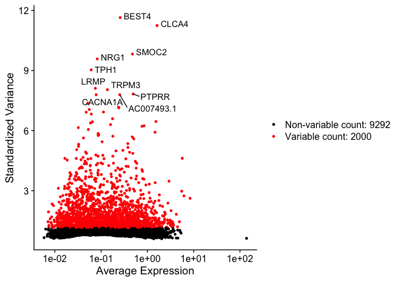

# Introduction to Single Cell RNA-Seq Part 3: Normalize and scale


## Set up workspace
First, we need to load the required libraries.

```r
library(Seurat)
library(kableExtra)
experiment.aggregate <- readRDS("scRNA_workshop-02.rds")
experiment.aggregate
```

<div class='r_output'> An object of class Seurat
 11292 features across 6312 samples within 1 assay
 Active assay: RNA (11292 features, 0 variable features)
</div>
```r
set.seed(12345)
```

## Normalize the data
After filtering, the next step is to normalize the data. We employ a global-scaling normalization method, LogNormalize, that normalizes the gene expression measurements for each cell by the total expression, multiplies this by a scale factor (10,000 by default), and then log-transforms the data.

```r
?NormalizeData
```


```r
experiment.aggregate <- NormalizeData(
  object = experiment.aggregate,
  normalization.method = "LogNormalize",
  scale.factor = 10000)
```

## Cell cycle assignment
Cell cycle phase can be a significant source of variation in single cell and single nucleus experiments. There are a number of automated cell cycle stage detection methods available for single cell data. For this workshop, we will be using the built-in Seurat cell cycle function, `CellCycleScoring`. This tool compares gene expression in each cell to a list of cell cycle marker genes and scores each barcode based on marker expression. The phase with the highest score is selected for each barcode. Seurat includes a list of cell cycle genes in human single cell data.

```r
s.genes <- cc.genes$s.genes
g2m.genes <- cc.genes$g2m.genes
```

For other species, a user-provided gene list may be substituted, or the orthologs of the human gene list used instead.

**Do not run the code below for human experiments!**

```r
# mouse code DO NOT RUN for human data
library(biomaRt)
convertHumanGeneList <- function(x){
  require("biomaRt")
  human = useEnsembl("ensembl",
                     dataset = "hsapiens_gene_ensembl",
                     mirror = "uswest")
  mouse = useEnsembl("ensembl",
                     dataset = "mmusculus_gene_ensembl",
                     mirror = "uswest")
  genes = getLDS(attributes = c("hgnc_symbol"),
                 filters = "hgnc_symbol",
                 values = x ,
                 mart = human,
                 attributesL = c("mgi_symbol"),
                 martL = mouse,
                 uniqueRows=T)
  humanx = unique(genes[, 2])
  print(head(humanx)) # print first 6 genes found to the screen
  return(humanx)
}
# convert lists to mouse orthologs
s.genes <- convertHumanGeneList(cc.genes.updated.2019$s.genes)
g2m.genes <- convertHumanGeneList(cc.genes.updated.2019$g2m.genes)
```

Once an appropriate gene list has been identified, the `CellCycleScoring` function can be run.

```r
experiment.aggregate <- CellCycleScoring(experiment.aggregate,
                                         s.features = s.genes,
                                         g2m.features = g2m.genes,
                                         set.ident = TRUE)
table(experiment.aggregate@meta.data$Phase) %>%
  kable(caption = "Number of Cells in each Cell Cycle Stage",
        col.names = c("Stage", "Count"),
        align = "c") %>%
  kable_styling()
```

<table class="table" style="margin-left: auto; margin-right: auto;">
<caption>Number of Cells in each Cell Cycle Stage</caption>
 <thead>
  <tr>
   <th style="text-align:center;"> Stage </th>
   <th style="text-align:center;"> Count </th>
  </tr>
 </thead>
<tbody>
  <tr>
   <td style="text-align:center;"> G1 </td>
   <td style="text-align:center;"> 3759 </td>
  </tr>
  <tr>
   <td style="text-align:center;"> G2M </td>
   <td style="text-align:center;"> 1136 </td>
  </tr>
  <tr>
   <td style="text-align:center;"> S </td>
   <td style="text-align:center;"> 1417 </td>
  </tr>
</tbody>
</table>

Because the "set.ident" argument was set to TRUE (this is also the default behavior), the active identity of the Seurat object was changed to the phase. To return the active identity to the sample identity, use the `Idents` function.

```r
table(Idents(experiment.aggregate))
```

<div class='r_output'>
    S  G2M   G1
 1417 1136 3759
</div>
```r
Idents(experiment.aggregate) <- "orig.ident"
table(Idents(experiment.aggregate))
```

<div class='r_output'>
 A001-C-007 A001-C-104 B001-A-301
       1023       1858       3431
</div>
## Identify variable genes
The function FindVariableFeatures identifies the most highly variable genes (default 2000 genes) by fitting a line to the relationship of log(variance) and log(mean) using loess smoothing, uses this information to standardize the data, then calculates the variance of the standardized data.  This helps avoid selecting genes that only appear variable due to their expression level.

```r
?FindVariableFeatures
```


```r
experiment.aggregate <- FindVariableFeatures(
  object = experiment.aggregate,
  selection.method = "vst")
length(VariableFeatures(experiment.aggregate))
```

<div class='r_output'> [1] 2000
</div>
```r
top10 <- head(VariableFeatures(experiment.aggregate), 10)
top10
```

<div class='r_output'>  [1] "BEST4"      "CLCA4"      "SMOC2"      "NRG1"       "TPH1"      
  [6] "LRMP"       "TRPM3"      "PTPRR"      "AC007493.1" "CACNA1A"
</div>
```r
var.feat.plot <- VariableFeaturePlot(experiment.aggregate)
var.feat.plot <- LabelPoints(plot = var.feat.plot, points = top10, repel = TRUE)
var.feat.plot
```

<!-- -->

**How do the results change if you use selection.method = "dispersion" or selection.method = "mean.var.plot"?**

FindVariableFeatures isn't the only way to set the "variable features" of a Seurat object. Another reasonable approach is to select a set of "minimally expressed" genes.

```r
min.value <- 2
min.cells <- 10

num.cells <- Matrix::rowSums(GetAssayData(experiment.aggregate, slot = "count") > min.value)
genes.use <- names(num.cells[which(num.cells >= min.cells)])
length(genes.use)
```

<div class='r_output'> [1] 7012
</div>
```r
VariableFeatures(experiment.aggregate) <- genes.use
```

## Scale the data
The `ScaleData` function scales and centers genes in the dataset. If variables are provided with the "vars.to.regress" argument, they are individually regressed against each gene, and the resulting residuals are then scaled and centered unless otherwise specified. We regress out cell cycle results S.Score and G2M.Score, mitochondrial RNA level (percent_MT), and the number of features (nFeature_RNA) as a proxy for sequencing depth.

```r
experiment.aggregate <- ScaleData(experiment.aggregate,
                                  vars.to.regress = c("S.Score", "G2M.Score", "percent_MT", "nFeature_RNA"))
```

## Prepare for the next section

#### Save object

```r
saveRDS(experiment.aggregate, file = "scRNA_workshop-03.rds")
```

#### Download Rmd

```r
download.file("https://raw.githubusercontent.com/ucdavis-bioinformatics-training/2023-December-Single-Cell-RNA-Seq-Analysis/main/data_analysis/04-dimensionality_reduction.Rmd", "04-dimensionality_reduction.Rmd")
```

#### Session Information

```r
sessionInfo()
```

<div class='r_output'> R version 4.3.1 (2023-06-16)
 Platform: aarch64-apple-darwin20 (64-bit)
 Running under: macOS Monterey 12.4

 Matrix products: default
 BLAS:   /Library/Frameworks/R.framework/Versions/4.3-arm64/Resources/lib/libRblas.0.dylib
 LAPACK: /Library/Frameworks/R.framework/Versions/4.3-arm64/Resources/lib/libRlapack.dylib;  LAPACK version 3.11.0

 locale:
 [1] en_US.UTF-8/en_US.UTF-8/en_US.UTF-8/C/en_US.UTF-8/en_US.UTF-8

 time zone: America/Los_Angeles
 tzcode source: internal

 attached base packages:
 [1] stats     graphics  grDevices utils     datasets  methods   base     

 other attached packages:
 [1] kableExtra_1.3.4   SeuratObject_4.1.3 Seurat_4.3.0.1    

 loaded via a namespace (and not attached):
   [1] deldir_1.0-9           pbapply_1.7-2          gridExtra_2.3         
   [4] rlang_1.1.1            magrittr_2.0.3         RcppAnnoy_0.0.21      
   [7] spatstat.geom_3.2-4    matrixStats_1.0.0      ggridges_0.5.4        
  [10] compiler_4.3.1         systemfonts_1.0.4      png_0.1-8             
  [13] vctrs_0.6.3            reshape2_1.4.4         rvest_1.0.3           
  [16] stringr_1.5.0          pkgconfig_2.0.3        fastmap_1.1.1         
  [19] ellipsis_0.3.2         labeling_0.4.2         utf8_1.2.3            
  [22] promises_1.2.0.1       rmarkdown_2.23         purrr_1.0.1           
  [25] xfun_0.39              cachem_1.0.8           jsonlite_1.8.7        
  [28] goftest_1.2-3          highr_0.10             later_1.3.1           
  [31] spatstat.utils_3.0-3   irlba_2.3.5.1          parallel_4.3.1        
  [34] cluster_2.1.4          R6_2.5.1               ica_1.0-3             
  [37] spatstat.data_3.0-1    bslib_0.5.0            stringi_1.7.12        
  [40] RColorBrewer_1.1-3     reticulate_1.30        parallelly_1.36.0     
  [43] lmtest_0.9-40          jquerylib_0.1.4        scattermore_1.2       
  [46] Rcpp_1.0.11            knitr_1.43             tensor_1.5            
  [49] future.apply_1.11.0    zoo_1.8-12             sctransform_0.3.5     
  [52] httpuv_1.6.11          Matrix_1.6-0           splines_4.3.1         
  [55] igraph_1.5.0           tidyselect_1.2.0       abind_1.4-5           
  [58] rstudioapi_0.15.0      yaml_2.3.7             spatstat.random_3.1-5
  [61] codetools_0.2-19       miniUI_0.1.1.1         spatstat.explore_3.2-1
  [64] listenv_0.9.0          lattice_0.21-8         tibble_3.2.1          
  [67] plyr_1.8.8             withr_2.5.0            shiny_1.7.4.1         
  [70] ROCR_1.0-11            evaluate_0.21          Rtsne_0.16            
  [73] future_1.33.0          survival_3.5-5         polyclip_1.10-4       
  [76] xml2_1.3.5             fitdistrplus_1.1-11    pillar_1.9.0          
  [79] KernSmooth_2.23-22     plotly_4.10.2          generics_0.1.3        
  [82] sp_2.0-0               ggplot2_3.4.2          munsell_0.5.0         
  [85] scales_1.2.1           globals_0.16.2         xtable_1.8-4          
  [88] glue_1.6.2             lazyeval_0.2.2         tools_4.3.1           
  [91] data.table_1.14.8      webshot_0.5.5          RANN_2.6.1            
  [94] leiden_0.4.3           cowplot_1.1.1          grid_4.3.1            
  [97] tidyr_1.3.0            colorspace_2.1-0       nlme_3.1-162          
 [100] patchwork_1.1.2        cli_3.6.1              spatstat.sparse_3.0-2
 [103] fansi_1.0.4            viridisLite_0.4.2      svglite_2.1.1         
 [106] dplyr_1.1.2            uwot_0.1.16            gtable_0.3.3          
 [109] sass_0.4.7             digest_0.6.33          progressr_0.13.0      
 [112] ggrepel_0.9.3          farver_2.1.1           htmlwidgets_1.6.2     
 [115] htmltools_0.5.5        lifecycle_1.0.3        httr_1.4.6            
 [118] mime_0.12              MASS_7.3-60
</div>
