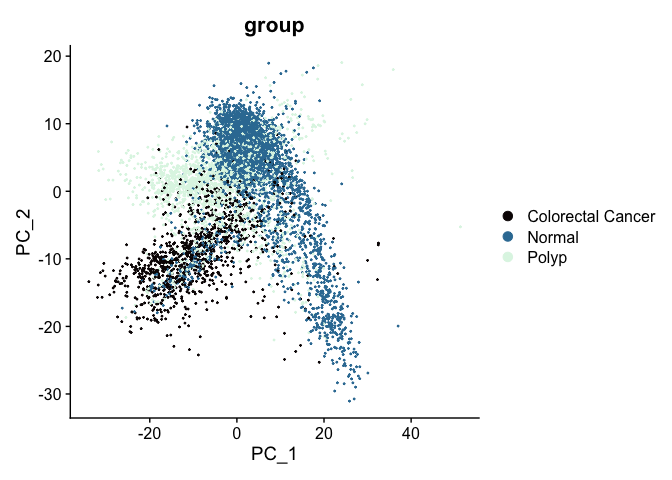
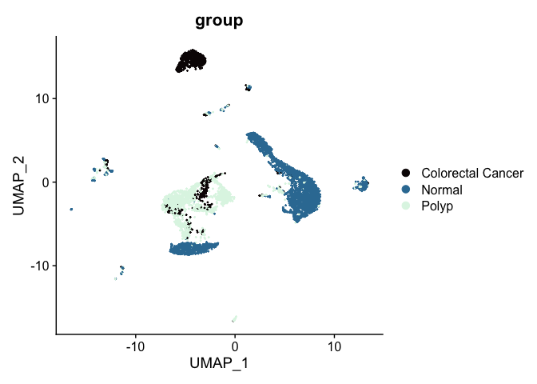

# Introduction to Single Cell RNA-Seq Part 8: Integration
```{r setup, include=FALSE}
knitr::opts_chunk$set(message = FALSE, warning = FALSE, error = FALSE)
```
More and more experiments involve a large number of samples/datasets, that may have been prepared in separate batches. Or in the case where one would like to include or integrate publicly available datasets. It is important to properly integrate these datasets, and we will see the effect the integration has at the end of this documentation.

Most of the methods that were developed to integrate single cell datasets fall into two categories. The first is the "anchor" based approach. In this approach, the first step is to select a batch as the "anchor" and convert other batches to the "anchor" batch. Among these approaches are [MNN](https://github.com/MarioniLab/MNN2017), [iMAP](https://github.com/Svvord/iMAP), and [SCALEX](https://github.com/jsxlei/SCALEX). The advantage of the anchor-based approach is that different batches of cells can be studied under the same experimental conditions, and the disadvantage is that it is not possible to fully combine the features of each batch because the cell types contained in each batch are unknown.

The second approach is to transform all batches of data to a low-dimensional space to correct batch effects, such as implemented in [Harmony](https://github.com/immunogenomics/harmony), [DESC](https://www.nature.com/articles/s41467-020-15851-3), [BBKNN](https://github.com/Teichlab/bbknn), [STACAS](https://www.ncbi.nlm.nih.gov/pmc/articles/PMC8098019/) and [Seurat's integration](https://www.cell.com/cell/fulltext/S0092-8674(19)30559-8). This second approach has the advantage of extracting biologically relevant latent features and reducing the impact of noise, but it cannot be used for differential gene expression analysis. Many of these existing methods work well when the batches of datasets have the same cell types, however, they fail when there are different cell types involved in different datasets. [Scanorama](https://github.com/brianhie/scanorama) uses similar approach, but it allows integration of datasets that don't always share a common cell type among all and the batch-corrected gene expression data can be used for differential gene expression analysis.

[scVI](https://www.nature.com/articles/s41592-018-0229-2) is based on a hierarchical Baysian model with conditional distributions specified by deep neural networks. The expression of a gene in a cell is modeled using a zero-inflated negative binomial distribution, conditioned on batch annotaton (if available), as well as two unoberserved random variable. One is the variation due to differences in capture efficiency and sequencing depth and it serves as a cell-specific scaling factor. The other captures the biological differences. This frame work used by scVI allows for integration of datasets from different experiment, and permits differential expression analysis on estimated expression data.

Recently, [IMGG](https://www.mdpi.com/1422-0067/23/4/2082) has been developed that uses connected graphs and generative adversarial networks (GAN) to achieve the goal of eliminating nonbiological noise between batches of datasets. This new method has been demonstrated to work well both in the situation where datasets have the same cell types and in the situation where datasets may have different cell types.

In this workshop, we are going to look at Seurat's integration approach using reciprocal PCA, which is supurior to its first integration approach using canonical correlation analysis. The basic idea is to identify cross-dataset pairs of cells that are in a matched biological state ("anchors"), and use them to correct technical differences between datasets. The integration method we use has been implemented in Seurat and you can find the details of the method in [its publication](https://www.sciencedirect.com/science/article/pii/S0092867419305598?via%3Dihub).

## Set up workspace
```{r workspace}
library(Seurat)
library(ggplot2)
set.seed(12345)
experiment.aggregate <- readRDS("scRNA_workshop-02.rds") # filtered object
```

## Prepare data for integration
Prior to integration samples should be processed independently. First, we split the filtered object by sample to create a list of Seurat objects.
```{r SplitObject}
experiment.split <- SplitObject(experiment.aggregate, split.by = "orig.ident")
rm(experiment.aggregate)
```

Each object is then normalized and variable features detected. CellCycleScoring is run here for later visualization purpose, and is not required for integration purpose.
```{r prepare}
experiment.split <- lapply(experiment.split, function(sce){
  sce = NormalizeData(sce, normalization.method = "LogNormalize", scale.factor = 10000)
  sce = CellCycleScoring(sce, s.features = cc.genes$s.genes, g2m.features = cc.genes$g2m.genes, set.ident = FALSE)
  sce = FindVariableFeatures(sce, selection.method = "vst", nfeatures = 2000)
})
```

## Select integration features
Integration features are genes that are repeatedly variable across the objects to integrate. These are used to scale the data and run the PCA.
```{r select_features}
features <- SelectIntegrationFeatures(object.list = experiment.split)
```

## Scale data and run PCA
Once integration features have been identified, we can scale the data and run the PCA, which is required for finding the integration anchors.
```{r ScaleData}
experiment.split <- lapply(experiment.split,function(sce){
  sce = ScaleData(sce, features = features, vars.to.regress = c("S.Score", "G2M.Score", "percent_MT", "nFeature_RNA"))
  RunPCA(sce, features = features)
})
```

## Idenfity integration anchors
The integration anchors are pairs of cells that are mutual nearest neighbors on the shared low-dimensional representation. These may be calculated either for each Seurat object relative to a reference object, or pairwise between all objects if no reference is provided.
```{r FindIntegrationAnchors}
anchors <- FindIntegrationAnchors(object.list = experiment.split, anchor.features = features, reduction = "rpca")
```

## Integrate
```{r IntegrateData}
experiment.integrated <- IntegrateData(anchorset = anchors)
experiment.integrated$group <- factor(experiment.integrated$group, levels=c("Normal", "Polyp", "Colorectal Cancer"))
```
The new experiment.integrated object has two assays: RNA and integrated. The RNA assay contains the normalized, scaled data from the individual experiment.split objects merged into a single table, while the data in the integrated assay has been scaled in such a way that it is no longer appropriate to use this assay for differential expression.

The authors recommend using the integrated assay for clustering and visualization (UMAP plots).

## Impact of integration
In the dimensionality reduction section we performed PCA on the un-integrated experiment.aggregate object, where we used the vars.to.regress argument of the ScaleData function to adjust for cell cycle, nucleus integrity, and sequencing depth. The PCA biplot looked like this:



After integration, the appearance of the PCA biplot has changed; cells no longer separate by group.
```{r PCA}
DefaultAssay(experiment.integrated) <- "integrated"
experiment.integrated <- ScaleData(experiment.integrated, assay="integrated")
experiment.integrated <- RunPCA(experiment.integrated, assay="integrated")
DimPlot(experiment.integrated,
        group.by = "group",
        reduction = "pca",
        shuffle = TRUE) +
  scale_color_viridis_d(option = "mako")
```

A similar effect can be seen in the UMAP. Previously, the un-integrated UMAP plot had this appearance:



After integration, the polyp and colorectal cancer cells are more co-localized on the biplot.
```{r}
experiment.integrated <- RunUMAP(experiment.integrated, dims = 1:50)
DimPlot(experiment.integrated,
        reduction = "umap",
        group.by = "group",
        shuffle = TRUE) +
  scale_color_viridis_d(option = "mako")
```

In the next section, we will use the integrated data to perform clustering.

### Visualize metadata

```{r meta}
lapply(c("nCount_RNA", "nFeature_RNA", "percent_MT"), function(feature){
  FeaturePlot(experiment.integrated,
              reduction = "umap",
              features = feature)
})
```

### Visualize cell cycle phase

```{r phase}
DimPlot(experiment.integrated,
        reduction = "umap",
        group.by = "Phase",
        shuffle = TRUE) +
  scale_color_viridis_d()
```

### Clusters using the integrated data

```{r clusters.integrated}
experiment.integrated <- FindNeighbors(experiment.integrated, reduction = "pca", dims = 1:50)
experiment.integrated <- FindClusters(experiment.integrated,
                                     resolution = seq(0.04, 0.07, 0.01))
cluster.resolutions <- grep("res", colnames(experiment.integrated@meta.data), value = TRUE)
sapply(cluster.resolutions, function(res){
  length(levels(experiment.integrated@meta.data[,res]))
})
cluster.resolutions
lapply(cluster.resolutions, function(res){
  DimPlot(experiment.integrated,
          group.by = res,
          reduction = "umap",
          shuffle = TRUE) +
    scale_color_viridis_d(option = "turbo")
})
lapply(cluster.resolutions, function(res){
         tmp = experiment.integrated@meta.data[,c(res, "group")]
         colnames(tmp) = c("cluster", "group")
         ggplot(tmp, aes(x = cluster, fill = group)) +
           geom_bar() +
           scale_fill_viridis_d(option = "mako") +
           theme_classic()
})
FeaturePlot(experiment.integrated,
            reduction = "umap",
            features = "KCNMA1")
VlnPlot(experiment.integrated,
        group.by = "integrated_snn_res.0.07",
        features = "KCNMA1",
        pt.size = 0.1) +
  scale_fill_viridis_d(option = "turbo")
Idents(experiment.integrated) <- "integrated_snn_res.0.07"
experiment.integrated <- BuildClusterTree(experiment.integrated, dims = 1:50)
PlotClusterTree(experiment.integrated)
```


```{r AddMetaData}
experiment.aggregate <- readRDS("scRNA_workshop-05.rds")
identical(rownames(experiment.aggregate@meta.data), rownames(experiment.integrated@meta.data))
experiment.aggregate <- AddMetaData(experiment.aggregate,
                                    metadata = experiment.integrated$integrated_snn_res.0.07,
                                    col.name = "integrated_snn_res.0.07")
DimPlot(experiment.aggregate,
        reduction = "umap",
        group.by = "integrated_snn_res.0.07",
        shuffle = TRUE) +
  scale_color_viridis_d(option = "turbo")
```

In this case, integration appears to have interfered with forming easily-interpreted clusters. There is very little relationship between location on the UMAP and cluster identity, which makes it harder to identify possible cell populations at a glance. We can add the integrated object's cluster identities to the un-integrated object if we choose, though projecting the integrated clustering onto the un-integrated UMAP is unlikely to be useful.

#### Save the Seurat object

```{r saveRDS}
saveRDS(experiment.integrated, file="scRNA_workshop-08.rds")
```


#### Session information
```{r sessioninfo}
sessionInfo()
```
