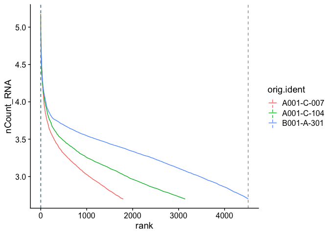
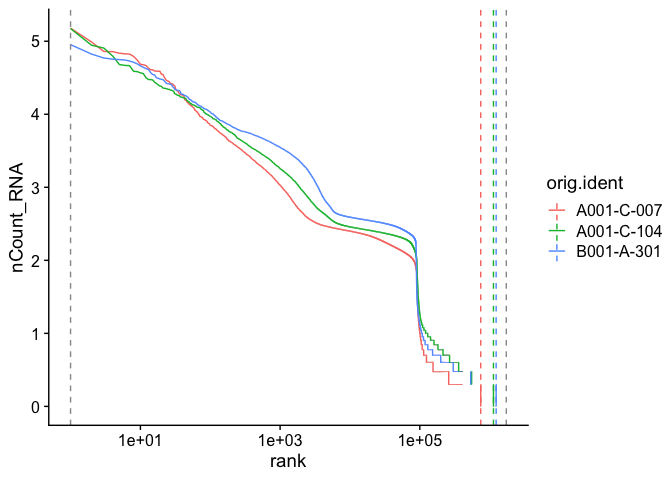

Last Updated: June 19, 2023

# Part 1: Loading data from CellRanger into R

Our first Markdown document concentrates on getting data into R and setting up our initial object.

## Single Cell Analysis with Seurat and some custom code!

[Seurat](http://satijalab.org/seurat/) (now Version 4) is a popular R package that is designed for QC, analysis, and exploration of single cell data. Seurat aims to enable users to identify and interpret sources of heterogeneity from single cell transcriptomic measurements, and to integrate diverse types of single cell data. Further, the authors provide several [tutorials](https://satijalab.org/seurat/vignettes.html), on their website.

The **expression_data_cellranger.zip** file that we have downloaded in previous step contains the single cell matrix files and HDF5 files for three single nuclei RNASeq samples from [Becker et al., 2022](https://www.nature.com/articles/s41588-022-01088-x). After un-compressing the file, please make sure that you see three folders: A001-C-007, A001-C-104 and B001-A-301 in the same folder as this R markdown file.

We start each markdown document with loading needed libraries for R:


```r
# must have Seurat
library(Seurat)
library(kableExtra)
library(ggplot2)
```


### Setup the experiment folder and data info

```r
experiment.name <- "Becker 2022 colorectal cancer continuum"
dataset.loc <- "./"
sample.ids <- c("A001-C-007", "A001-C-104", "B001-A-301")
```


### Read in the cellranger sample metrics csv files

There is a single metrics summary file for each sample. The code in the box below reads in each of these files and creates a single table containing data from all of the samples.


```r
sample.metrics <- lapply(sample.ids, function(id){
  metrics = read.csv(file.path(dataset.loc, paste0(id,"/outs"),"metrics_summary.csv"),
                     colClasses = "character")
})
experiment.metrics <- do.call("rbind", sample.metrics)
rownames(experiment.metrics) <- sample.ids

sequencing.metrics <- data.frame(t(experiment.metrics[,c(1:19)]))

rownames(sequencing.metrics) <- gsub("\\."," ", rownames(sequencing.metrics))

sequencing.metrics %>%
  kable(caption = 'Cell Ranger Results') %>%
  pack_rows("Overview", 1, 3, label_row_css = "background-color: #666; color: #fff;") %>%
  pack_rows("Sequencing Characteristics", 4, 9, label_row_css = "background-color: #666; color: #fff;") %>%
  pack_rows("Mapping Characteristics", 10, 19, label_row_css = "background-color: #666; color: #fff;") %>%
  kable_styling("striped")
```

<table class="table table-striped" style="margin-left: auto; margin-right: auto;">
<caption>Cell Ranger Results</caption>
 <thead>
  <tr>
   <th style="text-align:left;">   </th>
   <th style="text-align:left;"> A001.C.007 </th>
   <th style="text-align:left;"> A001.C.104 </th>
   <th style="text-align:left;"> B001.A.301 </th>
  </tr>
 </thead>
<tbody>
  <tr grouplength="3"><td colspan="4" style="background-color: #666; color: #fff;"><strong>Overview</strong></td></tr>
<tr>
   <td style="text-align:left;padding-left: 2em;" indentlevel="1"> Estimated Number of Cells </td>
   <td style="text-align:left;"> 1,796 </td>
   <td style="text-align:left;"> 3,142 </td>
   <td style="text-align:left;"> 4,514 </td>
  </tr>
  <tr>
   <td style="text-align:left;padding-left: 2em;" indentlevel="1"> Mean Reads per Cell </td>
   <td style="text-align:left;"> 77,524 </td>
   <td style="text-align:left;"> 151,317 </td>
   <td style="text-align:left;"> 38,935 </td>
  </tr>
  <tr>
   <td style="text-align:left;padding-left: 2em;" indentlevel="1"> Median Genes per Cell </td>
   <td style="text-align:left;"> 927 </td>
   <td style="text-align:left;"> 959 </td>
   <td style="text-align:left;"> 1,331 </td>
  </tr>
  <tr grouplength="6"><td colspan="4" style="background-color: #666; color: #fff;"><strong>Sequencing Characteristics</strong></td></tr>
<tr>
   <td style="text-align:left;padding-left: 2em;" indentlevel="1"> Number of Reads </td>
   <td style="text-align:left;"> 139,233,487 </td>
   <td style="text-align:left;"> 475,437,350 </td>
   <td style="text-align:left;"> 175,752,014 </td>
  </tr>
  <tr>
   <td style="text-align:left;padding-left: 2em;" indentlevel="1"> Valid Barcodes </td>
   <td style="text-align:left;"> 97.4% </td>
   <td style="text-align:left;"> 95.4% </td>
   <td style="text-align:left;"> 98.5% </td>
  </tr>
  <tr>
   <td style="text-align:left;padding-left: 2em;" indentlevel="1"> Sequencing Saturation </td>
   <td style="text-align:left;"> 75.5% </td>
   <td style="text-align:left;"> 84.3% </td>
   <td style="text-align:left;"> 69.0% </td>
  </tr>
  <tr>
   <td style="text-align:left;padding-left: 2em;" indentlevel="1"> Q30 Bases in Barcode </td>
   <td style="text-align:left;"> 97.4% </td>
   <td style="text-align:left;"> 96.4% </td>
   <td style="text-align:left;"> 96.6% </td>
  </tr>
  <tr>
   <td style="text-align:left;padding-left: 2em;" indentlevel="1"> Q30 Bases in RNA Read </td>
   <td style="text-align:left;"> 95.6% </td>
   <td style="text-align:left;"> 94.4% </td>
   <td style="text-align:left;"> 94.1% </td>
  </tr>
  <tr>
   <td style="text-align:left;padding-left: 2em;" indentlevel="1"> Q30 Bases in UMI </td>
   <td style="text-align:left;"> 97.5% </td>
   <td style="text-align:left;"> 96.4% </td>
   <td style="text-align:left;"> 96.5% </td>
  </tr>
  <tr grouplength="10"><td colspan="4" style="background-color: #666; color: #fff;"><strong>Mapping Characteristics</strong></td></tr>
<tr>
   <td style="text-align:left;padding-left: 2em;" indentlevel="1"> Reads Mapped to Genome </td>
   <td style="text-align:left;"> 94.3% </td>
   <td style="text-align:left;"> 92.1% </td>
   <td style="text-align:left;"> 89.0% </td>
  </tr>
  <tr>
   <td style="text-align:left;padding-left: 2em;" indentlevel="1"> Reads Mapped Confidently to Genome </td>
   <td style="text-align:left;"> 72.3% </td>
   <td style="text-align:left;"> 49.1% </td>
   <td style="text-align:left;"> 83.8% </td>
  </tr>
  <tr>
   <td style="text-align:left;padding-left: 2em;" indentlevel="1"> Reads Mapped Confidently to Intergenic Regions </td>
   <td style="text-align:left;"> 8.2% </td>
   <td style="text-align:left;"> 7.4% </td>
   <td style="text-align:left;"> 5.0% </td>
  </tr>
  <tr>
   <td style="text-align:left;padding-left: 2em;" indentlevel="1"> Reads Mapped Confidently to Intronic Regions </td>
   <td style="text-align:left;"> 26.9% </td>
   <td style="text-align:left;"> 20.6% </td>
   <td style="text-align:left;"> 40.2% </td>
  </tr>
  <tr>
   <td style="text-align:left;padding-left: 2em;" indentlevel="1"> Reads Mapped Confidently to Exonic Regions </td>
   <td style="text-align:left;"> 37.2% </td>
   <td style="text-align:left;"> 21.2% </td>
   <td style="text-align:left;"> 38.6% </td>
  </tr>
  <tr>
   <td style="text-align:left;padding-left: 2em;" indentlevel="1"> Reads Mapped Confidently to Transcriptome </td>
   <td style="text-align:left;"> 61.1% </td>
   <td style="text-align:left;"> 39.4% </td>
   <td style="text-align:left;"> 73.4% </td>
  </tr>
  <tr>
   <td style="text-align:left;padding-left: 2em;" indentlevel="1"> Reads Mapped Antisense to Gene </td>
   <td style="text-align:left;"> 2.4% </td>
   <td style="text-align:left;"> 1.9% </td>
   <td style="text-align:left;"> 4.8% </td>
  </tr>
  <tr>
   <td style="text-align:left;padding-left: 2em;" indentlevel="1"> Fraction Reads in Cells </td>
   <td style="text-align:left;"> 29.6% </td>
   <td style="text-align:left;"> 37.6% </td>
   <td style="text-align:left;"> 36.8% </td>
  </tr>
  <tr>
   <td style="text-align:left;padding-left: 2em;" indentlevel="1"> Total Genes Detected </td>
   <td style="text-align:left;"> 23,930 </td>
   <td style="text-align:left;"> 25,326 </td>
   <td style="text-align:left;"> 25,462 </td>
  </tr>
  <tr>
   <td style="text-align:left;padding-left: 2em;" indentlevel="1"> Median UMI Counts per Cell </td>
   <td style="text-align:left;"> 1,204 </td>
   <td style="text-align:left;"> 1,231 </td>
   <td style="text-align:left;"> 1,913 </td>
  </tr>
</tbody>
</table>

```r
rm(sample.metrics, experiment.metrics, sequencing.metrics)
```


### Load the Cell Ranger expression data and create the base Seurat object
Cell Ranger provides a function `cellranger aggr` that will combine multiple samples into a single matrix file. However, when processing data in R this is unnecessary and we can quickly aggregate them in R.

#### Load the expression matrix
First we read in data from each individual sample folder, using either the h5 file (first code block), or the matrix directory (second code block).


```r
expression.data <- lapply(sample.ids, function(id){
  sample.matrix = Read10X_h5(file.path(dataset.loc, id, "/outs","filtered_feature_bc_matrix.h5"))
  colnames(sample.matrix) = paste(sapply(strsplit(colnames(sample.matrix),split="-"), '[[', 1L), id, sep="_")
  sample.matrix
})
names(expression.data) <- sample.ids

str(expression.data)
```

<div class='r_output'> List of 3
  $ A001-C-007:Formal class 'dgCMatrix' [package "Matrix"] with 6 slots
   .. ..@ i       : int [1:2482307] 60 145 216 237 238 247 258 285 290 298 ...
   .. ..@ p       : int [1:1797] 0 1549 2236 2703 3241 4013 4642 5748 6285 7444 ...
   .. ..@ Dim     : int [1:2] 36601 1796
   .. ..@ Dimnames:List of 2
   .. .. ..$ : chr [1:36601] "MIR1302-2HG" "FAM138A" "OR4F5" "AL627309.1" ...
   .. .. ..$ : chr [1:1796] "AAACCCAAGTTATGGA_A001-C-007" "AAACCCACAACGCCCA_A001-C-007" "AAACCCACAGAAGTTA_A001-C-007" "AAACCCAGTCAGTCCG_A001-C-007" ...
   .. ..@ x       : num [1:2482307] 1 1 1 1 1 1 1 1 1 1 ...
   .. ..@ factors : list()
  $ A001-C-104:Formal class 'dgCMatrix' [package "Matrix"] with 6 slots
   .. ..@ i       : int [1:4039871] 70 83 86 94 216 237 246 247 282 338 ...
   .. ..@ p       : int [1:3143] 0 1303 2321 4305 5973 7072 8227 9174 10383 12432 ...
   .. ..@ Dim     : int [1:2] 36601 3142
   .. ..@ Dimnames:List of 2
   .. .. ..$ : chr [1:36601] "MIR1302-2HG" "FAM138A" "OR4F5" "AL627309.1" ...
   .. .. ..$ : chr [1:3142] "AAACCCACATAAGCAA_A001-C-104" "AAACCCAGTGGAACCA_A001-C-104" "AAACCCAGTTTCGCTC_A001-C-104" "AAACGAAAGAGAGTGA_A001-C-104" ...
   .. ..@ x       : num [1:4039871] 1 1 3 2 2 1 2 1 1 1 ...
   .. ..@ factors : list()
  $ B001-A-301:Formal class 'dgCMatrix' [package "Matrix"] with 6 slots
   .. ..@ i       : int [1:6777011] 86 94 177 228 247 258 298 339 344 362 ...
   .. ..@ p       : int [1:4515] 0 1572 3541 5325 6373 9028 10945 12986 14689 15717 ...
   .. ..@ Dim     : int [1:2] 36601 4514
   .. ..@ Dimnames:List of 2
   .. .. ..$ : chr [1:36601] "MIR1302-2HG" "FAM138A" "OR4F5" "AL627309.1" ...
   .. .. ..$ : chr [1:4514] "AAACCCACAGCTATTG_B001-A-301" "AAACCCAGTGTTCCAA_B001-A-301" "AAACGAAGTGGTATGG_B001-A-301" "AAACGAATCATTGGTG_B001-A-301" ...
   .. ..@ x       : num [1:6777011] 1 1 1 2 1 1 3 2 3 1 ...
   .. ..@ factors : list()
</div>
If you don't have the needed hdf5 libraries, you can read in the matrix files using the `Read10X` function rather than the `Read10X_h5` function. The resulting object is the same.


```r
expression.data <- sapply(sample.ids, function(id){
  sample.matrix <- Read10X(file.path(dataset.loc, id, "/outs","filtered_feature_bc_matrix"))
  colnames(sample.matrix) <- paste(sapply(strsplit(colnames(sample.matrix), split="-"), '[[', 1L), id, sep="_")
  sample.matrix
})
names(expression.data) <- sample.ids

str(expression.data)
```

#### Create the Seurat object

The `CreateSeuratObject` function allows feature (gene) and cell filtering by minimum cell and feature counts. We will set these to 0 for now in order to explore manual filtering more fully in part 2.


```r
aggregate.data <- do.call("cbind", expression.data)

experiment.aggregate <- CreateSeuratObject(
  aggregate.data,
  project = experiment.name,
  min.cells = 0,
  min.features = 0,
  names.field = 2, # tells Seurat which part of the cell identifier contains the sample name
  names.delim = "\\_")

experiment.aggregate
```

<div class='r_output'> An object of class Seurat
 36601 features across 9452 samples within 1 assay
 Active assay: RNA (36601 features, 0 variable features)
</div>
```r
str(experiment.aggregate)
```

<div class='r_output'> Formal class 'Seurat' [package "SeuratObject"] with 13 slots
   ..@ assays      :List of 1
   .. ..$ RNA:Formal class 'Assay' [package "SeuratObject"] with 8 slots
   .. .. .. ..@ counts       :Formal class 'dgCMatrix' [package "Matrix"] with 6 slots
   .. .. .. .. .. ..@ i       : int [1:13299189] 60 145 216 237 238 247 258 285 290 298 ...
   .. .. .. .. .. ..@ p       : int [1:9453] 0 1549 2236 2703 3241 4013 4642 5748 6285 7444 ...
   .. .. .. .. .. ..@ Dim     : int [1:2] 36601 9452
   .. .. .. .. .. ..@ Dimnames:List of 2
   .. .. .. .. .. .. ..$ : chr [1:36601] "MIR1302-2HG" "FAM138A" "OR4F5" "AL627309.1" ...
   .. .. .. .. .. .. ..$ : chr [1:9452] "AAACCCAAGTTATGGA_A001-C-007" "AAACCCACAACGCCCA_A001-C-007" "AAACCCACAGAAGTTA_A001-C-007" "AAACCCAGTCAGTCCG_A001-C-007" ...
   .. .. .. .. .. ..@ x       : num [1:13299189] 1 1 1 1 1 1 1 1 1 1 ...
   .. .. .. .. .. ..@ factors : list()
   .. .. .. ..@ data         :Formal class 'dgCMatrix' [package "Matrix"] with 6 slots
   .. .. .. .. .. ..@ i       : int [1:13299189] 60 145 216 237 238 247 258 285 290 298 ...
   .. .. .. .. .. ..@ p       : int [1:9453] 0 1549 2236 2703 3241 4013 4642 5748 6285 7444 ...
   .. .. .. .. .. ..@ Dim     : int [1:2] 36601 9452
   .. .. .. .. .. ..@ Dimnames:List of 2
   .. .. .. .. .. .. ..$ : chr [1:36601] "MIR1302-2HG" "FAM138A" "OR4F5" "AL627309.1" ...
   .. .. .. .. .. .. ..$ : chr [1:9452] "AAACCCAAGTTATGGA_A001-C-007" "AAACCCACAACGCCCA_A001-C-007" "AAACCCACAGAAGTTA_A001-C-007" "AAACCCAGTCAGTCCG_A001-C-007" ...
   .. .. .. .. .. ..@ x       : num [1:13299189] 1 1 1 1 1 1 1 1 1 1 ...
   .. .. .. .. .. ..@ factors : list()
   .. .. .. ..@ scale.data   : num[0 , 0 ]
   .. .. .. ..@ key          : chr "rna_"
   .. .. .. ..@ assay.orig   : NULL
   .. .. .. ..@ var.features : logi(0)
   .. .. .. ..@ meta.features:'data.frame':	36601 obs. of  0 variables
   .. .. .. ..@ misc         : list()
   ..@ meta.data   :'data.frame':	9452 obs. of  3 variables:
   .. ..$ orig.ident  : Factor w/ 3 levels "A001-C-007","A001-C-104",..: 1 1 1 1 1 1 1 1 1 1 ...
   .. ..$ nCount_RNA  : num [1:9452] 2078 854 541 605 954 ...
   .. ..$ nFeature_RNA: int [1:9452] 1549 687 467 538 772 629 1106 537 1159 1234 ...
   ..@ active.assay: chr "RNA"
   ..@ active.ident: Factor w/ 3 levels "A001-C-007","A001-C-104",..: 1 1 1 1 1 1 1 1 1 1 ...
   .. ..- attr(*, "names")= chr [1:9452] "AAACCCAAGTTATGGA_A001-C-007" "AAACCCACAACGCCCA_A001-C-007" "AAACCCACAGAAGTTA_A001-C-007" "AAACCCAGTCAGTCCG_A001-C-007" ...
   ..@ graphs      : list()
   ..@ neighbors   : list()
   ..@ reductions  : list()
   ..@ images      : list()
   ..@ project.name: chr "Becker 2022 colorectal cancer continuum"
   ..@ misc        : list()
   ..@ version     :Classes 'package_version', 'numeric_version'  hidden list of 1
   .. ..$ : int [1:3] 4 1 3
   ..@ commands    : list()
   ..@ tools       : list()
</div>
```r
rm(expression.data, aggregate.data)
```


#### Understanding the Seurat object

A Seurat object is a complex data structure containing the data from a single cell or single nucleus assay and **all** of the information associated with the experiment, including annotations, analysis, and more. This data structure was developed by the authors of the Seurat analysis package, for use with their pipeline.

Most Seurat functions take the object as an argument, and return either a new Seurat object or a ggplot object (a visualization). As the analysis continues, more and more data will be added to the object.

Let's take a moment to explore the Seurat object.


```r
slotNames(experiment.aggregate)
```

<div class='r_output'>  [1] "assays"       "meta.data"    "active.assay" "active.ident" "graphs"      
  [6] "neighbors"    "reductions"   "images"       "project.name" "misc"        
 [11] "version"      "commands"     "tools"
</div>
```r
# a slot is accessed with the @ symbol
experiment.aggregate@assays
```

<div class='r_output'> $RNA
 Assay data with 36601 features for 9452 cells
 First 10 features:
  MIR1302-2HG, FAM138A, OR4F5, AL627309.1, AL627309.3, AL627309.2,
 AL627309.5, AL627309.4, AP006222.2, AL732372.1
</div>
- Which slots are empty, and which contain data?
- What type of object is the content of the meta.data slot?
- What metadata is available?

There is often more than one way to interact with the information stored in each of a Seurat objects many slots. The default behaviors of different access functions are described in the help documentation.

```r
# which slot is being accessed here? can you write another way to produce the same result?
head(experiment.aggregate[[]])
```

<div class='r_output'>                             orig.ident nCount_RNA nFeature_RNA
 AAACCCAAGTTATGGA_A001-C-007 A001-C-007       2078         1549
 AAACCCACAACGCCCA_A001-C-007 A001-C-007        854          687
 AAACCCACAGAAGTTA_A001-C-007 A001-C-007        541          467
 AAACCCAGTCAGTCCG_A001-C-007 A001-C-007        605          538
 AAACGAAGTTGGTGTT_A001-C-007 A001-C-007        954          772
 AAACGCTAGGAGCAAA_A001-C-007 A001-C-007        734          629
</div>
### Explore the dataset

We will begin filtering and QA/QC in the next section. For now, let's take a moment to explore the basic characteristics of our dataset.

#### Metadata by sample

Using base R functions we can take a quick look at the available metadata by sample.


```r
table(experiment.aggregate$orig.ident)
```

<div class='r_output'>
 A001-C-007 A001-C-104 B001-A-301
       1796       3142       4514
</div>
```r
tapply(experiment.aggregate$nCount_RNA, experiment.aggregate$orig.ident, summary)
```

<div class='r_output'> $`A001-C-007`
    Min. 1st Qu.  Median    Mean 3rd Qu.    Max.
     500     756    1204    2785    2210  150805

 $`A001-C-104`
    Min. 1st Qu.  Median    Mean 3rd Qu.    Max.
     500     746    1231    2292    2188  149096

 $`B001-A-301`
    Min. 1st Qu.  Median    Mean 3rd Qu.    Max.
     500    1043    1913    2790    3299   89743
</div>
```r
tapply(experiment.aggregate$nFeature_RNA, experiment.aggregate$orig.ident, summary)
```

<div class='r_output'> $`A001-C-007`
    Min. 1st Qu.  Median    Mean 3rd Qu.    Max.
     404     625     927    1382    1570   12063

 $`A001-C-104`
    Min. 1st Qu.  Median    Mean 3rd Qu.    Max.
     397     622     959    1286    1520   12064

 $`B001-A-301`
    Min. 1st Qu.  Median    Mean 3rd Qu.    Max.
     416     821    1331    1501    1956    8812
</div>
#### Barcode inflection plots

Imagine the barcode rank plot from the Cell Ranger web summary. That graphic plots the number of UMIs agains the barcode rank, and typically has a sharp inflection point where the number of UMIs drops dramatically. These points can represent a transition between cell types from a higher RNA content population to a lower RNA content population, or from cell-associated barcodes to background.

The Seurat `BarcodeInflectionsPlot` provides a similar graphic. In this case, because we are using the filtered barcode matrix, rather than all barcodes, much of the background is absent from the plot.


```r
experiment.aggregate <- CalculateBarcodeInflections(experiment.aggregate)
BarcodeInflectionsPlot(experiment.aggregate)
```

<!-- -->

Adding a log-scale transformation to the x-axis increases the resemblance to the Cell Ranger plot. Values on the y-axis are already log-transformed.


```r
BarcodeInflectionsPlot(experiment.aggregate) +
  scale_x_continuous(trans = "log10")
```

<!-- -->

A barcode inflection plot calculated on all barcodes (the raw_feature_bc_matrix files) looks more like the familiar Cell Ranger barcode rank plot.

<!-- -->

#### Reads from the mitochondrial genome

Filtering on the expression of genes from the mitochondrial genome is not appropriate in all cell types, however, in many tissues, low-quality / dying cells may exhibit extensive mitochondrial contamination. Even when not filtering on mitochondrial expression, the data can be interesting or informative.

The `PercentageFeatureSet` function calculates the proportion of counts originating from a set of features. Genes in the human mitochondrial genome begin with 'MT', while those in the mouse mitochondrial genome begin with 'mt'. These naming conventions make calculating percent mitochondrial very straightforward.


```r
experiment.aggregate$percent_MT <- PercentageFeatureSet(experiment.aggregate, pattern = "^MT-")
summary(experiment.aggregate$percent_MT)
```

<div class='r_output'>    Min. 1st Qu.  Median    Mean 3rd Qu.    Max.
  0.0000  0.2802  0.5601  0.8283  1.0834 14.2037
</div>
### Save the object and download the next Rmd file


```r
saveRDS(experiment.aggregate, file="scRNA_workshop_1.rds")
download.file("https://raw.githubusercontent.com/ucdavis-bioinformatics-training/2023-June-Single-Cell-RNA-Seq-Analysis/main/data_analysis/scRNA_Workshop-PART2.Rmd", "scRNA_Workshop-PART2.Rmd")
```

### Session Information

```r
sessionInfo()
```

<div class='r_output'> R version 4.1.0 (2021-05-18)
 Platform: x86_64-apple-darwin17.0 (64-bit)
 Running under: macOS Big Sur 10.16

 Matrix products: default
 BLAS:   /Library/Frameworks/R.framework/Versions/4.1/Resources/lib/libRblas.dylib
 LAPACK: /Library/Frameworks/R.framework/Versions/4.1/Resources/lib/libRlapack.dylib

 locale:
 [1] en_US.UTF-8/en_US.UTF-8/en_US.UTF-8/C/en_US.UTF-8/en_US.UTF-8

 attached base packages:
 [1] stats     graphics  grDevices utils     datasets  methods   base     

 other attached packages:
 [1] ggplot2_3.4.2      kableExtra_1.3.4   SeuratObject_4.1.3 Seurat_4.3.0      

 loaded via a namespace (and not attached):
   [1] Rtsne_0.16             colorspace_2.1-0       deldir_1.0-9          
   [4] ellipsis_0.3.2         ggridges_0.5.4         rstudioapi_0.14       
   [7] spatstat.data_3.0-1    farver_2.1.1           leiden_0.4.3          
  [10] listenv_0.9.0          bit64_4.0.5            ggrepel_0.9.3         
  [13] fansi_1.0.4            xml2_1.3.4             codetools_0.2-19      
  [16] splines_4.1.0          cachem_1.0.8           knitr_1.43            
  [19] polyclip_1.10-4        jsonlite_1.8.5         ica_1.0-3             
  [22] cluster_2.1.4          png_0.1-8              uwot_0.1.14           
  [25] shiny_1.7.4            sctransform_0.3.5      spatstat.sparse_3.0-1
  [28] compiler_4.1.0         httr_1.4.6             Matrix_1.5-4.1        
  [31] fastmap_1.1.1          lazyeval_0.2.2         cli_3.6.1             
  [34] later_1.3.1            htmltools_0.5.5        tools_4.1.0           
  [37] igraph_1.5.0           gtable_0.3.3           glue_1.6.2            
  [40] RANN_2.6.1             reshape2_1.4.4         dplyr_1.1.2           
  [43] Rcpp_1.0.10            scattermore_1.2        jquerylib_0.1.4       
  [46] vctrs_0.6.3            svglite_2.1.1          nlme_3.1-162          
  [49] spatstat.explore_3.2-1 progressr_0.13.0       lmtest_0.9-40         
  [52] spatstat.random_3.1-5  xfun_0.39              stringr_1.5.0         
  [55] globals_0.16.2         rvest_1.0.3            mime_0.12             
  [58] miniUI_0.1.1.1         lifecycle_1.0.3        irlba_2.3.5.1         
  [61] goftest_1.2-3          future_1.32.0          MASS_7.3-60           
  [64] zoo_1.8-12             scales_1.2.1           promises_1.2.0.1      
  [67] spatstat.utils_3.0-3   parallel_4.1.0         RColorBrewer_1.1-3    
  [70] yaml_2.3.7             reticulate_1.30        pbapply_1.7-0         
  [73] gridExtra_2.3          sass_0.4.6             stringi_1.7.12        
  [76] highr_0.10             systemfonts_1.0.4      rlang_1.1.1           
  [79] pkgconfig_2.0.3        matrixStats_1.0.0      evaluate_0.21         
  [82] lattice_0.21-8         ROCR_1.0-11            purrr_1.0.1           
  [85] tensor_1.5             labeling_0.4.2         patchwork_1.1.2       
  [88] htmlwidgets_1.6.2      bit_4.0.5              cowplot_1.1.1         
  [91] tidyselect_1.2.0       parallelly_1.36.0      RcppAnnoy_0.0.20      
  [94] plyr_1.8.8             magrittr_2.0.3         R6_2.5.1              
  [97] generics_0.1.3         DBI_1.1.3              withr_2.5.0           
 [100] pillar_1.9.0           fitdistrplus_1.1-11    survival_3.5-5        
 [103] abind_1.4-5            sp_1.6-1               tibble_3.2.1          
 [106] future.apply_1.11.0    hdf5r_1.3.8            KernSmooth_2.23-21    
 [109] utf8_1.2.3             spatstat.geom_3.2-1    plotly_4.10.2         
 [112] rmarkdown_2.22         grid_4.1.0             data.table_1.14.8     
 [115] webshot_0.5.4          digest_0.6.31          xtable_1.8-4          
 [118] tidyr_1.3.0            httpuv_1.6.11          munsell_0.5.0         
 [121] viridisLite_0.4.2      bslib_0.5.0
</div>
