Last Updated: June 19, 2023

# Part 2: QA/QC, filtering, and normalization

In this workshop, we are using the filtered feature barcode matrix. While this lowers the likelihood of encountering barcodes that are not cell-associated within our expression matrix, it is still good practice to perform quality assurance / control on the experiment.

## Setup

First, we need to load the required libraries.


```r
library(Seurat)
library(biomaRt)
library(ggplot2)
library(knitr)
library(kableExtra)
library(reshape2)
```

If you are continuing directly from part 1, the experiment.aggregate object is likely already in your workspace. In case you cleared your workspace at the end of the previous section, or are working on this project at a later date, after quitting and re-starting R, you can use the `readRDS` function to read your saved Seurat object from part 1.


```r
experiment.aggregate <- readRDS("scRNA_workshop_1.rds")
experiment.aggregate
```

```
## An object of class Seurat 
## 36601 features across 9452 samples within 1 assay 
## Active assay: RNA (36601 features, 0 variable features)
```

The seed is used to initialize pseudo-random functions. Some of the functions we will be using have pseudo-random elements. Setting a common seed ensures that all of us will get the same results, and that the results will remain stable when re-run.


```r
set.seed(12345)
```

## Display metadata by quantile

Using a few nested functions, we can produce prettier, more detailed, versions of the simple exploratory summary statistics we generated for the available metadata in the last section. In the code below, 5% quantile tables are produced for each metadata value, separated by sample identity.

**Genes per cell**

```r
kable(do.call("cbind", tapply(experiment.aggregate$nFeature_RNA, 
                      Idents(experiment.aggregate),quantile,probs=seq(0,1,0.05))),
      caption = "5% Quantiles of Genes/Cell by Sample") %>% kable_styling()
```

<table class="table" style="margin-left: auto; margin-right: auto;">
<caption>5% Quantiles of Genes/Cell by Sample</caption>
 <thead>
  <tr>
   <th style="text-align:left;">   </th>
   <th style="text-align:right;"> A001-C-007 </th>
   <th style="text-align:right;"> A001-C-104 </th>
   <th style="text-align:right;"> B001-A-301 </th>
  </tr>
 </thead>
<tbody>
  <tr>
   <td style="text-align:left;"> 0% </td>
   <td style="text-align:right;"> 404.00 </td>
   <td style="text-align:right;"> 397.00 </td>
   <td style="text-align:right;"> 416.00 </td>
  </tr>
  <tr>
   <td style="text-align:left;"> 5% </td>
   <td style="text-align:right;"> 459.75 </td>
   <td style="text-align:right;"> 468.00 </td>
   <td style="text-align:right;"> 505.00 </td>
  </tr>
  <tr>
   <td style="text-align:left;"> 10% </td>
   <td style="text-align:right;"> 495.00 </td>
   <td style="text-align:right;"> 505.00 </td>
   <td style="text-align:right;"> 577.00 </td>
  </tr>
  <tr>
   <td style="text-align:left;"> 15% </td>
   <td style="text-align:right;"> 530.00 </td>
   <td style="text-align:right;"> 537.15 </td>
   <td style="text-align:right;"> 657.00 </td>
  </tr>
  <tr>
   <td style="text-align:left;"> 20% </td>
   <td style="text-align:right;"> 574.00 </td>
   <td style="text-align:right;"> 581.00 </td>
   <td style="text-align:right;"> 733.00 </td>
  </tr>
  <tr>
   <td style="text-align:left;"> 25% </td>
   <td style="text-align:right;"> 625.00 </td>
   <td style="text-align:right;"> 622.00 </td>
   <td style="text-align:right;"> 821.00 </td>
  </tr>
  <tr>
   <td style="text-align:left;"> 30% </td>
   <td style="text-align:right;"> 677.00 </td>
   <td style="text-align:right;"> 676.30 </td>
   <td style="text-align:right;"> 907.00 </td>
  </tr>
  <tr>
   <td style="text-align:left;"> 35% </td>
   <td style="text-align:right;"> 726.50 </td>
   <td style="text-align:right;"> 730.00 </td>
   <td style="text-align:right;"> 1006.55 </td>
  </tr>
  <tr>
   <td style="text-align:left;"> 40% </td>
   <td style="text-align:right;"> 783.00 </td>
   <td style="text-align:right;"> 791.00 </td>
   <td style="text-align:right;"> 1105.00 </td>
  </tr>
  <tr>
   <td style="text-align:left;"> 45% </td>
   <td style="text-align:right;"> 847.50 </td>
   <td style="text-align:right;"> 881.00 </td>
   <td style="text-align:right;"> 1228.85 </td>
  </tr>
  <tr>
   <td style="text-align:left;"> 50% </td>
   <td style="text-align:right;"> 927.00 </td>
   <td style="text-align:right;"> 959.00 </td>
   <td style="text-align:right;"> 1331.00 </td>
  </tr>
  <tr>
   <td style="text-align:left;"> 55% </td>
   <td style="text-align:right;"> 1020.25 </td>
   <td style="text-align:right;"> 1042.55 </td>
   <td style="text-align:right;"> 1447.00 </td>
  </tr>
  <tr>
   <td style="text-align:left;"> 60% </td>
   <td style="text-align:right;"> 1129.00 </td>
   <td style="text-align:right;"> 1127.00 </td>
   <td style="text-align:right;"> 1564.00 </td>
  </tr>
  <tr>
   <td style="text-align:left;"> 65% </td>
   <td style="text-align:right;"> 1241.50 </td>
   <td style="text-align:right;"> 1231.00 </td>
   <td style="text-align:right;"> 1680.00 </td>
  </tr>
  <tr>
   <td style="text-align:left;"> 70% </td>
   <td style="text-align:right;"> 1382.00 </td>
   <td style="text-align:right;"> 1358.00 </td>
   <td style="text-align:right;"> 1810.30 </td>
  </tr>
  <tr>
   <td style="text-align:left;"> 75% </td>
   <td style="text-align:right;"> 1570.00 </td>
   <td style="text-align:right;"> 1520.00 </td>
   <td style="text-align:right;"> 1955.75 </td>
  </tr>
  <tr>
   <td style="text-align:left;"> 80% </td>
   <td style="text-align:right;"> 1797.00 </td>
   <td style="text-align:right;"> 1718.80 </td>
   <td style="text-align:right;"> 2119.00 </td>
  </tr>
  <tr>
   <td style="text-align:left;"> 85% </td>
   <td style="text-align:right;"> 2101.75 </td>
   <td style="text-align:right;"> 1970.85 </td>
   <td style="text-align:right;"> 2325.00 </td>
  </tr>
  <tr>
   <td style="text-align:left;"> 90% </td>
   <td style="text-align:right;"> 2592.00 </td>
   <td style="text-align:right;"> 2344.70 </td>
   <td style="text-align:right;"> 2567.00 </td>
  </tr>
  <tr>
   <td style="text-align:left;"> 95% </td>
   <td style="text-align:right;"> 3735.00 </td>
   <td style="text-align:right;"> 3299.00 </td>
   <td style="text-align:right;"> 2959.35 </td>
  </tr>
  <tr>
   <td style="text-align:left;"> 100% </td>
   <td style="text-align:right;"> 12063.00 </td>
   <td style="text-align:right;"> 12064.00 </td>
   <td style="text-align:right;"> 8812.00 </td>
  </tr>
</tbody>
</table>

**UMIs per cell**

```r
kable(do.call("cbind", tapply(experiment.aggregate$nCount_RNA, 
                                      Idents(experiment.aggregate),quantile,probs=seq(0,1,0.05))),
      caption = "5% Quantiles of UMI/Cell by Sample") %>% kable_styling()
```

<table class="table" style="margin-left: auto; margin-right: auto;">
<caption>5% Quantiles of UMI/Cell by Sample</caption>
 <thead>
  <tr>
   <th style="text-align:left;">   </th>
   <th style="text-align:right;"> A001-C-007 </th>
   <th style="text-align:right;"> A001-C-104 </th>
   <th style="text-align:right;"> B001-A-301 </th>
  </tr>
 </thead>
<tbody>
  <tr>
   <td style="text-align:left;"> 0% </td>
   <td style="text-align:right;"> 500.00 </td>
   <td style="text-align:right;"> 500.00 </td>
   <td style="text-align:right;"> 500.00 </td>
  </tr>
  <tr>
   <td style="text-align:left;"> 5% </td>
   <td style="text-align:right;"> 536.00 </td>
   <td style="text-align:right;"> 542.00 </td>
   <td style="text-align:right;"> 595.00 </td>
  </tr>
  <tr>
   <td style="text-align:left;"> 10% </td>
   <td style="text-align:right;"> 576.50 </td>
   <td style="text-align:right;"> 588.00 </td>
   <td style="text-align:right;"> 698.00 </td>
  </tr>
  <tr>
   <td style="text-align:left;"> 15% </td>
   <td style="text-align:right;"> 632.25 </td>
   <td style="text-align:right;"> 631.00 </td>
   <td style="text-align:right;"> 803.00 </td>
  </tr>
  <tr>
   <td style="text-align:left;"> 20% </td>
   <td style="text-align:right;"> 686.00 </td>
   <td style="text-align:right;"> 692.20 </td>
   <td style="text-align:right;"> 909.00 </td>
  </tr>
  <tr>
   <td style="text-align:left;"> 25% </td>
   <td style="text-align:right;"> 756.00 </td>
   <td style="text-align:right;"> 746.00 </td>
   <td style="text-align:right;"> 1043.00 </td>
  </tr>
  <tr>
   <td style="text-align:left;"> 30% </td>
   <td style="text-align:right;"> 826.50 </td>
   <td style="text-align:right;"> 821.00 </td>
   <td style="text-align:right;"> 1179.90 </td>
  </tr>
  <tr>
   <td style="text-align:left;"> 35% </td>
   <td style="text-align:right;"> 894.25 </td>
   <td style="text-align:right;"> 899.00 </td>
   <td style="text-align:right;"> 1339.00 </td>
  </tr>
  <tr>
   <td style="text-align:left;"> 40% </td>
   <td style="text-align:right;"> 981.00 </td>
   <td style="text-align:right;"> 995.80 </td>
   <td style="text-align:right;"> 1514.60 </td>
  </tr>
  <tr>
   <td style="text-align:left;"> 45% </td>
   <td style="text-align:right;"> 1076.75 </td>
   <td style="text-align:right;"> 1106.45 </td>
   <td style="text-align:right;"> 1717.85 </td>
  </tr>
  <tr>
   <td style="text-align:left;"> 50% </td>
   <td style="text-align:right;"> 1203.50 </td>
   <td style="text-align:right;"> 1231.00 </td>
   <td style="text-align:right;"> 1913.00 </td>
  </tr>
  <tr>
   <td style="text-align:left;"> 55% </td>
   <td style="text-align:right;"> 1336.75 </td>
   <td style="text-align:right;"> 1371.00 </td>
   <td style="text-align:right;"> 2141.00 </td>
  </tr>
  <tr>
   <td style="text-align:left;"> 60% </td>
   <td style="text-align:right;"> 1493.00 </td>
   <td style="text-align:right;"> 1514.60 </td>
   <td style="text-align:right;"> 2399.00 </td>
  </tr>
  <tr>
   <td style="text-align:left;"> 65% </td>
   <td style="text-align:right;"> 1691.25 </td>
   <td style="text-align:right;"> 1686.30 </td>
   <td style="text-align:right;"> 2647.45 </td>
  </tr>
  <tr>
   <td style="text-align:left;"> 70% </td>
   <td style="text-align:right;"> 1920.00 </td>
   <td style="text-align:right;"> 1909.20 </td>
   <td style="text-align:right;"> 2960.10 </td>
  </tr>
  <tr>
   <td style="text-align:left;"> 75% </td>
   <td style="text-align:right;"> 2209.50 </td>
   <td style="text-align:right;"> 2188.25 </td>
   <td style="text-align:right;"> 3298.75 </td>
  </tr>
  <tr>
   <td style="text-align:left;"> 80% </td>
   <td style="text-align:right;"> 2690.00 </td>
   <td style="text-align:right;"> 2606.60 </td>
   <td style="text-align:right;"> 3704.00 </td>
  </tr>
  <tr>
   <td style="text-align:left;"> 85% </td>
   <td style="text-align:right;"> 3332.75 </td>
   <td style="text-align:right;"> 3124.00 </td>
   <td style="text-align:right;"> 4309.05 </td>
  </tr>
  <tr>
   <td style="text-align:left;"> 90% </td>
   <td style="text-align:right;"> 4419.00 </td>
   <td style="text-align:right;"> 4052.50 </td>
   <td style="text-align:right;"> 5087.10 </td>
  </tr>
  <tr>
   <td style="text-align:left;"> 95% </td>
   <td style="text-align:right;"> 7780.25 </td>
   <td style="text-align:right;"> 6615.75 </td>
   <td style="text-align:right;"> 6472.75 </td>
  </tr>
  <tr>
   <td style="text-align:left;"> 100% </td>
   <td style="text-align:right;"> 150805.00 </td>
   <td style="text-align:right;"> 149096.00 </td>
   <td style="text-align:right;"> 89743.00 </td>
  </tr>
</tbody>
</table>

**Mitochondrial percentage per cell**

```r
kable(round(do.call("cbind", tapply(experiment.aggregate$percent_MT, Idents(experiment.aggregate),quantile,probs=seq(0,1,0.05))), digits = 3),
      caption = "5% Quantiles of Percent Mitochondrial by Sample") %>% kable_styling()
```

<table class="table" style="margin-left: auto; margin-right: auto;">
<caption>5% Quantiles of Percent Mitochondrial by Sample</caption>
 <thead>
  <tr>
   <th style="text-align:left;">   </th>
   <th style="text-align:right;"> A001-C-007 </th>
   <th style="text-align:right;"> A001-C-104 </th>
   <th style="text-align:right;"> B001-A-301 </th>
  </tr>
 </thead>
<tbody>
  <tr>
   <td style="text-align:left;"> 0% </td>
   <td style="text-align:right;"> 0.000 </td>
   <td style="text-align:right;"> 0.000 </td>
   <td style="text-align:right;"> 0.000 </td>
  </tr>
  <tr>
   <td style="text-align:left;"> 5% </td>
   <td style="text-align:right;"> 0.194 </td>
   <td style="text-align:right;"> 0.245 </td>
   <td style="text-align:right;"> 0.087 </td>
  </tr>
  <tr>
   <td style="text-align:left;"> 10% </td>
   <td style="text-align:right;"> 0.266 </td>
   <td style="text-align:right;"> 0.350 </td>
   <td style="text-align:right;"> 0.118 </td>
  </tr>
  <tr>
   <td style="text-align:left;"> 15% </td>
   <td style="text-align:right;"> 0.326 </td>
   <td style="text-align:right;"> 0.430 </td>
   <td style="text-align:right;"> 0.143 </td>
  </tr>
  <tr>
   <td style="text-align:left;"> 20% </td>
   <td style="text-align:right;"> 0.368 </td>
   <td style="text-align:right;"> 0.510 </td>
   <td style="text-align:right;"> 0.164 </td>
  </tr>
  <tr>
   <td style="text-align:left;"> 25% </td>
   <td style="text-align:right;"> 0.419 </td>
   <td style="text-align:right;"> 0.593 </td>
   <td style="text-align:right;"> 0.185 </td>
  </tr>
  <tr>
   <td style="text-align:left;"> 30% </td>
   <td style="text-align:right;"> 0.473 </td>
   <td style="text-align:right;"> 0.677 </td>
   <td style="text-align:right;"> 0.211 </td>
  </tr>
  <tr>
   <td style="text-align:left;"> 35% </td>
   <td style="text-align:right;"> 0.529 </td>
   <td style="text-align:right;"> 0.765 </td>
   <td style="text-align:right;"> 0.235 </td>
  </tr>
  <tr>
   <td style="text-align:left;"> 40% </td>
   <td style="text-align:right;"> 0.581 </td>
   <td style="text-align:right;"> 0.851 </td>
   <td style="text-align:right;"> 0.263 </td>
  </tr>
  <tr>
   <td style="text-align:left;"> 45% </td>
   <td style="text-align:right;"> 0.642 </td>
   <td style="text-align:right;"> 0.946 </td>
   <td style="text-align:right;"> 0.292 </td>
  </tr>
  <tr>
   <td style="text-align:left;"> 50% </td>
   <td style="text-align:right;"> 0.705 </td>
   <td style="text-align:right;"> 1.043 </td>
   <td style="text-align:right;"> 0.323 </td>
  </tr>
  <tr>
   <td style="text-align:left;"> 55% </td>
   <td style="text-align:right;"> 0.789 </td>
   <td style="text-align:right;"> 1.160 </td>
   <td style="text-align:right;"> 0.362 </td>
  </tr>
  <tr>
   <td style="text-align:left;"> 60% </td>
   <td style="text-align:right;"> 0.864 </td>
   <td style="text-align:right;"> 1.281 </td>
   <td style="text-align:right;"> 0.404 </td>
  </tr>
  <tr>
   <td style="text-align:left;"> 65% </td>
   <td style="text-align:right;"> 0.962 </td>
   <td style="text-align:right;"> 1.401 </td>
   <td style="text-align:right;"> 0.450 </td>
  </tr>
  <tr>
   <td style="text-align:left;"> 70% </td>
   <td style="text-align:right;"> 1.061 </td>
   <td style="text-align:right;"> 1.537 </td>
   <td style="text-align:right;"> 0.512 </td>
  </tr>
  <tr>
   <td style="text-align:left;"> 75% </td>
   <td style="text-align:right;"> 1.184 </td>
   <td style="text-align:right;"> 1.720 </td>
   <td style="text-align:right;"> 0.587 </td>
  </tr>
  <tr>
   <td style="text-align:left;"> 80% </td>
   <td style="text-align:right;"> 1.330 </td>
   <td style="text-align:right;"> 1.912 </td>
   <td style="text-align:right;"> 0.681 </td>
  </tr>
  <tr>
   <td style="text-align:left;"> 85% </td>
   <td style="text-align:right;"> 1.491 </td>
   <td style="text-align:right;"> 2.222 </td>
   <td style="text-align:right;"> 0.796 </td>
  </tr>
  <tr>
   <td style="text-align:left;"> 90% </td>
   <td style="text-align:right;"> 1.717 </td>
   <td style="text-align:right;"> 2.735 </td>
   <td style="text-align:right;"> 0.947 </td>
  </tr>
  <tr>
   <td style="text-align:left;"> 95% </td>
   <td style="text-align:right;"> 2.165 </td>
   <td style="text-align:right;"> 3.559 </td>
   <td style="text-align:right;"> 1.191 </td>
  </tr>
  <tr>
   <td style="text-align:left;"> 100% </td>
   <td style="text-align:right;"> 14.204 </td>
   <td style="text-align:right;"> 13.172 </td>
   <td style="text-align:right;"> 3.481 </td>
  </tr>
</tbody>
</table>

## Visualize distribution of metadata values
Seurat has a number of convenient built-in functions for visualizing metadata. These functions produce ggplot objects, which can easily be modified using ggplot2. Of course, all of these visualizations can be reproduced with custom code as well, and we will include some examples of both modifying Seurat plots and generating plots from scratch as the analysis continues.

### Violin plots

The `VlnPlot` function produces a composite plot with one panel for each element of the "features" vector. The data are grouped by the provided identity; by default, this is the active identity of the object, which can be accessed using the `Idents()` function, or in the "active.ident" slot.


```r
VlnPlot(experiment.aggregate,
        features = c("nFeature_RNA", "nCount_RNA","percent_MT"),
        ncol = 1,
        pt.size = 0.3)
```

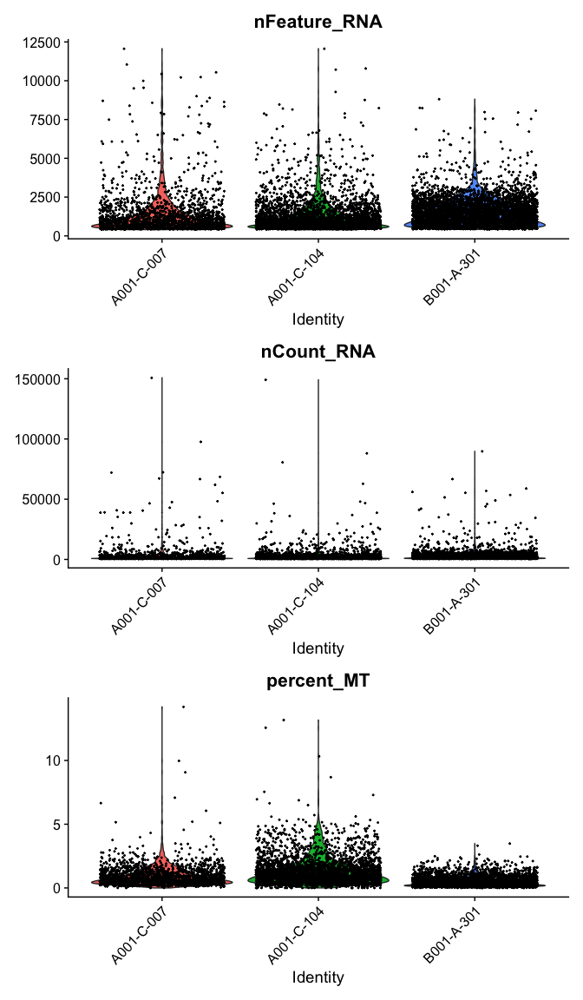<!-- -->

#### Modifying Seurat plots
Modifying the ggplot objects produced by a Seurat plotting function works best on individual panels. Therefore, to recreate the function above with modifications, we can use `lapply` to create a list of plots. In some cases it may be more appropriate to create the plots individually so that different modifications can be applied to each plot.


```r
lapply(c("nFeature_RNA", "nCount_RNA","percent_MT"), function(feature){
  VlnPlot(experiment.aggregate,
          features = feature,
          pt.size = 0.01) +
    scale_fill_viridis_d(option = "mako") # default colors are not colorblind-friendly
})
```

```
## [[1]]
```

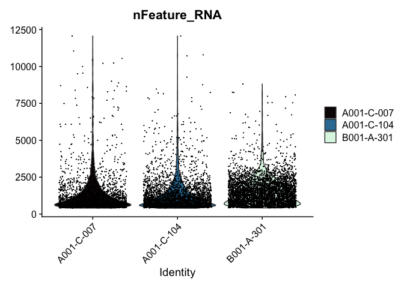<!-- -->

```
## 
## [[2]]
```

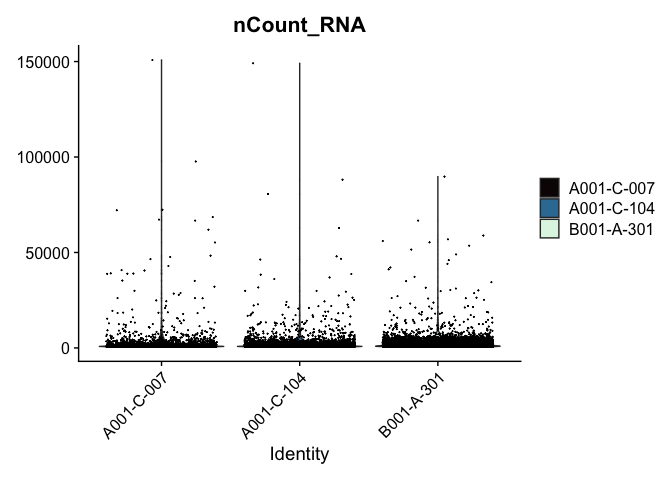<!-- -->

```
## 
## [[3]]
```

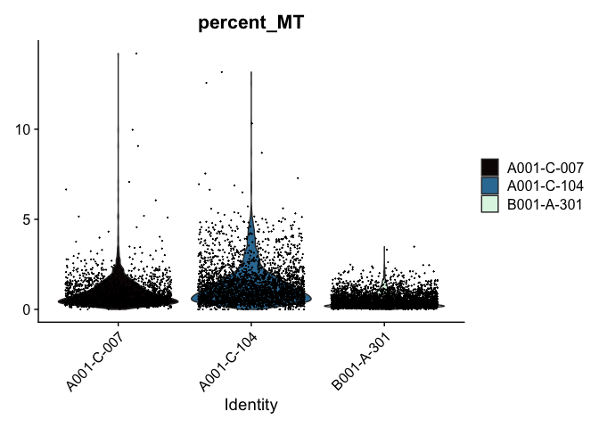<!-- -->

```r
VlnPlot(experiment.aggregate, features = "nCount_RNA", pt.size = 0.01) + 
  scale_y_continuous(trans = "log10") +
  scale_fill_viridis_d(option = "mako") +
  ggtitle("log10(nCount_RNA)")
```

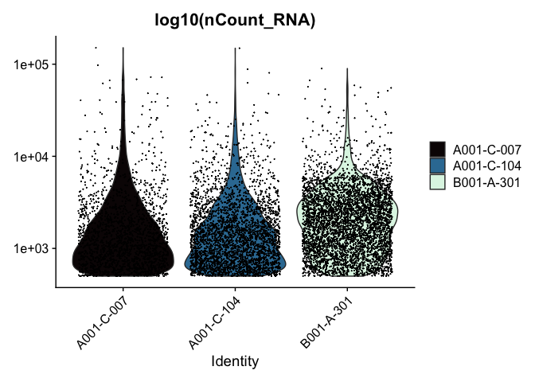<!-- -->

These can later be stitched together with another library, like patchwork, or cowplot.

### Ridge plots

Ridge plots are very similar in appearance to violin plots turned on their sides. In some cases it may be more appropriate to create the plots individually so that appropriate transformations can be applied to each plot.


```r
RidgePlot(experiment.aggregate, features="nFeature_RNA") +
  scale_fill_viridis_d(option = "mako")
```

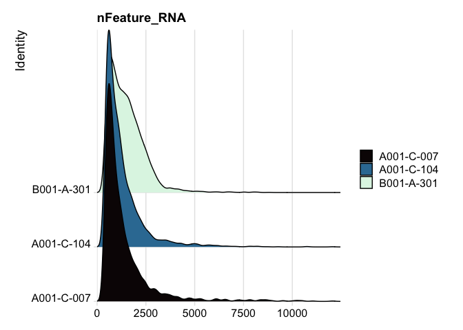<!-- -->

```r
RidgePlot(experiment.aggregate, features="nCount_RNA") +
  scale_x_continuous(trans = "log10") + # "un-squish" the distribution
  scale_fill_viridis_d(option = "mako")
```

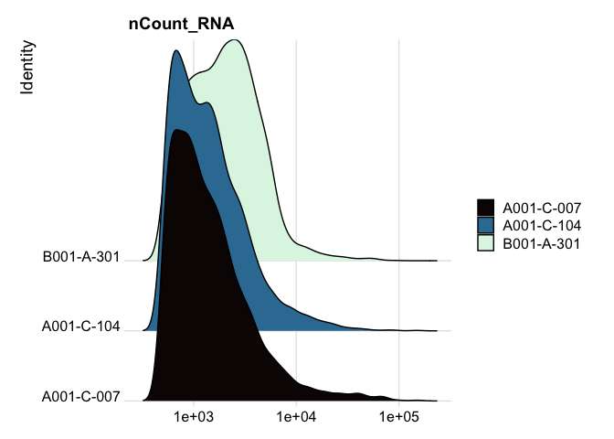<!-- -->

```r
RidgePlot(experiment.aggregate, features="percent_MT") +
  scale_fill_viridis_d(option = "mako") +
  coord_cartesian(xlim = c(0, 10)) # zoom in on the lower end of the distribution
```

<!-- -->

### Custom plots
The Seurat built-in functions are useful and easy to interact with, but sometimes you may wish to visualize something for which a plotting function does not already exist. For example, we might want to see how many cells are expressing each gene over some UMI threshold.

The code below produces a ranked plot similar to the barcode inflection plots from the last section. On the x-axis are the genes arranged from most ubiquitously expressed to rarest. In a single cell dataset, many genes are expessed in a relatively small number of cells, or not at all. The y-axis displays the number of cells in which each gene is expressed.

**Note: this function is SLOW You may want to skip this code block or run it while you take a break for a few minutes.**


```r
# retrieve count data
counts <- GetAssayData(experiment.aggregate)
# order genes from most to least ubiquitous
ranked.genes <- names(sort(Matrix::rowSums(counts >= 3), decreasing = TRUE))
# drop genes not expressed in any cell
ranked.genes <- ranked.genes[ranked.genes %in% names(which(Matrix::rowSums(counts >= 3) >= 1))]
# get number of cells for each sample
cell.counts <- sapply(ranked.genes, function(gene){
  tapply(counts[gene,], experiment.aggregate$orig.ident, function(x){
    sum(x >= 3)
  })
})
cell.counts <- as.data.frame(t(cell.counts))
cell.counts$gene <- rownames(cell.counts)
cell.counts <- melt(cell.counts, variable.name = "sample", value.name = "count")
cell.counts$rank <- match(ranked.genes, cell.counts$gene)
# plot
ggplot(cell.counts, mapping = aes(x = rank, y = count, color = sample)) +
  scale_x_continuous(trans = "log10") +
  scale_y_continuous(trans = "log10") +
  geom_smooth() +
  scale_color_viridis_d(option = "mako") +
  theme_classic() +
  theme(legend.title = element_blank())
```

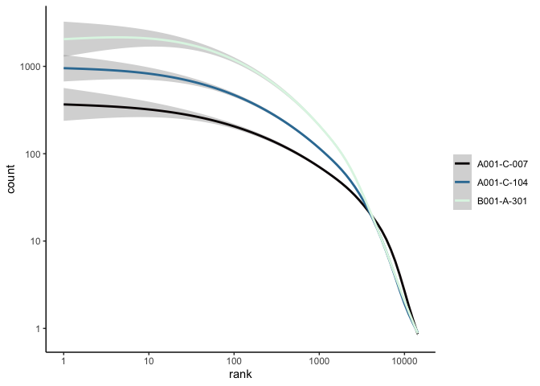<!-- -->

```r
rm(counts, ranked.genes, cell.counts)
```

### Scatter plots

Scatter plots allow us to visualize the relationships between the metadata variables.


```r
# mitochondrial vs UMI
FeatureScatter(experiment.aggregate,
               feature1 = "nCount_RNA",
               feature2 = "percent_MT",
               shuffle = TRUE) +
  scale_color_viridis_d(option = "mako")
```

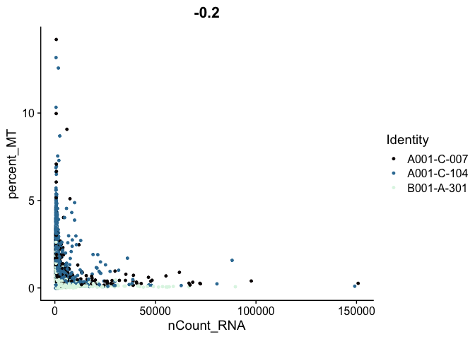<!-- -->

```r
# mitochondrial vs genes
FeatureScatter(experiment.aggregate,
               feature1 = "nFeature_RNA",
               feature2 = "percent_MT",
               shuffle = TRUE) +
  scale_color_viridis_d(option = "mako")
```

<!-- -->

```r
# genes vs UMI
FeatureScatter(experiment.aggregate,
               feature1 = "nCount_RNA",
               feature2 = "nFeature_RNA",
               shuffle = TRUE)  +
  scale_color_viridis_d(option = "mako")
```

<!-- -->

## Cell filtering
The goal of cell filtering is to remove cells with anomolous expression profiles, typically low UMI cells, which may correspond to low-quality cells or background barcodes that made it through the Cell Ranger filtration algorithm. It may also be appropriate to remove outlier cells with extremely high UMI counts.

In this case, the proposed cut-offs on the high end of the distributions are quite conservative, in part to reduce the size of the object and speed up analysis during the workshop.

The plots below display proposed filtering cut-offs.

```r
FeatureScatter(experiment.aggregate,
               feature1 = "nCount_RNA",
               feature2 = "percent_MT",
               shuffle = TRUE) +
  geom_vline(xintercept = c(1000, 25000)) +
  geom_hline(yintercept = 5) +
  scale_color_viridis_d(option = "mako")
```

<!-- -->

```r
FeatureScatter(experiment.aggregate,
               feature1 = "nFeature_RNA",
               feature2 = "percent_MT",
               shuffle = TRUE) +
  geom_vline(xintercept = c(500, 7500)) +
  geom_hline(yintercept = 5) +
  scale_color_viridis_d(option = "mako")
```

<!-- -->

```r
FeatureScatter(experiment.aggregate,
               feature1 = "nCount_RNA",
               feature2 = "nFeature_RNA",
               pt.size = 0.5,
               shuffle = TRUE)  +
  geom_vline(xintercept = c(1000, 25000)) +
  geom_hline(yintercept = c(500, 7500)) +
  scale_color_viridis_d(option = "mako")
```

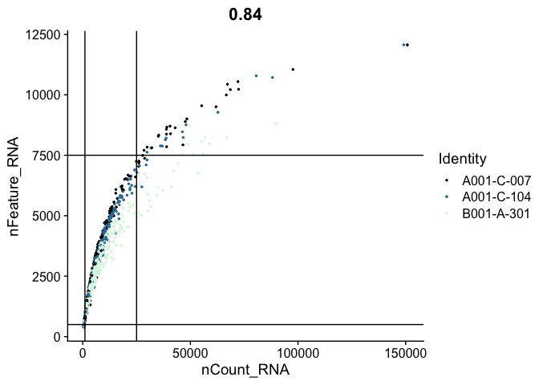<!-- -->

These filters can be put in place with the `subset` function.


```r
table(experiment.aggregate$orig.ident)
```

```
## 
## A001-C-007 A001-C-104 B001-A-301 
##       1796       3142       4514
```

```r
# mitochondrial filter
experiment.filter <- subset(experiment.aggregate, percent_MT <= 5)
# UMI filter
experiment.filter <- subset(experiment.filter, nCount_RNA >= 1000 & nCount_RNA <= 25000)
# gene filter
experiment.filter <- subset(experiment.filter, nFeature_RNA >= 500 & nFeature_RNA <= 7500)
# filtering results
experiment.filter
```

```
## An object of class Seurat 
## 36601 features across 6312 samples within 1 assay 
## Active assay: RNA (36601 features, 0 variable features)
```

```r
table(experiment.filter$orig.ident)
```

```
## 
## A001-C-007 A001-C-104 B001-A-301 
##       1023       1858       3431
```

```r
# ridge plots
RidgePlot(experiment.filter, features="nFeature_RNA") +
  scale_fill_viridis_d(option = "mako")
```

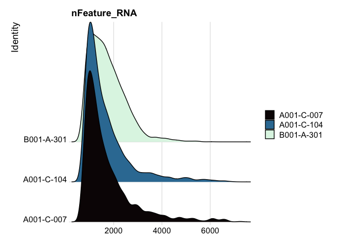<!-- -->

```r
RidgePlot(experiment.filter, features="nCount_RNA") +
  scale_x_continuous(trans = "log10") + 
  scale_fill_viridis_d(option = "mako")
```

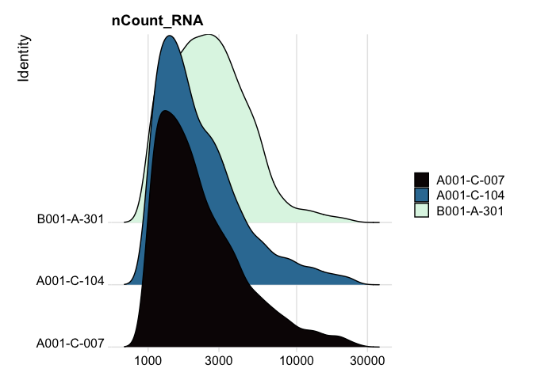<!-- -->

```r
RidgePlot(experiment.filter, features="percent_MT") +
  scale_fill_viridis_d(option = "mako")
```

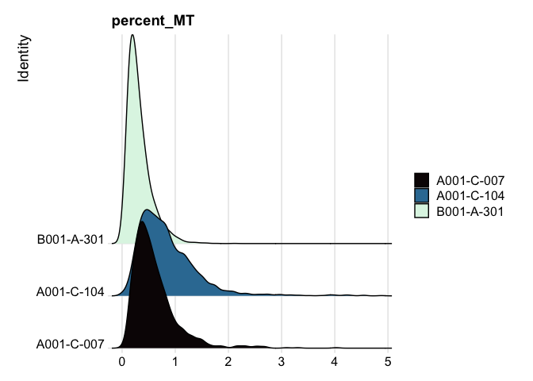<!-- -->

```r
# use filtered results from now on
experiment.aggregate <- experiment.filter
rm(experiment.filter)
```

**Play with the filtering parameters, and see how the results change. Is there a set of parameters you feel is more appropriate? Why?**

## Feature filtering

When creating the base Seurat object, we had the opportunity filter out some genes using the "min.cells" argument. At the time, we set that to 0. Since we didn't filter our features then, we can apply a filter at this point, or if we did filter when the object was created, this would be an opportunity to be more aggressive with filtration. The custom code below provides a function that filters genes requiring a min.umi in at least min.cells, or takes a user-provided list of genes.


```r
# define function
FilterGenes <- function(object, min.umi = NA, min.cells = NA, genes = NULL) {
  genes.use = NA
  if (!is.null(genes)) {
    genes.use = intersect(rownames(object), genes)
    } else if (min.cells & min.umi) {
      num.cells = Matrix::rowSums(GetAssayData(object) >= min.umi)
      genes.use = names(num.cells[which(num.cells >= min.cells)])
    }
  object = object[genes.use,]
  object = LogSeuratCommand(object = object)
  return(object)
}
# apply filter
experiment.filter <- FilterGenes(object = experiment.aggregate, min.umi = 2, min.cells = 10)
# filtering results
experiment.filter
```

```
## An object of class Seurat 
## 11292 features across 6312 samples within 1 assay 
## Active assay: RNA (11292 features, 0 variable features)
```

```r
experiment.aggregate <- experiment.filter
rm(experiment.filter)
```

## Normalize the data

After filtering, the next step is to normalize the data. We employ a global-scaling normalization method LogNormalize that normalizes the gene expression measurements for each cell by the total expression, multiplies this by a scale factor (10,000 by default), and then log-transforms the data.


```r
?NormalizeData
```


```r
experiment.aggregate <- NormalizeData(
  object = experiment.aggregate,
  normalization.method = "LogNormalize",
  scale.factor = 10000)
```

## Cell cycle assignment
Cell cycle phase can be a significant source of variation in single cell and single nucleus experiments. There are a number of automated cell cycle stage detection methods available for single cell data. For this workshop, we will be using the built-in Seurat cell cycle function, `CellCycleScoring`. This tool compares gene expression in each cell to a list of cell cycle marker genes and scores each barcode based on marker expression. The phase with the highest score is selected for each barcode. Seurat includes a list of cell cycle genes in human single cell data.


```r
s.genes <- cc.genes$s.genes
g2m.genes <- cc.genes$g2m.genes
```

For other species, a user-provided gene list may be substituted, or the orthologs of the human gene list used instead.

**Do not run the code below for human experiments!**

```r
# mouse code DO NOT RUN for human data
convertHumanGeneList <- function(x){
  require("biomaRt")
  human = useEnsembl("ensembl",
                     dataset = "hsapiens_gene_ensembl",
                     mirror = "uswest")
  mouse = useEnsembl("ensembl",
                     dataset = "mmusculus_gene_ensembl",
                     mirror = "uswest")
  genes = getLDS(attributes = c("hgnc_symbol"),
                 filters = "hgnc_symbol",
                 values = x ,
                 mart = human,
                 attributesL = c("mgi_symbol"),
                 martL = mouse,
                 uniqueRows=T)
  humanx = unique(genes[, 2])
  print(head(humanx)) # print first 6 genes found to the screen
  return(humanx)
}
# convert lists to mouse orthologs
s.genes <- convertHumanGeneList(cc.genes.updated.2019$s.genes)
g2m.genes <- convertHumanGeneList(cc.genes.updated.2019$g2m.genes)
```

Once an appropriate gene list has been identified, the `CellCycleScoring` function can be run.


```r
experiment.aggregate <- CellCycleScoring(experiment.aggregate,
                                         s.features = s.genes,
                                         g2m.features = g2m.genes,
                                         set.ident = TRUE)
table(experiment.aggregate@meta.data$Phase) %>%
  kable(caption = "Number of Cells in each Cell Cycle Stage",
        col.names = c("Stage", "Count"),
        align = "c") %>%
  kable_styling()
```

<table class="table" style="margin-left: auto; margin-right: auto;">
<caption>Number of Cells in each Cell Cycle Stage</caption>
 <thead>
  <tr>
   <th style="text-align:center;"> Stage </th>
   <th style="text-align:center;"> Count </th>
  </tr>
 </thead>
<tbody>
  <tr>
   <td style="text-align:center;"> G1 </td>
   <td style="text-align:center;"> 3759 </td>
  </tr>
  <tr>
   <td style="text-align:center;"> G2M </td>
   <td style="text-align:center;"> 1136 </td>
  </tr>
  <tr>
   <td style="text-align:center;"> S </td>
   <td style="text-align:center;"> 1417 </td>
  </tr>
</tbody>
</table>

```r
rm(s.genes, g2m.genes)
```

Because the "set.ident" argument was set to TRUE (this is also the default behavior), the active identity of the Seurat object was changed to the phase. To return the active identity to the sample identity, use the `Idents` function.


```r
table(Idents(experiment.aggregate))
```

```
## 
##    S  G2M   G1 
## 1417 1136 3759
```

```r
Idents(experiment.aggregate) <- "orig.ident"
table(Idents(experiment.aggregate))
```

```
## 
## A001-C-007 A001-C-104 B001-A-301 
##       1023       1858       3431
```


## Identify variable genes

The function FindVariableFeatures identifies the most highly variable genes (default 2000 genes) by fitting a line to the relationship of log(variance) and log(mean) using loess smoothing, uses this information to standardize the data, then calculates the variance of the standardized data.  This helps avoid selecting genes that only appear variable due to their expression level.


```r
?FindVariableFeatures
```


```r
experiment.aggregate <- FindVariableFeatures(
  object = experiment.aggregate,
  selection.method = "vst")
length(VariableFeatures(experiment.aggregate))
```

```
## [1] 2000
```

```r
top10 <- head(VariableFeatures(experiment.aggregate), 10)
top10
```

```
##  [1] "BEST4"      "CLCA4"      "SMOC2"      "NRG1"       "TPH1"      
##  [6] "LRMP"       "TRPM3"      "PTPRR"      "AC007493.1" "CACNA1A"
```

```r
vfp1 <- VariableFeaturePlot(experiment.aggregate)
vfp1 <- LabelPoints(plot = vfp1, points = top10, repel = TRUE)
vfp1
```

<!-- -->

**How do the results change if you use selection.method = "dispersion" or selection.method = "mean.var.plot"?**

FindVariableFeatures isn't the only way to set the "variable features" of a Seurat object. Another reasonable approach is to select a set of "minimally expressed" genes.


```r
min.value <- 2
min.cells <- 10

num.cells <- Matrix::rowSums(GetAssayData(experiment.aggregate, slot = "count") > min.value)
genes.use <- names(num.cells[which(num.cells >= min.cells)])
length(genes.use)
```

```
## [1] 7012
```

```r
VariableFeatures(experiment.aggregate) <- genes.use
rm(min.value, min.cells, num.cells, genes.use)
```

## Save the Seurat object and download the next Rmd file

```r
saveRDS(experiment.aggregate, file="scRNA_workshop_2.rds")
download.file("https://raw.githubusercontent.com/ucdavis-bioinformatics-training/2023-June-Single-Cell-RNA-Seq-Analysis/main/data_analysis/scRNA_Workshop-PART3.Rmd", "scRNA_Workshop-PART3.Rmd")
```

## Session Information

```r
sessionInfo()
```

```
## R version 4.1.0 (2021-05-18)
## Platform: x86_64-apple-darwin17.0 (64-bit)
## Running under: macOS Big Sur 10.16
## 
## Matrix products: default
## BLAS:   /Library/Frameworks/R.framework/Versions/4.1/Resources/lib/libRblas.dylib
## LAPACK: /Library/Frameworks/R.framework/Versions/4.1/Resources/lib/libRlapack.dylib
## 
## locale:
## [1] en_US.UTF-8/en_US.UTF-8/en_US.UTF-8/C/en_US.UTF-8/en_US.UTF-8
## 
## attached base packages:
## [1] stats     graphics  grDevices utils     datasets  methods   base     
## 
## other attached packages:
## [1] reshape2_1.4.4     kableExtra_1.3.4   knitr_1.43         ggplot2_3.4.2     
## [5] biomaRt_2.50.3     SeuratObject_4.1.3 Seurat_4.3.0      
## 
## loaded via a namespace (and not attached):
##   [1] systemfonts_1.0.4      BiocFileCache_2.2.1    plyr_1.8.8            
##   [4] igraph_1.5.0           lazyeval_0.2.2         sp_1.6-1              
##   [7] splines_4.1.0          listenv_0.9.0          scattermore_1.2       
##  [10] GenomeInfoDb_1.30.1    digest_0.6.31          htmltools_0.5.5       
##  [13] fansi_1.0.4            magrittr_2.0.3         memoise_2.0.1         
##  [16] tensor_1.5             cluster_2.1.4          ROCR_1.0-11           
##  [19] globals_0.16.2         Biostrings_2.62.0      matrixStats_1.0.0     
##  [22] svglite_2.1.1          spatstat.sparse_3.0-1  prettyunits_1.1.1     
##  [25] colorspace_2.1-0       rvest_1.0.3            rappdirs_0.3.3        
##  [28] blob_1.2.4             ggrepel_0.9.3          xfun_0.39             
##  [31] dplyr_1.1.2            crayon_1.5.2           RCurl_1.98-1.12       
##  [34] jsonlite_1.8.5         progressr_0.13.0       spatstat.data_3.0-1   
##  [37] survival_3.5-5         zoo_1.8-12             glue_1.6.2            
##  [40] polyclip_1.10-4        gtable_0.3.3           zlibbioc_1.40.0       
##  [43] XVector_0.34.0         webshot_0.5.4          leiden_0.4.3          
##  [46] future.apply_1.11.0    BiocGenerics_0.40.0    abind_1.4-5           
##  [49] scales_1.2.1           DBI_1.1.3              spatstat.random_3.1-5 
##  [52] miniUI_0.1.1.1         Rcpp_1.0.10            progress_1.2.2        
##  [55] viridisLite_0.4.2      xtable_1.8-4           reticulate_1.30       
##  [58] bit_4.0.5              stats4_4.1.0           htmlwidgets_1.6.2     
##  [61] httr_1.4.6             RColorBrewer_1.1-3     ellipsis_0.3.2        
##  [64] ica_1.0-3              farver_2.1.1           pkgconfig_2.0.3       
##  [67] XML_3.99-0.14          dbplyr_2.3.2           sass_0.4.6            
##  [70] uwot_0.1.14            deldir_1.0-9           utf8_1.2.3            
##  [73] labeling_0.4.2         tidyselect_1.2.0       rlang_1.1.1           
##  [76] later_1.3.1            AnnotationDbi_1.56.2   munsell_0.5.0         
##  [79] tools_4.1.0            cachem_1.0.8           cli_3.6.1             
##  [82] generics_0.1.3         RSQLite_2.3.1          ggridges_0.5.4        
##  [85] evaluate_0.21          stringr_1.5.0          fastmap_1.1.1         
##  [88] yaml_2.3.7             goftest_1.2-3          bit64_4.0.5           
##  [91] fitdistrplus_1.1-11    purrr_1.0.1            RANN_2.6.1            
##  [94] KEGGREST_1.34.0        pbapply_1.7-0          future_1.32.0         
##  [97] nlme_3.1-162           mime_0.12              xml2_1.3.4            
## [100] compiler_4.1.0         rstudioapi_0.14        filelock_1.0.2        
## [103] curl_5.0.1             plotly_4.10.2          png_0.1-8             
## [106] spatstat.utils_3.0-3   tibble_3.2.1           bslib_0.5.0           
## [109] stringi_1.7.12         highr_0.10             lattice_0.21-8        
## [112] Matrix_1.5-4.1         vctrs_0.6.3            pillar_1.9.0          
## [115] lifecycle_1.0.3        spatstat.geom_3.2-1    lmtest_0.9-40         
## [118] jquerylib_0.1.4        RcppAnnoy_0.0.20       data.table_1.14.8     
## [121] cowplot_1.1.1          bitops_1.0-7           irlba_2.3.5.1         
## [124] httpuv_1.6.11          patchwork_1.1.2        R6_2.5.1              
## [127] promises_1.2.0.1       KernSmooth_2.23-21     gridExtra_2.3         
## [130] IRanges_2.28.0         parallelly_1.36.0      codetools_0.2-19      
## [133] MASS_7.3-60            withr_2.5.0            sctransform_0.3.5     
## [136] S4Vectors_0.32.4       GenomeInfoDbData_1.2.7 mgcv_1.8-42           
## [139] hms_1.1.3              parallel_4.1.0         grid_4.1.0            
## [142] tidyr_1.3.0            rmarkdown_2.22         Rtsne_0.16            
## [145] spatstat.explore_3.2-1 Biobase_2.54.0         shiny_1.7.4
```
