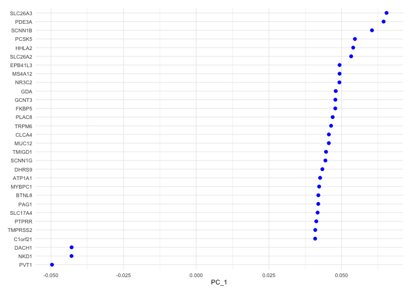
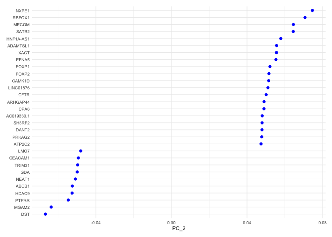
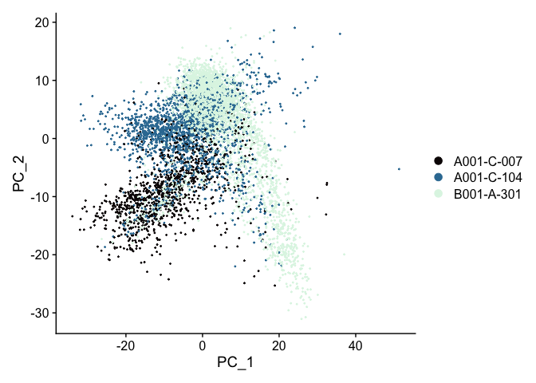
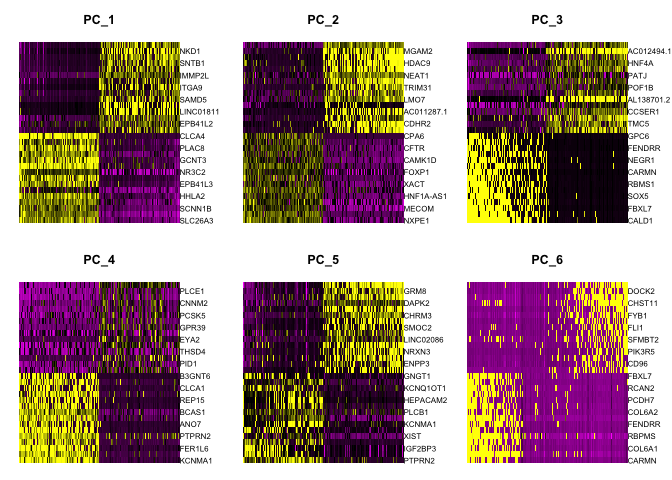
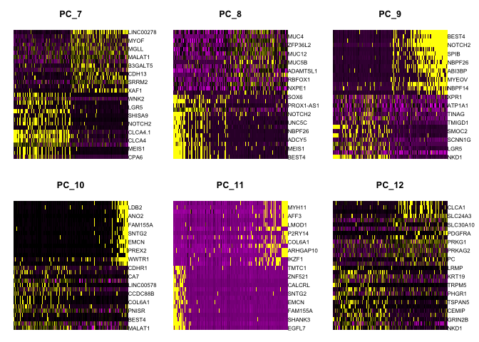
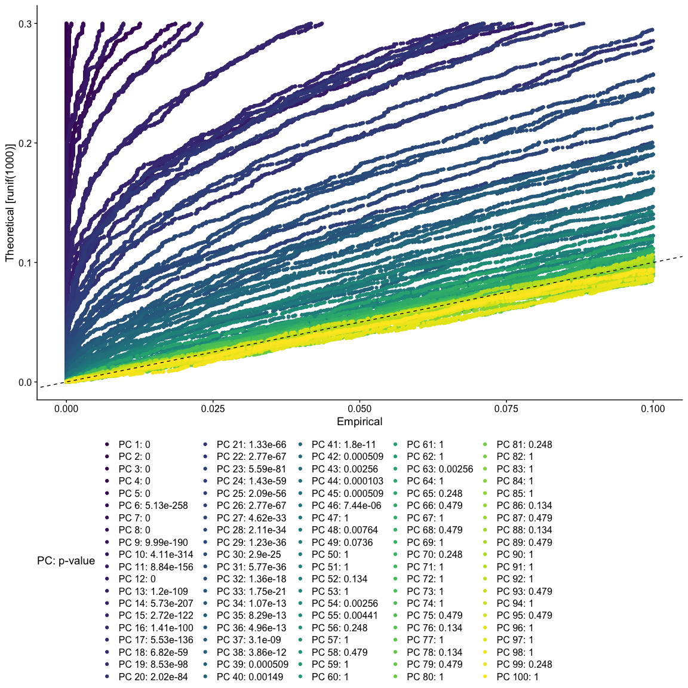

Last Updated: June 19, 2023

# Part 3: PCA and choice in number of PCS

## Setup

First, load the required R libraries.

```r
library(Seurat)
library(knitr)
library(ggplot2)
```

Next, read in the saved Seurat object from the previous section.

```r
experiment.aggregate <- readRDS(file="scRNA_workshop_2.rds")
experiment.aggregate
```

<div class='r_output'> An object of class Seurat
 11292 features across 6312 samples within 1 assay
 Active assay: RNA (11292 features, 7012 variable features)
</div>
Set a seed for any pseudo-random functions.

```r
set.seed(12345)
```

## Scale the data

The `ScaleData` function scales and centers genes in the dataset. If variables are provided with the "vars.to.regress" argument, they are individually regressed against each gene, and the resulting residuals are then scaled and centered unless otherwise specified. We regress out cell cycle results S.Score and G2M.Score, mitochondrial RNA level (percent_MT), and the number of features (nFeature_RNA) as a proxy for sequencing depth.


```r
experiment.aggregate <- ScaleData(experiment.aggregate,
                                  vars.to.regress = c("S.Score", "G2M.Score", "percent_MT", "nFeature_RNA"))
```

## Perform dimensionality reduction with PCA

Next we perform PCA (principal components analysis) on the scaled data.  


```r
?RunPCA
```


```r
experiment.aggregate <- RunPCA(experiment.aggregate, npcs = 100)
```

Seurat provides a number of ways to visualize the PCA results.

### PCA loadings

The top genes associated with the reduction component are plotted for the selected dimension.


```r
VizDimLoadings(experiment.aggregate, dims = 1, ncol = 1) + theme_minimal(base_size = 8)
```

<!-- -->

```r
VizDimLoadings(experiment.aggregate, dims = 2, ncol = 1) + theme_minimal(base_size = 8)
```

<!-- -->

### Principal components plot

A scatter plot showing the placement of each cell on two selected components, by default, the first and second.


```r
DimPlot(experiment.aggregate,
        reduction = "pca",
        shuffle = TRUE) +
  scale_color_viridis_d(option = "mako")
```

<!-- -->

### Heat map

Heat maps can be drawn for each component. Both cells and genes are sorted by their principal component scores. This allows for nice visualization of sources of heterogeneity in the dataset.


```r
DimHeatmap(experiment.aggregate, dims = 1:6, cells = 500, balanced = TRUE)
```

<!-- -->

```r
DimHeatmap(experiment.aggregate, dims = 7:12, cells = 500, balanced = TRUE)
```

<!-- -->

#### Explore

Re-import the original data and try modifying the ScaleData vars.to.regress argument. You could remove some variables, or add others. What happens? See how choices effect the plots.


```r
experiment.explore <- readRDS("scRNA_workshop_2.rds")
experiment.explore <- ScaleData(experiment.explore) # make changes here to explore the data
experiment.explore <- RunPCA(experiment.explore) # what happens if you adjust npcs?
VizDimLoadings(experiment.explore, dims = 1:2)
DimPlot(experiment.explore, reduction = "pca")
DimHeatmap(experiment.explore, dims = 1:6, cells = 500, balanced = TRUE) # adjust parameters
rm(experiment.explore)
```

## Selecting PCs to use

To overcome the extensive technical noise in any single gene, Seurat clusters cells based on their PCA scores, with each PC essentially representing a metagene that combines information across a correlated gene set. Determining how many PCs to include downstream is therefore an important step.

### Elbow plot

An elbow plot displays the standard deviations (or approximate singular values if running PCAFast) of the principle components for easy identification of an elbow in the graph. This elbow often corresponds well with the significant PCs and is much faster to run.  This is the traditional approach to selecting principal components.

The appearance of elbow plots tends to be highly consistent across single cell / single nucleus experiments. Generally, the line approaches zero at around PC 50. This is a reasonable number of PCs to use for the downstream steps.


```r
ElbowPlot(experiment.aggregate, ndims = 100)
```

<!-- -->

### JackStraw

The JackStraw function randomly permutes a subset of data, and calculates projected PCA scores for these genes. The PCA scores for these randomly permuted genes are then compared with the observed PCA scores to determine statistical significance. The end result is a p-value for each gene's association with each principal component.

PCs with a strong enrichment of low p-value genes are identified as significant components.

**The JackStraw permutation is computationally intensive and can be quite slow. Consider skipping this step and exploring the function when you have some extra time.**


```r
experiment.aggregate <- JackStraw(experiment.aggregate, dims = 100)
experiment.aggregate <- ScoreJackStraw(experiment.aggregate, dims = 1:100)
JackStrawPlot(object = experiment.aggregate, dims = 1:100) +
  scale_color_viridis_d() +
  theme(legend.position="bottom")
```

<!-- -->

## Save the Seurat object and download the next Rmd file

```r
saveRDS(experiment.aggregate, file="scRNA_workshop_3.rds")
download.file("https://raw.githubusercontent.com/ucdavis-bioinformatics-training/2023-June-Single-Cell-RNA-Seq-Analysis/main/data_analysis/scRNA_Workshop-PART4.Rmd", "scRNA_Workshop-PART4.Rmd")
```

## Session Information

```r
sessionInfo()
```

<div class='r_output'> R version 4.1.0 (2021-05-18)
 Platform: x86_64-apple-darwin17.0 (64-bit)
 Running under: macOS Big Sur 10.16

 Matrix products: default
 BLAS:   /Library/Frameworks/R.framework/Versions/4.1/Resources/lib/libRblas.dylib
 LAPACK: /Library/Frameworks/R.framework/Versions/4.1/Resources/lib/libRlapack.dylib

 locale:
 [1] en_US.UTF-8/en_US.UTF-8/en_US.UTF-8/C/en_US.UTF-8/en_US.UTF-8

 attached base packages:
 [1] stats     graphics  grDevices utils     datasets  methods   base     

 other attached packages:
 [1] ggplot2_3.4.2      knitr_1.43         SeuratObject_4.1.3 Seurat_4.3.0      

 loaded via a namespace (and not attached):
   [1] Rtsne_0.16             colorspace_2.1-0       deldir_1.0-9          
   [4] ellipsis_0.3.2         ggridges_0.5.4         rstudioapi_0.14       
   [7] spatstat.data_3.0-1    farver_2.1.1           leiden_0.4.3          
  [10] listenv_0.9.0          ggrepel_0.9.3          fansi_1.0.4           
  [13] codetools_0.2-19       splines_4.1.0          cachem_1.0.8          
  [16] polyclip_1.10-4        jsonlite_1.8.5         ica_1.0-3             
  [19] cluster_2.1.4          png_0.1-8              uwot_0.1.14           
  [22] shiny_1.7.4            sctransform_0.3.5      spatstat.sparse_3.0-1
  [25] compiler_4.1.0         httr_1.4.6             Matrix_1.5-4.1        
  [28] fastmap_1.1.1          lazyeval_0.2.2         cli_3.6.1             
  [31] later_1.3.1            htmltools_0.5.5        tools_4.1.0           
  [34] igraph_1.5.0           gtable_0.3.3           glue_1.6.2            
  [37] RANN_2.6.1             reshape2_1.4.4         dplyr_1.1.2           
  [40] Rcpp_1.0.10            scattermore_1.2        jquerylib_0.1.4       
  [43] vctrs_0.6.3            nlme_3.1-162           spatstat.explore_3.2-1
  [46] progressr_0.13.0       lmtest_0.9-40          spatstat.random_3.1-5
  [49] xfun_0.39              stringr_1.5.0          globals_0.16.2        
  [52] mime_0.12              miniUI_0.1.1.1         lifecycle_1.0.3       
  [55] irlba_2.3.5.1          goftest_1.2-3          future_1.32.0         
  [58] MASS_7.3-60            zoo_1.8-12             scales_1.2.1          
  [61] promises_1.2.0.1       spatstat.utils_3.0-3   parallel_4.1.0        
  [64] RColorBrewer_1.1-3     yaml_2.3.7             reticulate_1.30       
  [67] pbapply_1.7-0          gridExtra_2.3          sass_0.4.6            
  [70] stringi_1.7.12         highr_0.10             rlang_1.1.1           
  [73] pkgconfig_2.0.3        matrixStats_1.0.0      evaluate_0.21         
  [76] lattice_0.21-8         ROCR_1.0-11            purrr_1.0.1           
  [79] tensor_1.5             labeling_0.4.2         patchwork_1.1.2       
  [82] htmlwidgets_1.6.2      cowplot_1.1.1          tidyselect_1.2.0      
  [85] parallelly_1.36.0      RcppAnnoy_0.0.20       plyr_1.8.8            
  [88] magrittr_2.0.3         R6_2.5.1               generics_0.1.3        
  [91] DBI_1.1.3              withr_2.5.0            pillar_1.9.0          
  [94] fitdistrplus_1.1-11    survival_3.5-5         abind_1.4-5           
  [97] sp_1.6-1               tibble_3.2.1           future.apply_1.11.0   
 [100] KernSmooth_2.23-21     utf8_1.2.3             spatstat.geom_3.2-1   
 [103] plotly_4.10.2          rmarkdown_2.22         grid_4.1.0            
 [106] data.table_1.14.8      digest_0.6.31          xtable_1.8-4          
 [109] tidyr_1.3.0            httpuv_1.6.11          munsell_0.5.0         
 [112] viridisLite_0.4.2      bslib_0.5.0
</div>
