Last Updated: June 20, 2023

# Part 4: Clustering

## Setup

Load the required libraries and read in the saved object from the previous section.


```r
library(Seurat)
library(kableExtra)
library(tidyr)
library(dplyr)
library(ggplot2)
library(dplyr)

experiment.aggregate <- readRDS("scRNA_workshop_3.rds")
experiment.aggregate
```

<div class='r_output'> An object of class Seurat
 11292 features across 6312 samples within 1 assay
 Active assay: RNA (11292 features, 7012 variable features)
  1 dimensional reduction calculated: pca
</div>
```r
set.seed(12345)
```


## Select compenents

In the previous section, we looked at the principal components analysis in a number of different ways. Now we need to select the components that will be used in the following steps (dimensionality reduction by UMAP or tSNE and clustering). If we use too few components, we risk leaving out interesting variation that may define cell types. What happens if we use too many? A greater number of PCs will increase the computational time of following steps.

Lets choose the first 50, based on the elbow plot from the last section.


```r
use.pcs <- 1:50
```

## Cluster

Seurat implements an graph-based clustering approach. Distances between the cells are calculated based on previously identified PCs.

The default method for identifying k-nearest neighbors has been changed in V4 to [annoy](https://github.com/spotify/annoy) ("Approximate Nearest Neighbors Oh Yeah!). This is an approximate nearest-neighbor approach that is widely used for high-dimensional analysis in many fields, including single-cell analysis. Extensive community benchmarking has shown that annoy substantially improves the speed and memory requirements of neighbor discovery, with negligible impact to downstream results.

Seurat prior approach was heavily inspired by recent manuscripts which applied graph-based clustering approaches to scRNAseq data. Briefly, Seurat identified clusters of cells by a shared nearest neighbor (SNN) modularity optimization based clustering algorithm. First calculate k-nearest neighbors (KNN) and construct the SNN graph. Then optimize the modularity function to determine clusters. For a full description of the algorithms, see Waltman and van Eck (2013) The European Physical Journal B. You can switch back to using the previous default setting using nn.method="rann".

The FindClusters function implements the neighbor based clustering procedure, and contains a resolution parameter that sets the granularity of the downstream clustering, with increased values leading to a greater number of clusters. This code produces a series of resolutions for us to investigate and choose from.


```r
?FindNeighbors
```


```r
experiment.aggregate <- FindNeighbors(experiment.aggregate, reduction = "pca", dims = use.pcs)
experiment.aggregate <- FindClusters(experiment.aggregate,
                                     resolution = seq(0.25, 4, 0.5))
```

Seurat adds the clustering information to the metadata beginning with "RNA_snn_res." followed by the resolution.


```r
head(experiment.aggregate@meta.data) %>%
  kable(caption = 'Cluster identities are added to the meta.data slot.') %>%
  kable_styling("striped")
```

<table class="table table-striped" style="margin-left: auto; margin-right: auto;">
<caption>Cluster identities are added to the meta.data slot.</caption>
 <thead>
  <tr>
   <th style="text-align:left;">   </th>
   <th style="text-align:left;"> orig.ident </th>
   <th style="text-align:right;"> nCount_RNA </th>
   <th style="text-align:right;"> nFeature_RNA </th>
   <th style="text-align:right;"> percent_MT </th>
   <th style="text-align:right;"> S.Score </th>
   <th style="text-align:right;"> G2M.Score </th>
   <th style="text-align:left;"> Phase </th>
   <th style="text-align:left;"> old.ident </th>
   <th style="text-align:left;"> RNA_snn_res.0.25 </th>
   <th style="text-align:left;"> RNA_snn_res.0.75 </th>
   <th style="text-align:left;"> RNA_snn_res.1.25 </th>
   <th style="text-align:left;"> RNA_snn_res.1.75 </th>
   <th style="text-align:left;"> RNA_snn_res.2.25 </th>
   <th style="text-align:left;"> RNA_snn_res.2.75 </th>
   <th style="text-align:left;"> RNA_snn_res.3.25 </th>
   <th style="text-align:left;"> RNA_snn_res.3.75 </th>
   <th style="text-align:left;"> seurat_clusters </th>
  </tr>
 </thead>
<tbody>
  <tr>
   <td style="text-align:left;"> AAACCCAAGTTATGGA_A001-C-007 </td>
   <td style="text-align:left;"> A001-C-007 </td>
   <td style="text-align:right;"> 2024 </td>
   <td style="text-align:right;"> 1496 </td>
   <td style="text-align:right;"> 0.5774783 </td>
   <td style="text-align:right;"> 0.0287929 </td>
   <td style="text-align:right;"> -0.1413033 </td>
   <td style="text-align:left;"> S </td>
   <td style="text-align:left;"> A001-C-007 </td>
   <td style="text-align:left;"> 5 </td>
   <td style="text-align:left;"> 8 </td>
   <td style="text-align:left;"> 10 </td>
   <td style="text-align:left;"> 10 </td>
   <td style="text-align:left;"> 10 </td>
   <td style="text-align:left;"> 21 </td>
   <td style="text-align:left;"> 20 </td>
   <td style="text-align:left;"> 21 </td>
   <td style="text-align:left;"> 21 </td>
  </tr>
  <tr>
   <td style="text-align:left;"> AAACGCTTCTCTGCTG_A001-C-007 </td>
   <td style="text-align:left;"> A001-C-007 </td>
   <td style="text-align:right;"> 1401 </td>
   <td style="text-align:right;"> 1036 </td>
   <td style="text-align:right;"> 1.1486486 </td>
   <td style="text-align:right;"> 0.2739756 </td>
   <td style="text-align:right;"> 0.8777017 </td>
   <td style="text-align:left;"> G2M </td>
   <td style="text-align:left;"> A001-C-007 </td>
   <td style="text-align:left;"> 9 </td>
   <td style="text-align:left;"> 14 </td>
   <td style="text-align:left;"> 18 </td>
   <td style="text-align:left;"> 20 </td>
   <td style="text-align:left;"> 22 </td>
   <td style="text-align:left;"> 24 </td>
   <td style="text-align:left;"> 24 </td>
   <td style="text-align:left;"> 25 </td>
   <td style="text-align:left;"> 25 </td>
  </tr>
  <tr>
   <td style="text-align:left;"> AAAGAACGTGCTTATG_A001-C-007 </td>
   <td style="text-align:left;"> A001-C-007 </td>
   <td style="text-align:right;"> 1624 </td>
   <td style="text-align:right;"> 1125 </td>
   <td style="text-align:right;"> 0.4219409 </td>
   <td style="text-align:right;"> -0.0702453 </td>
   <td style="text-align:right;"> -0.0551464 </td>
   <td style="text-align:left;"> G1 </td>
   <td style="text-align:left;"> A001-C-007 </td>
   <td style="text-align:left;"> 5 </td>
   <td style="text-align:left;"> 8 </td>
   <td style="text-align:left;"> 10 </td>
   <td style="text-align:left;"> 10 </td>
   <td style="text-align:left;"> 10 </td>
   <td style="text-align:left;"> 20 </td>
   <td style="text-align:left;"> 19 </td>
   <td style="text-align:left;"> 19 </td>
   <td style="text-align:left;"> 19 </td>
  </tr>
  <tr>
   <td style="text-align:left;"> AAAGAACGTTTCGCTC_A001-C-007 </td>
   <td style="text-align:left;"> A001-C-007 </td>
   <td style="text-align:right;"> 1683 </td>
   <td style="text-align:right;"> 1177 </td>
   <td style="text-align:right;"> 0.4595060 </td>
   <td style="text-align:right;"> 0.0843744 </td>
   <td style="text-align:right;"> 1.0192889 </td>
   <td style="text-align:left;"> G2M </td>
   <td style="text-align:left;"> A001-C-007 </td>
   <td style="text-align:left;"> 4 </td>
   <td style="text-align:left;"> 2 </td>
   <td style="text-align:left;"> 14 </td>
   <td style="text-align:left;"> 16 </td>
   <td style="text-align:left;"> 18 </td>
   <td style="text-align:left;"> 18 </td>
   <td style="text-align:left;"> 18 </td>
   <td style="text-align:left;"> 18 </td>
   <td style="text-align:left;"> 18 </td>
  </tr>
  <tr>
   <td style="text-align:left;"> AAAGGATTCATTACCT_A001-C-007 </td>
   <td style="text-align:left;"> A001-C-007 </td>
   <td style="text-align:right;"> 1178 </td>
   <td style="text-align:right;"> 936 </td>
   <td style="text-align:right;"> 0.8176615 </td>
   <td style="text-align:right;"> -0.0128403 </td>
   <td style="text-align:right;"> 0.1327610 </td>
   <td style="text-align:left;"> G2M </td>
   <td style="text-align:left;"> A001-C-007 </td>
   <td style="text-align:left;"> 4 </td>
   <td style="text-align:left;"> 2 </td>
   <td style="text-align:left;"> 14 </td>
   <td style="text-align:left;"> 16 </td>
   <td style="text-align:left;"> 18 </td>
   <td style="text-align:left;"> 18 </td>
   <td style="text-align:left;"> 18 </td>
   <td style="text-align:left;"> 18 </td>
   <td style="text-align:left;"> 18 </td>
  </tr>
  <tr>
   <td style="text-align:left;"> AAAGTGACACGCTTAA_A001-C-007 </td>
   <td style="text-align:left;"> A001-C-007 </td>
   <td style="text-align:right;"> 2701 </td>
   <td style="text-align:right;"> 1779 </td>
   <td style="text-align:right;"> 0.3259689 </td>
   <td style="text-align:right;"> -0.0803025 </td>
   <td style="text-align:right;"> 0.0327879 </td>
   <td style="text-align:left;"> G2M </td>
   <td style="text-align:left;"> A001-C-007 </td>
   <td style="text-align:left;"> 5 </td>
   <td style="text-align:left;"> 8 </td>
   <td style="text-align:left;"> 10 </td>
   <td style="text-align:left;"> 10 </td>
   <td style="text-align:left;"> 10 </td>
   <td style="text-align:left;"> 21 </td>
   <td style="text-align:left;"> 20 </td>
   <td style="text-align:left;"> 21 </td>
   <td style="text-align:left;"> 21 </td>
  </tr>
</tbody>
</table>

## Explore clustering resolutions

Lets first investigate how many clusters each resolution produces and set it to the smallest resolutions of 0.5 (fewest clusters).


```r
cluster.resolutions <- grep("res", colnames(experiment.aggregate@meta.data), value = TRUE)
sapply(cluster.resolutions, function(x) length(levels(experiment.aggregate@meta.data[,x])))
```

<div class='r_output'> RNA_snn_res.0.25 RNA_snn_res.0.75 RNA_snn_res.1.25 RNA_snn_res.1.75
               12               21               25               27
 RNA_snn_res.2.25 RNA_snn_res.2.75 RNA_snn_res.3.25 RNA_snn_res.3.75
               30               33               34               35
</div>
### Visualize clustering

Dimensionality reduction plots can be used to visualize the clustering results. On these plots, we can see how each clustering resolution aligns with patterns in the data revealed by dimensionality reductions.

#### tSNE


```r
# calculate tSNE
experiment.aggregate <- RunTSNE(experiment.aggregate,
                                reduction.use = "pca",
                                dims = use.pcs,
                                do.fast = TRUE)
# tSNE colored by sample identity
DimPlot(experiment.aggregate,
        group.by = "orig.ident",
        reduction = "tsne",
        shuffle = TRUE) +
  scale_color_viridis_d(option = "mako")
```

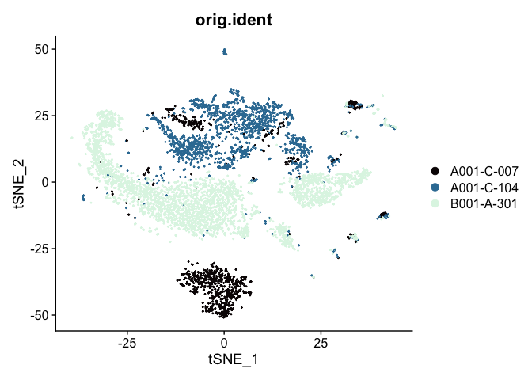<!-- -->

```r
# tSNE colored by cluster
lapply(cluster.resolutions, function(res){
  DimPlot(experiment.aggregate,
          group.by = res,
          reduction = "tsne",
          label = TRUE,
          shuffle = TRUE) +
    scale_color_viridis_d(option = "turbo")
})
```

<div class='r_output'> [[1]]
</div>
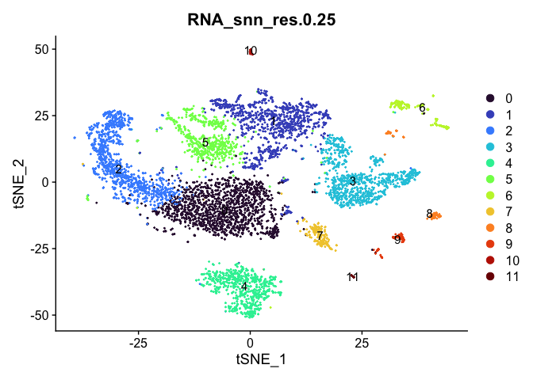<!-- -->

<div class='r_output'>
 [[2]]
</div>
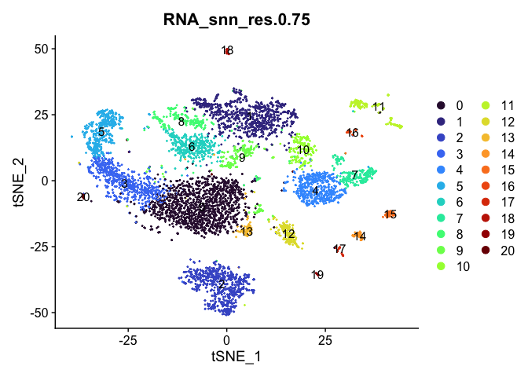<!-- -->

<div class='r_output'>
 [[3]]
</div>
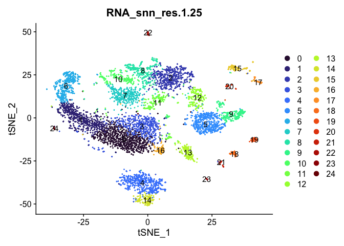<!-- -->

<div class='r_output'>
 [[4]]
</div>
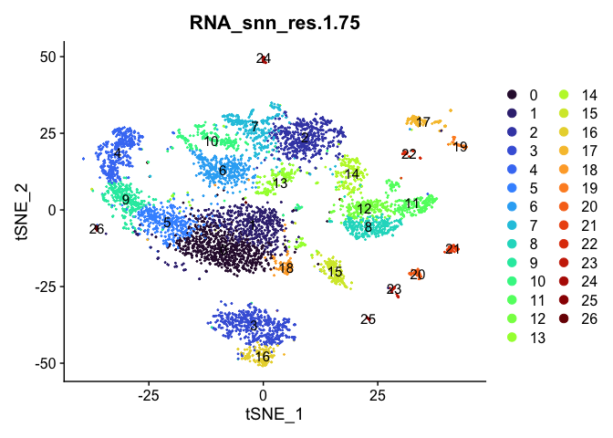<!-- -->

<div class='r_output'>
 [[5]]
</div>
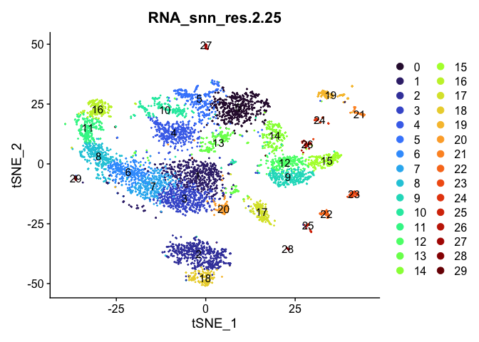<!-- -->

<div class='r_output'>
 [[6]]
</div>
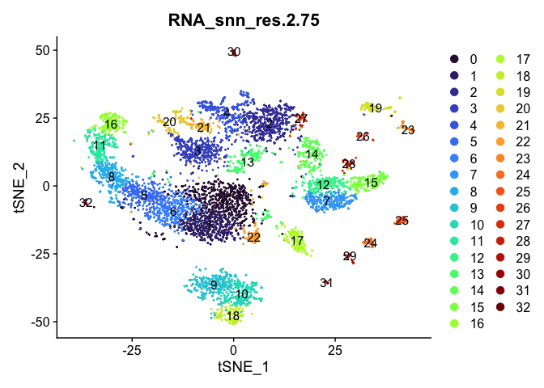<!-- -->

<div class='r_output'>
 [[7]]
</div>
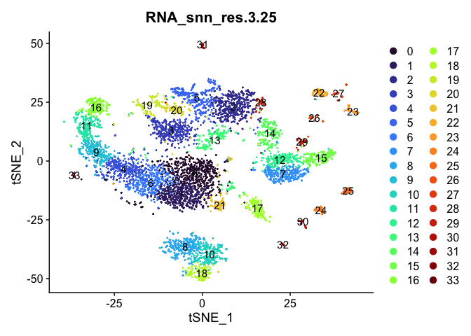<!-- -->

<div class='r_output'>
 [[8]]
</div>
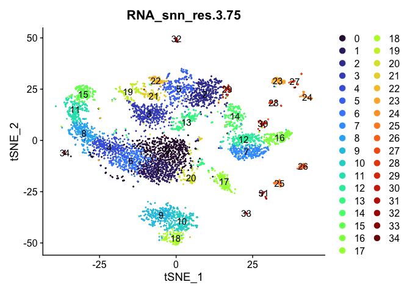<!-- -->

#### UMAP


```r
# calculate UMAP
experiment.aggregate <- RunUMAP(experiment.aggregate,
                                dims = use.pcs)
# UMAP colored by sample identity
DimPlot(experiment.aggregate,
        group.by = "orig.ident",
        reduction = "umap",
        shuffle = TRUE) +
  scale_color_viridis_d(option = "mako")
```

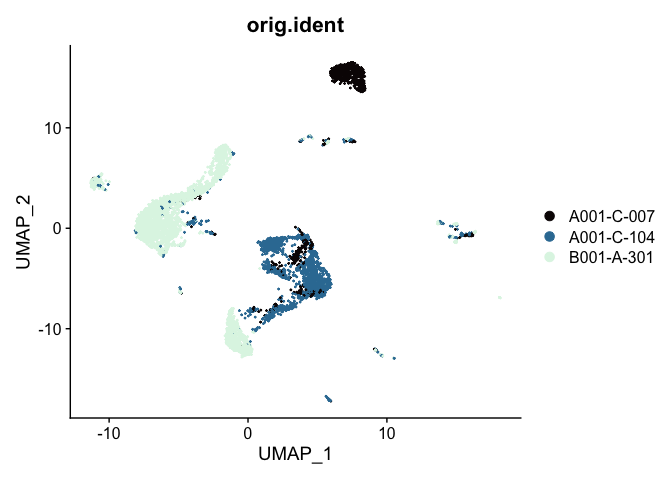<!-- -->

```r
# UMAP colored by cluster
lapply(cluster.resolutions, function(res){
  DimPlot(experiment.aggregate,
          group.by = res,
          reduction = "umap",
          label = TRUE,
          shuffle = TRUE) +
    scale_color_viridis_d(option = "turbo")
})
```

<div class='r_output'> [[1]]
</div>
<!-- -->

<div class='r_output'>
 [[2]]
</div>
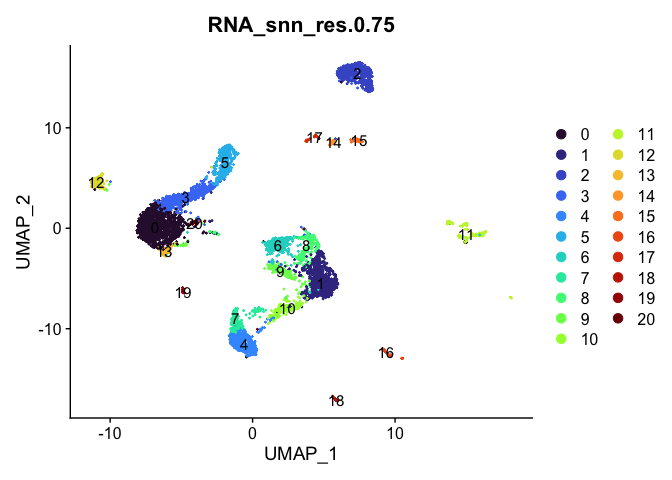<!-- -->

<div class='r_output'>
 [[3]]
</div>
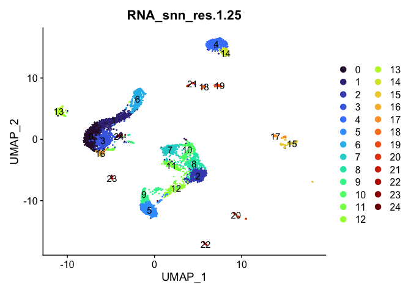<!-- -->

<div class='r_output'>
 [[4]]
</div>
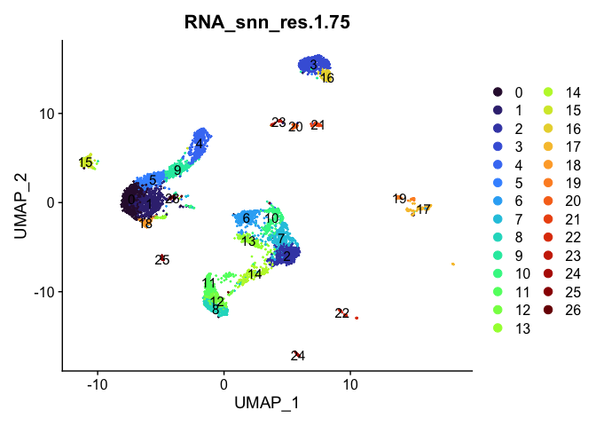<!-- -->

<div class='r_output'>
 [[5]]
</div>
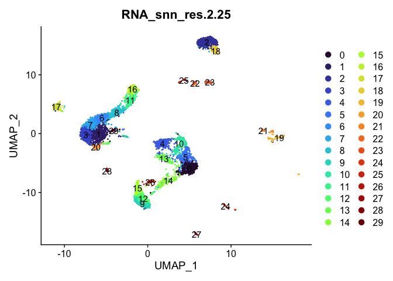<!-- -->

<div class='r_output'>
 [[6]]
</div>
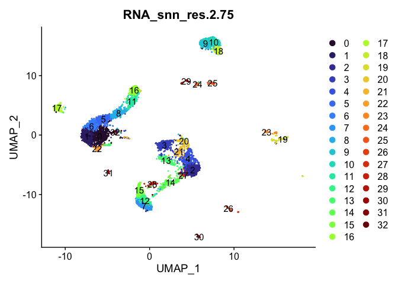<!-- -->

<div class='r_output'>
 [[7]]
</div>
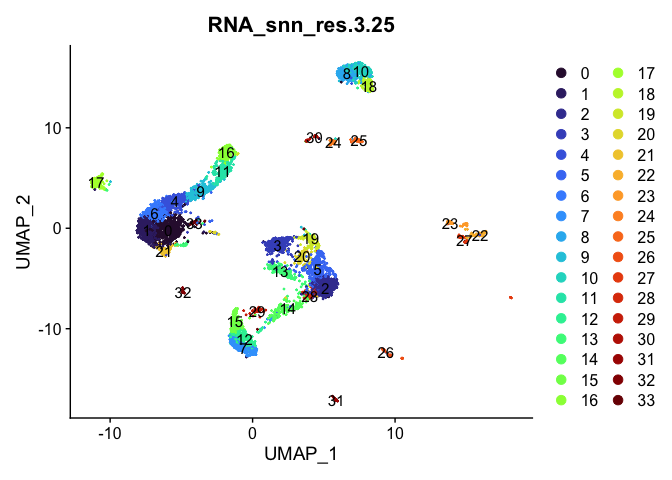<!-- -->

<div class='r_output'>
 [[8]]
</div>
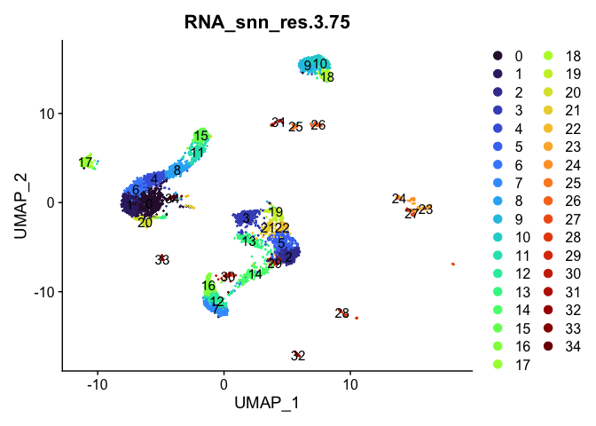<!-- -->

### Investigate the relationship between cluster identity and sample identity

```r
lapply(cluster.resolutions, function(res){
         tmp = experiment.aggregate@meta.data[,c(res, "orig.ident")]
         colnames(tmp) = c("cluster", "orig.ident")
         ggplot(tmp, aes(x = cluster, fill = orig.ident)) +
           geom_bar() +
           scale_fill_viridis_d(option = "mako") +
           theme_classic()
})
```

<div class='r_output'> [[1]]
</div>
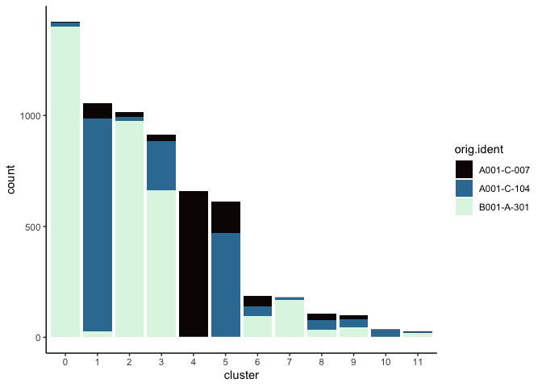<!-- -->

<div class='r_output'>
 [[2]]
</div>
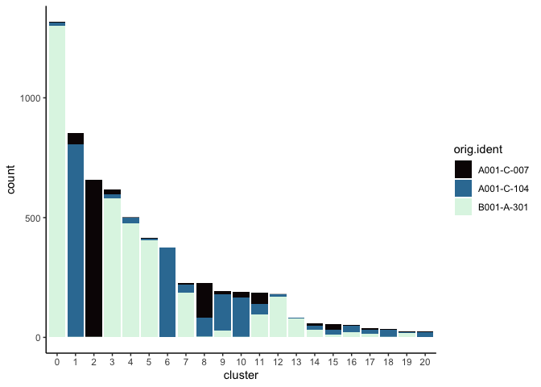<!-- -->

<div class='r_output'>
 [[3]]
</div>
<!-- -->

<div class='r_output'>
 [[4]]
</div>
<!-- -->

<div class='r_output'>
 [[5]]
</div>
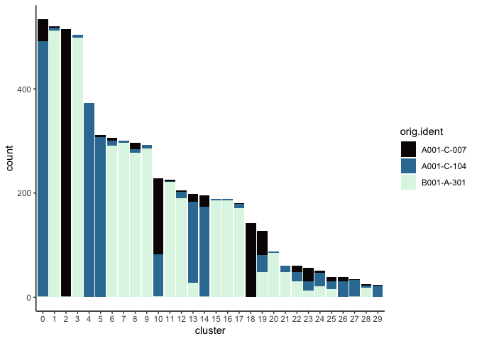<!-- -->

<div class='r_output'>
 [[6]]
</div>
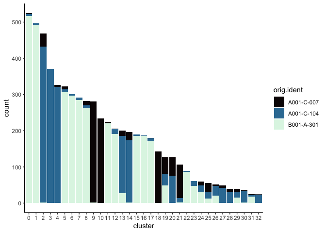<!-- -->

<div class='r_output'>
 [[7]]
</div>
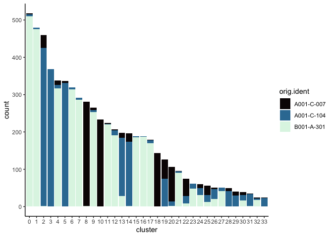<!-- -->

<div class='r_output'>
 [[8]]
</div>
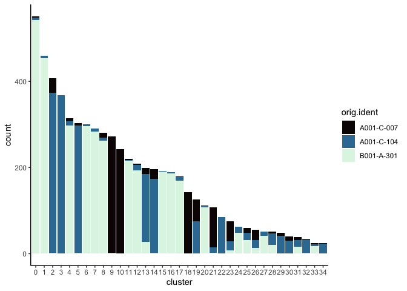<!-- -->

### Visualize metadata


```r
FeaturePlot(experiment.aggregate,
            reduction = "umap",
            features = c("nCount_RNA", "nFeature_RNA", "percent_MT"))
```

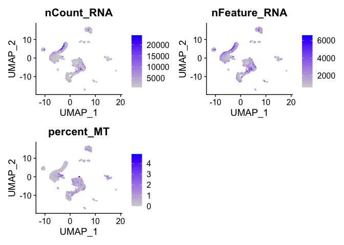<!-- -->

### Visualize cell cycle phase


```r
DimPlot(experiment.aggregate,
        reduction = "umap",
        group.by = "Phase",
        shuffle = TRUE) +
  scale_color_viridis_d()
```

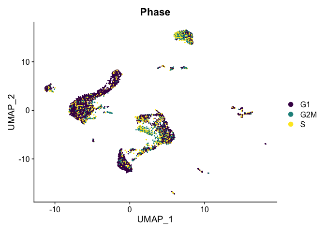<!-- -->

### Visualize expression of genes of interest


```r
FeaturePlot(experiment.aggregate,
            reduction = "umap",
            features = "KCNMA1")
```

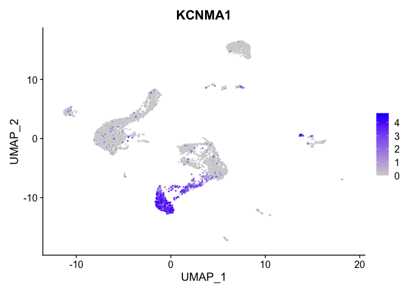<!-- -->

## Select a resolution

For now, let's use resolution 0.75. Over the remainder of this section, we will refine the clustering further.


```r
Idents(experiment.aggregate) <- "RNA_snn_res.0.75"
```


## Visualize cluster tree

Building a phylogenetic tree relating the 'average' cell from each group in default 'Ident' (currently "RNA_snn_res.1.25"). Tree is estimated based on a distance matrix constructed in either gene expression space or PCA space.


```r
experiment.aggregate <- BuildClusterTree(experiment.aggregate, dims = use.pcs)
PlotClusterTree(experiment.aggregate)
```

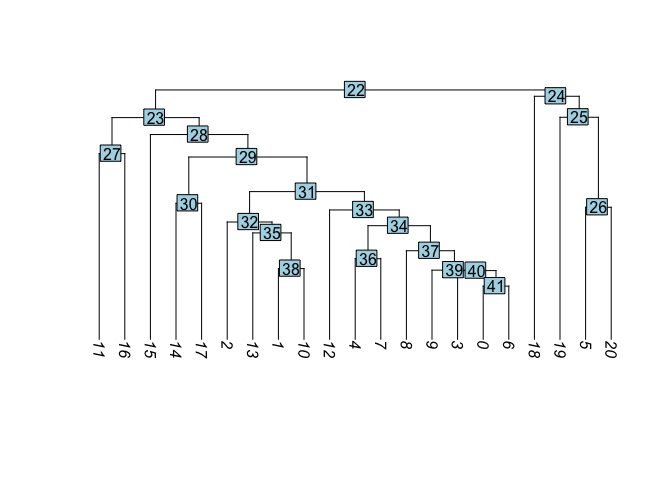<!-- -->


## Merge clusters

In many experiments, the clustering resolution does not need to be uniform across all of the cell types present. While for some cell types of interest fine detail may be desirable, for others, simply grouping them into a larger parent cluster is sufficient. Merging cluster is very straightforward.


```r
experiment.aggregate <- RenameIdents(experiment.aggregate,
                                     '7' = '4',
                                     '19' = '5',
                                     '20' = '5',
                                     '17' = '14',
                                     '15' = '14',
                                     '16' = '11')
experiment.aggregate$res.0.75_merged <- Idents(experiment.aggregate)
table(experiment.aggregate$res.0.75_merged)
```

<div class='r_output'>
    4    5   14   11    0    1    2    3    6    8    9   10   12   13   18
  728  463  155  238 1318  854  658  618  375  227  192  189  180   82   35
</div>
```r
DimPlot(experiment.aggregate,
        reduction = "umap",
        group.by = "res.0.75_merged",
        label = TRUE) +
  scale_color_viridis_d(option = "turbo")
```

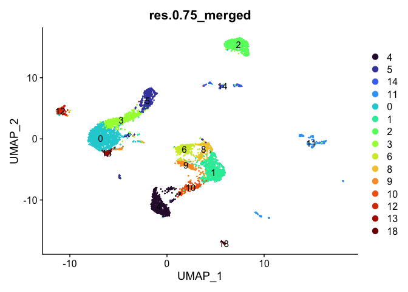<!-- -->

```r
VlnPlot(experiment.aggregate,
        group.by = "res.0.75_merged",
        features = "KCNMA1") +
  scale_fill_viridis_d(option = "turbo")
```

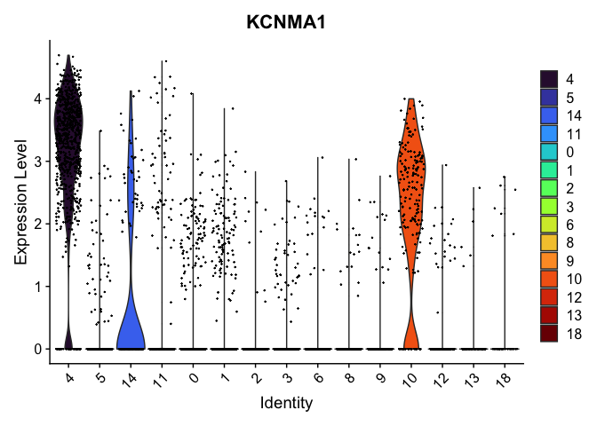<!-- -->

## Reorder the clusters

Merging the clusters changed the order in which they appear on a plot. In order to reorder the clusters for plotting purposes take a look at the levels of the identity, then re-level as desired.


```r
levels(experiment.aggregate$res.0.75_merged)
```

<div class='r_output'>  [1] "4"  "5"  "14" "11" "0"  "1"  "2"  "3"  "6"  "8"  "9"  "10" "12" "13" "18"
</div>
```r
# move one cluster to the first position
experiment.aggregate$res.0.75_merged <- relevel(experiment.aggregate$res.0.75_merged, "0")
levels(experiment.aggregate$res.0.75_merged)
```

<div class='r_output'>  [1] "0"  "4"  "5"  "14" "11" "1"  "2"  "3"  "6"  "8"  "9"  "10" "12" "13" "18"
</div>
```r
# the color assigned to some clusters will change
VlnPlot(experiment.aggregate,
        group.by = "res.0.75_merged",
        features = "percent_MT") +
  scale_fill_viridis_d(option = "turbo")
```

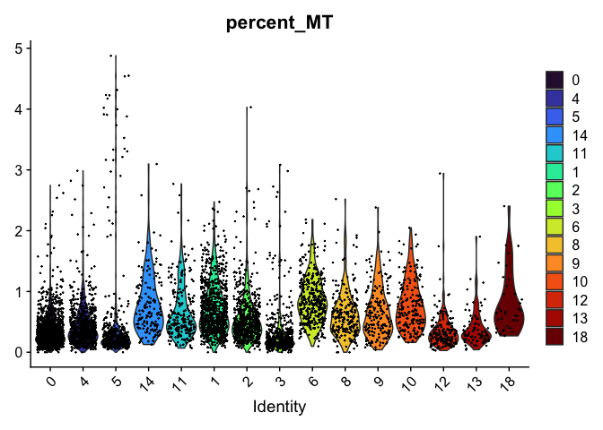<!-- -->

```r
# re-level entire factor
new.order <- as.character(sort(as.numeric(levels(experiment.aggregate$res.0.75_merged))))
experiment.aggregate$res.0.75_merged <- factor(experiment.aggregate$res.0.75_merged, levels = new.order)
levels(experiment.aggregate$res.0.75_merged)
```

<div class='r_output'>  [1] "0"  "1"  "2"  "3"  "4"  "5"  "6"  "8"  "9"  "10" "11" "12" "13" "14" "18"
</div>
```r
VlnPlot(experiment.aggregate,
        group.by = "res.0.75_merged",
        features = "nCount_RNA") +
  scale_fill_viridis_d(option = "turbo")
```

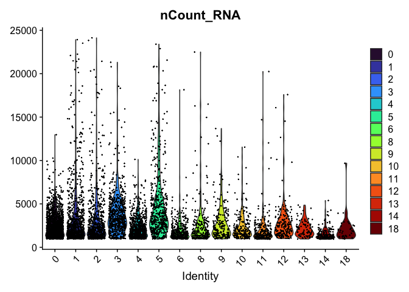<!-- -->

## Subcluster

While merging clusters reduces the resolution in some parts of the experiment, sub-clustering has the opposite effect. Let's produce sub-clusters for cluster 0.

```r
experiment.aggregate <- FindSubCluster(experiment.aggregate,
                                       graph.name = "RNA_snn",
                                       cluster = 0,
                                       subcluster.name = "subcluster")
```

<div class='r_output'> Modularity Optimizer version 1.3.0 by Ludo Waltman and Nees Jan van Eck

 Number of nodes: 1318
 Number of edges: 60033

 Running Louvain algorithm...
 Maximum modularity in 10 random starts: 0.6694
 Number of communities: 3
 Elapsed time: 0 seconds
</div>
```r
DimPlot(experiment.aggregate,
        reduction = "umap",
        group.by = "subcluster",
        label = TRUE,
        shuffle = TRUE) +
  scale_color_viridis_d(option = "turbo")
```

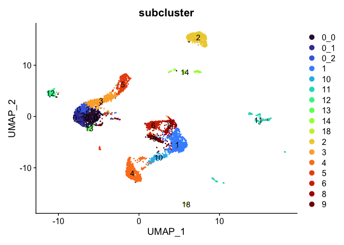<!-- -->

## Sub-setting experiment by cluster identity

After exploring and refining the cluster resolution, we may have identified some clusters that are composed of cells we aren't interested in. For example, if we have identified a cluster likely composed of contaminants, this cluster can be removed from the analysis. Alternatively, if a group of clusters have been identified as particularly of interest, these can be isolated and re-analyzed.


```r
# remove cluster 18
Idents(experiment.aggregate) <- experiment.aggregate$subcluster
experiment.tmp <- subset(experiment.aggregate, subcluster != "18")
DimPlot(experiment.tmp,
        reduction = "umap",
        group.by = "subcluster",
        label = TRUE,
        shuffle = TRUE) +
  scale_color_viridis_d(option = "turbo")
```

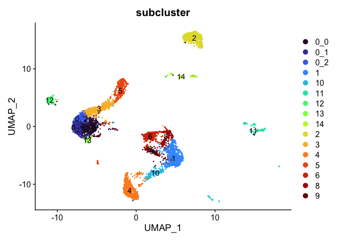<!-- -->

```r
# retain clusters 0_0, 0_1, 0_2, 3, 5, and 13
experiment.tmp <- subset(experiment.aggregate, subcluster %in% c("0_0", "0_1", "0_2", "3", "5", "13"))
DimPlot(experiment.tmp,
        reduction = "umap",
        group.by = "subcluster",
        label = TRUE,
        shuffle = TRUE) +
  scale_color_viridis_d(option = "turbo")
```

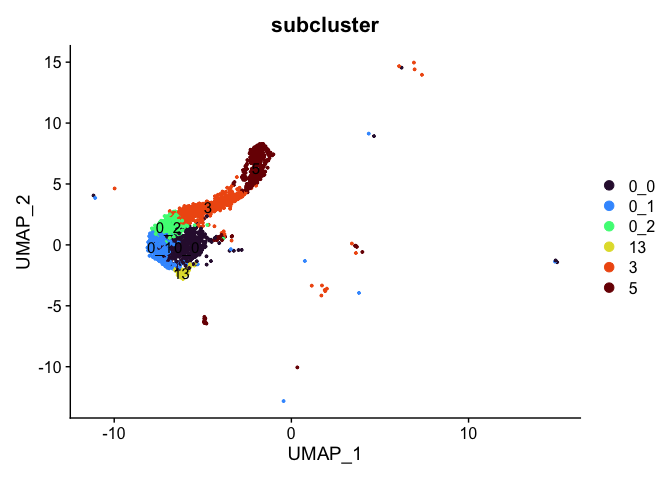<!-- -->

```r
rm(experiment.tmp)
```

## Identify marker genes

Seurat provides several functions that can help you find markers that define clusters via differential expression:

* `FindMarkers` identifies markers for a cluster relative to all other clusters

* `FindAllMarkers` performs the find markers operation for all clusters

* `FindAllMarkersNode` defines all markers that split a node from the cluster tree

### FindMarkers


```r
markers <- FindMarkers(experiment.aggregate,
                       group.by = "subcluster",
                       ident.1 = "0_2",
                       ident.2 = c("0_0", "0_1"))
length(which(markers$p_val_adj < 0.05)) # how many are significant?
```

<div class='r_output'> [1] 291
</div>
```r
head(markers) %>%
  kable() %>%
  kable_styling("striped")
```

<table class="table table-striped" style="margin-left: auto; margin-right: auto;">
 <thead>
  <tr>
   <th style="text-align:left;">   </th>
   <th style="text-align:right;"> p_val </th>
   <th style="text-align:right;"> avg_log2FC </th>
   <th style="text-align:right;"> pct.1 </th>
   <th style="text-align:right;"> pct.2 </th>
   <th style="text-align:right;"> p_val_adj </th>
  </tr>
 </thead>
<tbody>
  <tr>
   <td style="text-align:left;"> PPARGC1A </td>
   <td style="text-align:right;"> 0 </td>
   <td style="text-align:right;"> 0.8574109 </td>
   <td style="text-align:right;"> 0.885 </td>
   <td style="text-align:right;"> 0.572 </td>
   <td style="text-align:right;"> 0 </td>
  </tr>
  <tr>
   <td style="text-align:left;"> TRPM6 </td>
   <td style="text-align:right;"> 0 </td>
   <td style="text-align:right;"> 0.8593728 </td>
   <td style="text-align:right;"> 0.446 </td>
   <td style="text-align:right;"> 0.149 </td>
   <td style="text-align:right;"> 0 </td>
  </tr>
  <tr>
   <td style="text-align:left;"> PDE3A </td>
   <td style="text-align:right;"> 0 </td>
   <td style="text-align:right;"> 0.5157900 </td>
   <td style="text-align:right;"> 0.978 </td>
   <td style="text-align:right;"> 0.923 </td>
   <td style="text-align:right;"> 0 </td>
  </tr>
  <tr>
   <td style="text-align:left;"> CNNM2 </td>
   <td style="text-align:right;"> 0 </td>
   <td style="text-align:right;"> 0.7380028 </td>
   <td style="text-align:right;"> 0.849 </td>
   <td style="text-align:right;"> 0.505 </td>
   <td style="text-align:right;"> 0 </td>
  </tr>
  <tr>
   <td style="text-align:left;"> PARM1 </td>
   <td style="text-align:right;"> 0 </td>
   <td style="text-align:right;"> 0.7124092 </td>
   <td style="text-align:right;"> 0.756 </td>
   <td style="text-align:right;"> 0.388 </td>
   <td style="text-align:right;"> 0 </td>
  </tr>
  <tr>
   <td style="text-align:left;"> MICAL2 </td>
   <td style="text-align:right;"> 0 </td>
   <td style="text-align:right;"> 0.6546806 </td>
   <td style="text-align:right;"> 0.692 </td>
   <td style="text-align:right;"> 0.328 </td>
   <td style="text-align:right;"> 0 </td>
  </tr>
</tbody>
</table>

The "pct.1" and "pct.2" columns record the proportion of cells with normalized expression above 0 in ident.1 and ident.2, respectively. The "p_val" is the raw p-value associated with the differential expression test, while the BH-adjusted value is found in "p_val_adj". Finally, "avg_logFC" is the average log fold change difference between the two groups.

Marker genes identified this way can be visualized in violin plots, feature plots, and heat maps.

```r
view.markers <- c(rownames(markers[markers$avg_log2FC > 0,])[1],
                  rownames(markers[markers$avg_log2FC < 0,])[1])
lapply(view.markers, function(marker){
  VlnPlot(experiment.aggregate,
          group.by = "subcluster",
          features = marker) +
    scale_fill_viridis_d(option = "turbo")
})
```

<div class='r_output'> [[1]]
</div>
<!-- -->

<div class='r_output'>
 [[2]]
</div>
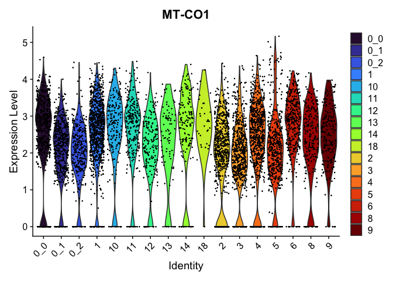<!-- -->

```r
FeaturePlot(experiment.aggregate,
            features = view.markers,
            ncol = 2)
```

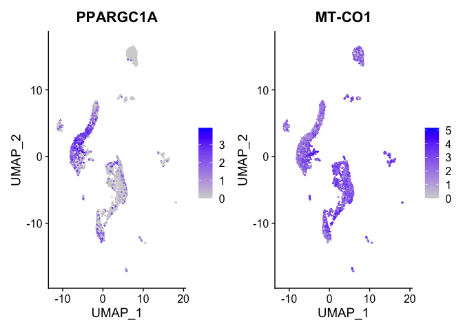<!-- -->

```r
DoHeatmap(experiment.aggregate,
          group.by = "subcluster",
          features = view.markers,
          group.colors = viridis::turbo(length(unique(experiment.aggregate$subcluster))))
```

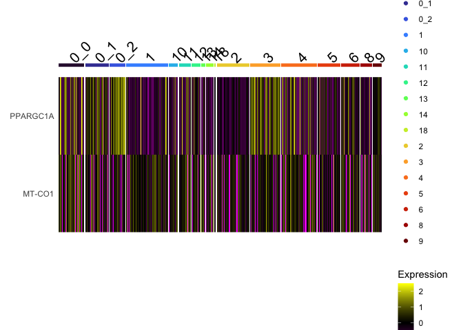<!-- -->


### FindAllMarkers

FindAllMarkers can be used to automate this process across all genes.


```r
markers <- FindAllMarkers(experiment.aggregate,
                          only.pos = TRUE,
                          min.pct = 0.25,
                          thresh.use = 0.25)
tapply(markers$p_val_adj, markers$cluster, function(x){
  length(x < 0.05)
})
```

<div class='r_output'>    8   14    2   11    1    9   10    3    5    4  0_0   18   12    6  0_1   13
  479  261 1180  342  705  688  459  760 1037  497  152  294  539  282  626  297
  0_2
  701
</div>
```r
head(markers) %>%
  kable() %>%
  kable_styling("striped")
```

<table class="table table-striped" style="margin-left: auto; margin-right: auto;">
 <thead>
  <tr>
   <th style="text-align:left;">   </th>
   <th style="text-align:right;"> p_val </th>
   <th style="text-align:right;"> avg_log2FC </th>
   <th style="text-align:right;"> pct.1 </th>
   <th style="text-align:right;"> pct.2 </th>
   <th style="text-align:right;"> p_val_adj </th>
   <th style="text-align:left;"> cluster </th>
   <th style="text-align:left;"> gene </th>
  </tr>
 </thead>
<tbody>
  <tr>
   <td style="text-align:left;"> LINC00278 </td>
   <td style="text-align:right;"> 0 </td>
   <td style="text-align:right;"> 1.825056 </td>
   <td style="text-align:right;"> 0.590 </td>
   <td style="text-align:right;"> 0.163 </td>
   <td style="text-align:right;"> 0 </td>
   <td style="text-align:left;"> 8 </td>
   <td style="text-align:left;"> LINC00278 </td>
  </tr>
  <tr>
   <td style="text-align:left;"> XAF1 </td>
   <td style="text-align:right;"> 0 </td>
   <td style="text-align:right;"> 1.532780 </td>
   <td style="text-align:right;"> 0.449 </td>
   <td style="text-align:right;"> 0.117 </td>
   <td style="text-align:right;"> 0 </td>
   <td style="text-align:left;"> 8 </td>
   <td style="text-align:left;"> XAF1 </td>
  </tr>
  <tr>
   <td style="text-align:left;"> DST </td>
   <td style="text-align:right;"> 0 </td>
   <td style="text-align:right;"> 1.681989 </td>
   <td style="text-align:right;"> 0.885 </td>
   <td style="text-align:right;"> 0.652 </td>
   <td style="text-align:right;"> 0 </td>
   <td style="text-align:left;"> 8 </td>
   <td style="text-align:left;"> DST </td>
  </tr>
  <tr>
   <td style="text-align:left;"> DUOX2 </td>
   <td style="text-align:right;"> 0 </td>
   <td style="text-align:right;"> 1.914879 </td>
   <td style="text-align:right;"> 0.322 </td>
   <td style="text-align:right;"> 0.068 </td>
   <td style="text-align:right;"> 0 </td>
   <td style="text-align:left;"> 8 </td>
   <td style="text-align:left;"> DUOX2 </td>
  </tr>
  <tr>
   <td style="text-align:left;"> CEACAM5 </td>
   <td style="text-align:right;"> 0 </td>
   <td style="text-align:right;"> 1.211420 </td>
   <td style="text-align:right;"> 0.855 </td>
   <td style="text-align:right;"> 0.514 </td>
   <td style="text-align:right;"> 0 </td>
   <td style="text-align:left;"> 8 </td>
   <td style="text-align:left;"> CEACAM5 </td>
  </tr>
  <tr>
   <td style="text-align:left;"> XDH </td>
   <td style="text-align:right;"> 0 </td>
   <td style="text-align:right;"> 2.047630 </td>
   <td style="text-align:right;"> 0.515 </td>
   <td style="text-align:right;"> 0.207 </td>
   <td style="text-align:right;"> 0 </td>
   <td style="text-align:left;"> 8 </td>
   <td style="text-align:left;"> XDH </td>
  </tr>
</tbody>
</table>

```r
view.markers <- tapply(markers$gene, markers$cluster, function(x){head(x,1)})
# violin plots
lapply(view.markers, function(marker){
  VlnPlot(experiment.aggregate,
          group.by = "subcluster",
          features = marker) +
    scale_fill_viridis_d(option = "turbo")
})
```

<div class='r_output'> $`8`
</div>
<!-- -->

<div class='r_output'>
 $`14`
</div>
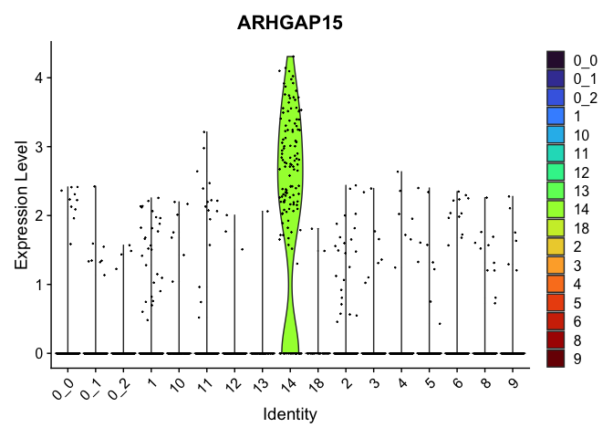<!-- -->

<div class='r_output'>
 $`2`
</div>
<!-- -->

<div class='r_output'>
 $`11`
</div>
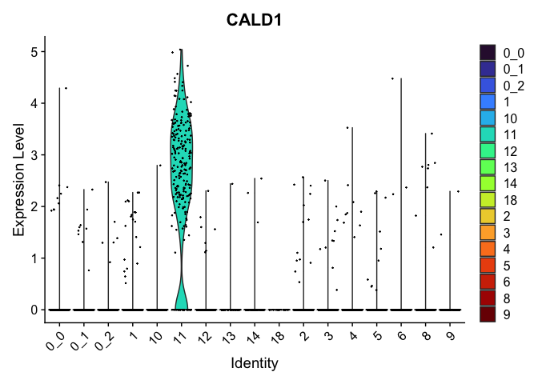<!-- -->

<div class='r_output'>
 $`1`
</div>
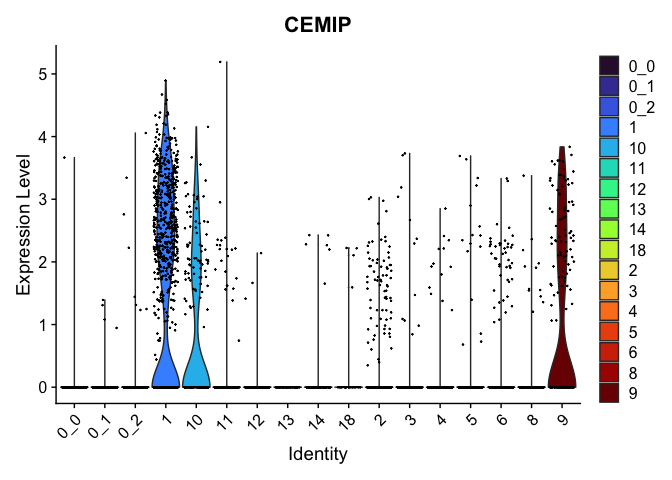<!-- -->

<div class='r_output'>
 $`9`
</div>
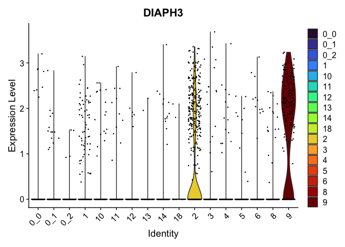<!-- -->

<div class='r_output'>
 $`10`
</div>
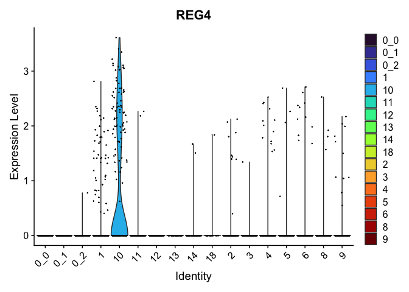<!-- -->

<div class='r_output'>
 $`3`
</div>
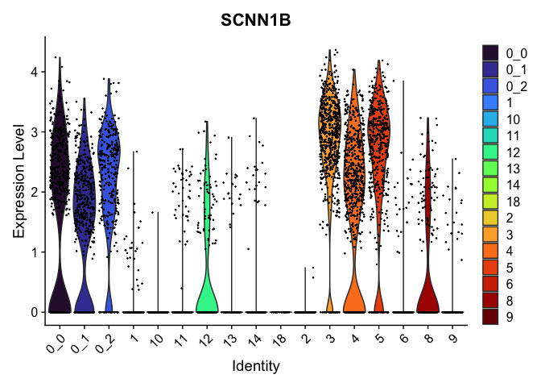<!-- -->

<div class='r_output'>
 $`5`
</div>
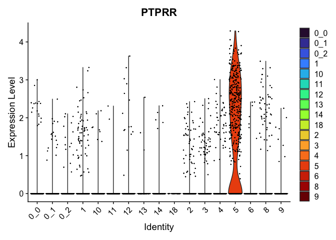<!-- -->

<div class='r_output'>
 $`4`
</div>
<!-- -->

<div class='r_output'>
 $`0_0`
</div>
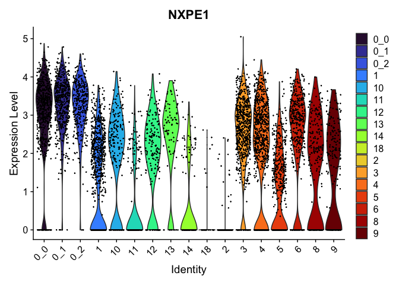<!-- -->

<div class='r_output'>
 $`18`
</div>
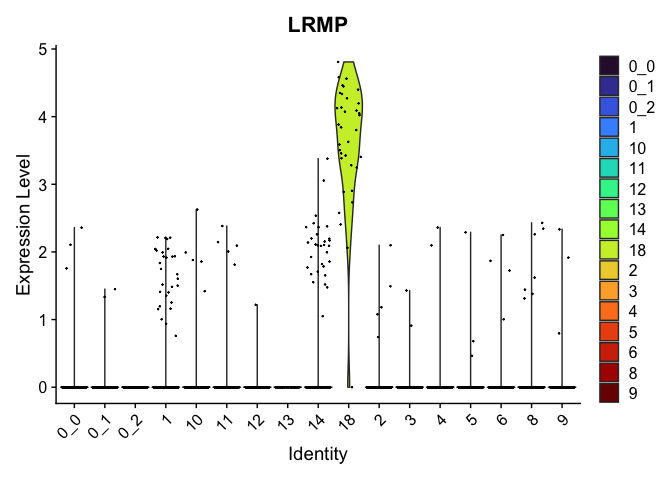<!-- -->

<div class='r_output'>
 $`12`
</div>
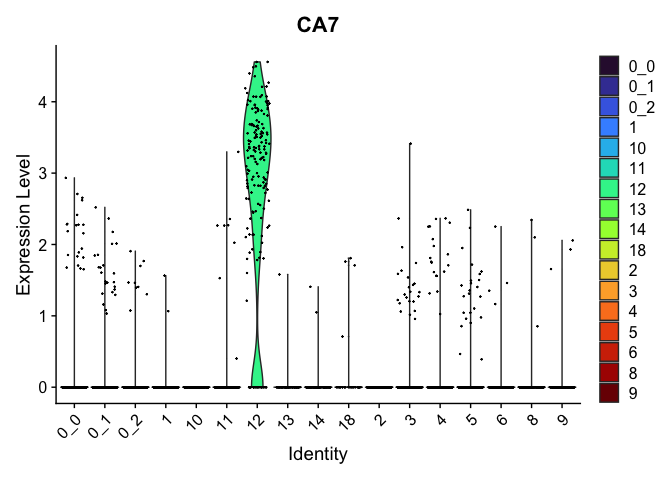<!-- -->

<div class='r_output'>
 $`6`
</div>
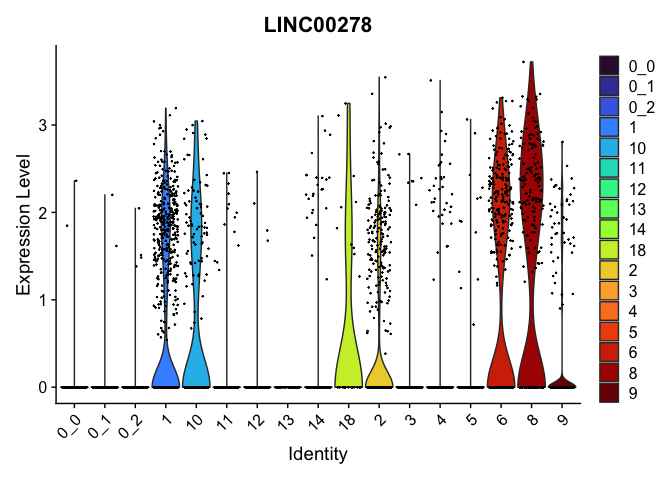<!-- -->

<div class='r_output'>
 $`0_1`
</div>
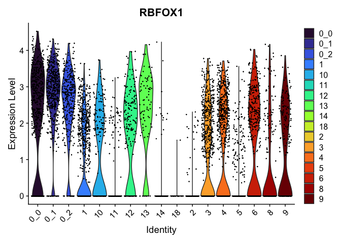<!-- -->

<div class='r_output'>
 $`13`
</div>
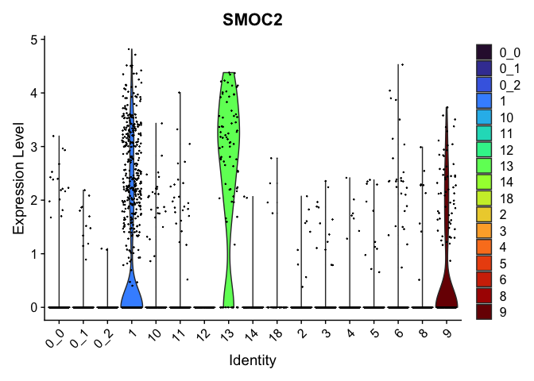<!-- -->

<div class='r_output'>
 $`0_2`
</div>
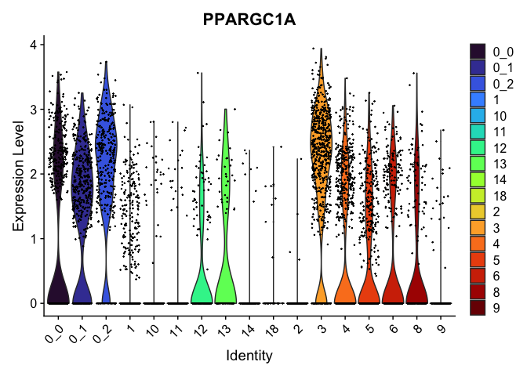<!-- -->

```r
# feature plots
lapply(view.markers, function(marker){
  FeaturePlot(experiment.aggregate,
              features = marker)
})
```

<div class='r_output'> $`8`
</div>
<!-- -->

<div class='r_output'>
 $`14`
</div>
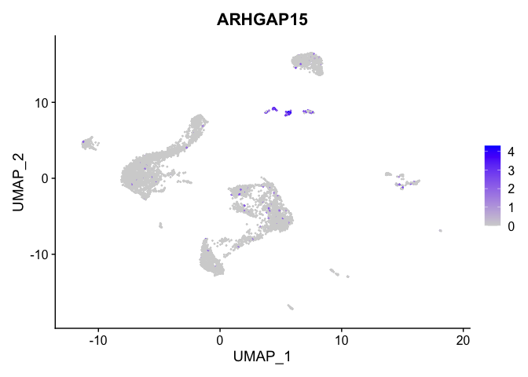<!-- -->

<div class='r_output'>
 $`2`
</div>
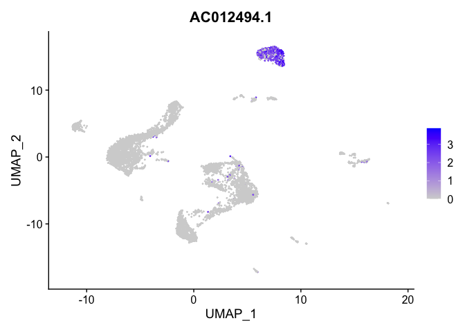<!-- -->

<div class='r_output'>
 $`11`
</div>
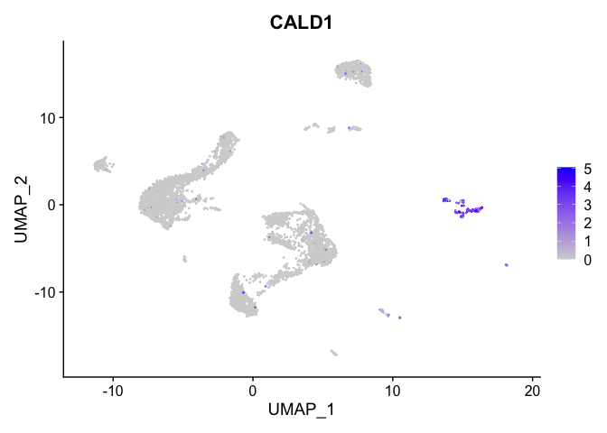<!-- -->

<div class='r_output'>
 $`1`
</div>
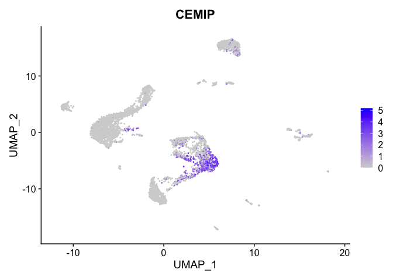<!-- -->

<div class='r_output'>
 $`9`
</div>
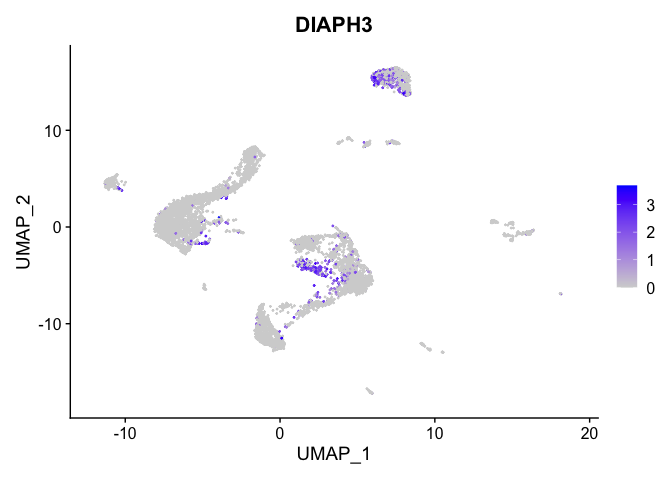<!-- -->

<div class='r_output'>
 $`10`
</div>
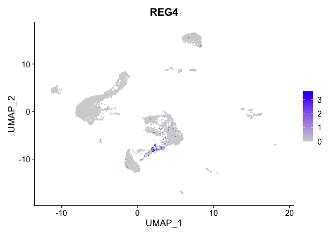<!-- -->

<div class='r_output'>
 $`3`
</div>
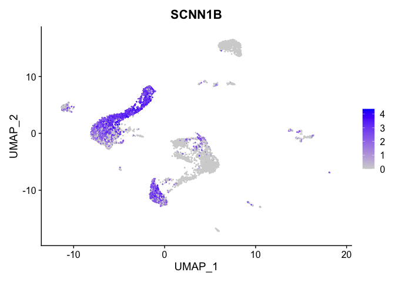<!-- -->

<div class='r_output'>
 $`5`
</div>
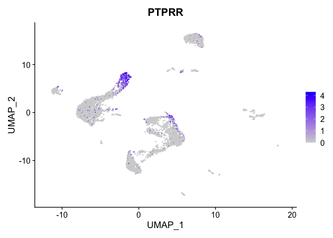<!-- -->

<div class='r_output'>
 $`4`
</div>
<!-- -->

<div class='r_output'>
 $`0_0`
</div>
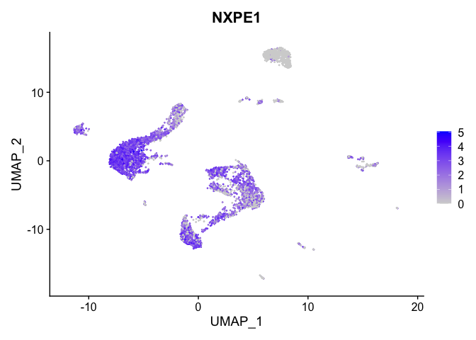<!-- -->

<div class='r_output'>
 $`18`
</div>
<!-- -->

<div class='r_output'>
 $`12`
</div>
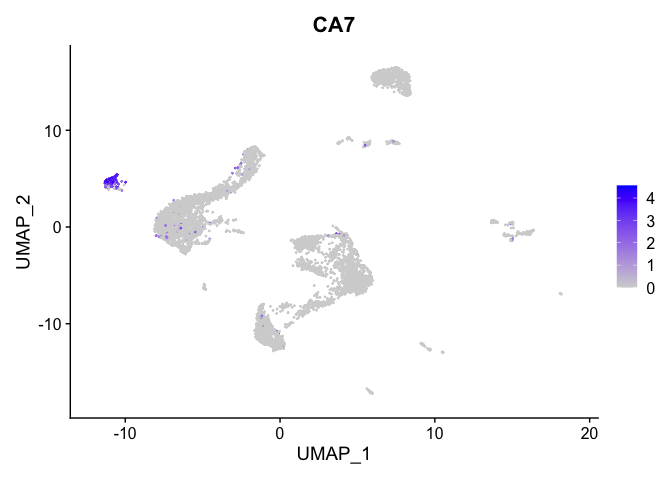<!-- -->

<div class='r_output'>
 $`6`
</div>
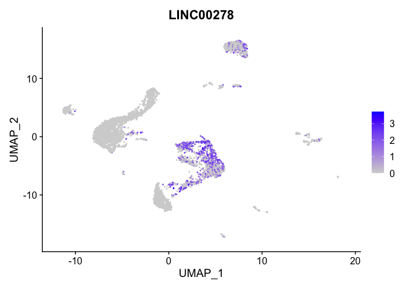<!-- -->

<div class='r_output'>
 $`0_1`
</div>
<!-- -->

<div class='r_output'>
 $`13`
</div>
<!-- -->

<div class='r_output'>
 $`0_2`
</div>
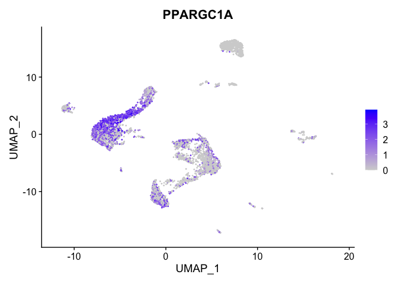<!-- -->

```r
# heat map
DoHeatmap(experiment.aggregate,
          group.by = "subcluster",
          features = view.markers,
          group.colors = viridis::turbo(length(unique(experiment.aggregate$subcluster))))
```

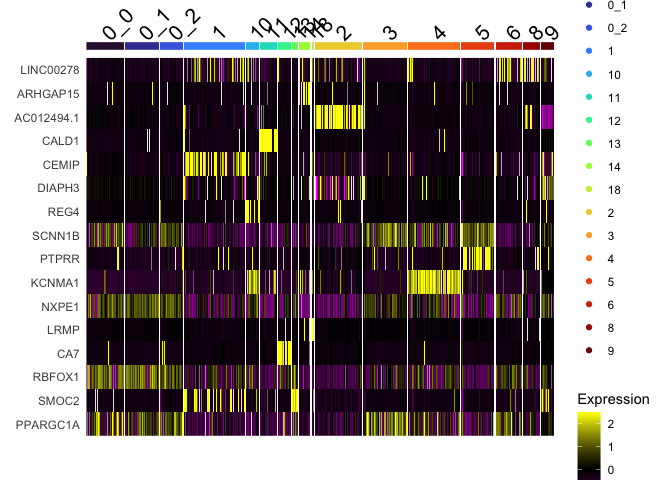<!-- -->

#### Calculate mean marker expression within clusters

You may want to get an idea of the mean expression of markers in a cluster or group of clusters. The percent expressing is provided by FindMarkers and FindAllMarkers, along with the average log fold change, but not the expression value itself. The function below calculates a mean for the supplied marker in the named cluster(s) and all other groups. Please note that this function accesses the active identity.


```r
# ensure active identity is set to desired clustering resolution
Idents(experiment.aggregate) <- experiment.aggregate$subcluster
# define function
getGeneClusterMeans <- function(feature, idents){
  x = GetAssayData(experiment.aggregate)[feature,]
  m = tapply(x, Idents(experiment.aggregate) %in% idents, mean)
  names(m) = c("mean.out.of.idents", "mean.in.idents")
  return(m[c(2,1)])
}
# calculate means for a single marker
getGeneClusterMeans("SMOC2", c("1"))
```

<div class='r_output'>     mean.in.idents mean.out.of.idents
           1.033247           0.121912
</div>
```r
# add means to marker table (example using subset)
markers.small <- markers[view.markers,]
means <- matrix(mapply(getGeneClusterMeans, view.markers, markers.small$cluster), ncol = 2, byrow = TRUE)
colnames(means) <- c("mean.in.cluster", "mean.out.of.cluster")
rownames(means) <- view.markers
markers.small <- cbind(markers.small, means)
markers.small[,c("cluster", "mean.in.cluster", "mean.out.of.cluster", "avg_log2FC", "p_val_adj")] %>%
  kable() %>%
  kable_styling("striped")
```

<table class="table table-striped" style="margin-left: auto; margin-right: auto;">
 <thead>
  <tr>
   <th style="text-align:left;">   </th>
   <th style="text-align:left;"> cluster </th>
   <th style="text-align:right;"> mean.in.cluster </th>
   <th style="text-align:right;"> mean.out.of.cluster </th>
   <th style="text-align:right;"> avg_log2FC </th>
   <th style="text-align:right;"> p_val_adj </th>
  </tr>
 </thead>
<tbody>
  <tr>
   <td style="text-align:left;"> LINC00278 </td>
   <td style="text-align:left;"> 8 </td>
   <td style="text-align:right;"> 1.3905765 </td>
   <td style="text-align:right;"> 0.3126136 </td>
   <td style="text-align:right;"> 1.8250560 </td>
   <td style="text-align:right;"> 0 </td>
  </tr>
  <tr>
   <td style="text-align:left;"> ARHGAP15 </td>
   <td style="text-align:left;"> 14 </td>
   <td style="text-align:right;"> 2.0999714 </td>
   <td style="text-align:right;"> 0.0420769 </td>
   <td style="text-align:right;"> 3.8168553 </td>
   <td style="text-align:right;"> 0 </td>
  </tr>
  <tr>
   <td style="text-align:left;"> AC012494.1 </td>
   <td style="text-align:left;"> 2 </td>
   <td style="text-align:right;"> 1.9829173 </td>
   <td style="text-align:right;"> 0.0198549 </td>
   <td style="text-align:right;"> 3.4055733 </td>
   <td style="text-align:right;"> 0 </td>
  </tr>
  <tr>
   <td style="text-align:left;"> CALD1 </td>
   <td style="text-align:left;"> 11 </td>
   <td style="text-align:right;"> 2.4889292 </td>
   <td style="text-align:right;"> 0.0321684 </td>
   <td style="text-align:right;"> 4.2588299 </td>
   <td style="text-align:right;"> 0 </td>
  </tr>
  <tr>
   <td style="text-align:left;"> CEMIP </td>
   <td style="text-align:left;"> 1 </td>
   <td style="text-align:right;"> 1.7103302 </td>
   <td style="text-align:right;"> 0.1470160 </td>
   <td style="text-align:right;"> 2.9158868 </td>
   <td style="text-align:right;"> 0 </td>
  </tr>
  <tr>
   <td style="text-align:left;"> DIAPH3 </td>
   <td style="text-align:left;"> 2 </td>
   <td style="text-align:right;"> 0.7078035 </td>
   <td style="text-align:right;"> 0.1208302 </td>
   <td style="text-align:right;"> 1.3733030 </td>
   <td style="text-align:right;"> 0 </td>
  </tr>
  <tr>
   <td style="text-align:left;"> REG4 </td>
   <td style="text-align:left;"> 10 </td>
   <td style="text-align:right;"> 0.8891786 </td>
   <td style="text-align:right;"> 0.0282499 </td>
   <td style="text-align:right;"> 2.2188514 </td>
   <td style="text-align:right;"> 0 </td>
  </tr>
  <tr>
   <td style="text-align:left;"> SCNN1B </td>
   <td style="text-align:left;"> 3 </td>
   <td style="text-align:right;"> 2.7606983 </td>
   <td style="text-align:right;"> 0.8929028 </td>
   <td style="text-align:right;"> 1.9172739 </td>
   <td style="text-align:right;"> 0 </td>
  </tr>
  <tr>
   <td style="text-align:left;"> PTPRR </td>
   <td style="text-align:left;"> 5 </td>
   <td style="text-align:right;"> 1.7170380 </td>
   <td style="text-align:right;"> 0.1082672 </td>
   <td style="text-align:right;"> 2.9851173 </td>
   <td style="text-align:right;"> 0 </td>
  </tr>
  <tr>
   <td style="text-align:left;"> KCNMA1 </td>
   <td style="text-align:left;"> 10 </td>
   <td style="text-align:right;"> 2.1932315 </td>
   <td style="text-align:right;"> 0.5296899 </td>
   <td style="text-align:right;"> 1.4143155 </td>
   <td style="text-align:right;"> 0 </td>
  </tr>
  <tr>
   <td style="text-align:left;"> NXPE1 </td>
   <td style="text-align:left;"> 3 </td>
   <td style="text-align:right;"> 2.5301263 </td>
   <td style="text-align:right;"> 1.7681133 </td>
   <td style="text-align:right;"> 0.3819432 </td>
   <td style="text-align:right;"> 0 </td>
  </tr>
  <tr>
   <td style="text-align:left;"> LRMP </td>
   <td style="text-align:left;"> 18 </td>
   <td style="text-align:right;"> 3.6264698 </td>
   <td style="text-align:right;"> 0.0292279 </td>
   <td style="text-align:right;"> 5.4904492 </td>
   <td style="text-align:right;"> 0 </td>
  </tr>
  <tr>
   <td style="text-align:left;"> CA7 </td>
   <td style="text-align:left;"> 12 </td>
   <td style="text-align:right;"> 2.7331103 </td>
   <td style="text-align:right;"> 0.0397866 </td>
   <td style="text-align:right;"> 4.5913220 </td>
   <td style="text-align:right;"> 0 </td>
  </tr>
  <tr>
   <td style="text-align:left;"> LINC00278.1 </td>
   <td style="text-align:left;"> 8 </td>
   <td style="text-align:right;"> 1.3905765 </td>
   <td style="text-align:right;"> 0.3126136 </td>
   <td style="text-align:right;"> 1.8250560 </td>
   <td style="text-align:right;"> 0 </td>
  </tr>
  <tr>
   <td style="text-align:left;"> RBFOX1 </td>
   <td style="text-align:left;"> 0_0 </td>
   <td style="text-align:right;"> 2.1639139 </td>
   <td style="text-align:right;"> 1.1637186 </td>
   <td style="text-align:right;"> 1.2089765 </td>
   <td style="text-align:right;"> 0 </td>
  </tr>
  <tr>
   <td style="text-align:left;"> SMOC2 </td>
   <td style="text-align:left;"> 1 </td>
   <td style="text-align:right;"> 1.0332466 </td>
   <td style="text-align:right;"> 0.1219120 </td>
   <td style="text-align:right;"> 2.2988903 </td>
   <td style="text-align:right;"> 0 </td>
  </tr>
  <tr>
   <td style="text-align:left;"> PPARGC1A </td>
   <td style="text-align:left;"> 3 </td>
   <td style="text-align:right;"> 2.0532474 </td>
   <td style="text-align:right;"> 0.6728933 </td>
   <td style="text-align:right;"> 1.6622156 </td>
   <td style="text-align:right;"> 0 </td>
  </tr>
</tbody>
</table>

## Advanced visualizations

Researchers may use the tree, markers, domain knowledge, and goals to identify useful clusters. This may mean adjusting PCA to use, choosing a new resolution, merging clusters together, sub-clustering, sub-setting, etc. You may also want to use automated cell type identification at this point, which will be discussed in the next section.

### Address overplotting
Single cell and single nucleus experiments may include so many cells that dimensionality reduction plots sometimes suffer from overplotting, where individual points are difficult to see. The following code addresses this by adjusting the size and opacity of the points.

```r
alpha.use <- 0.4
p <- DimPlot(experiment.aggregate,
             group.by="subcluster",
             pt.size=0.5,
             reduction = "umap",
             shuffle = TRUE) +
  scale_color_viridis_d(option = "turbo")
p$layers[[1]]$mapping$alpha <- alpha.use
p + scale_alpha_continuous(range = alpha.use, guide = FALSE)
```

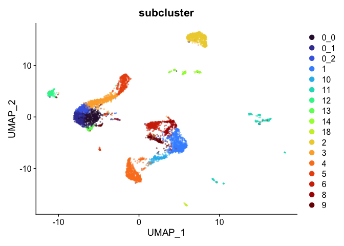<!-- -->


### Highlight a subset


```r
DimPlot(experiment.aggregate,
        group.by = "subcluster",
        cells.highlight = CellsByIdentities(experiment.aggregate, idents = c("0_1", "8", "1")),
        cols.highlight = c(viridis::viridis(3))) +
  ggtitle("Selected sub-clusters")
```

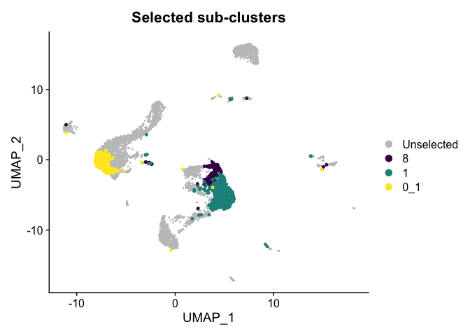<!-- -->

### Split dimensionality reduction plots


```r
DimPlot(experiment.aggregate,
        group.by = "subcluster",
        split.by = "orig.ident") +
  scale_color_viridis_d(option = "turbo")
```

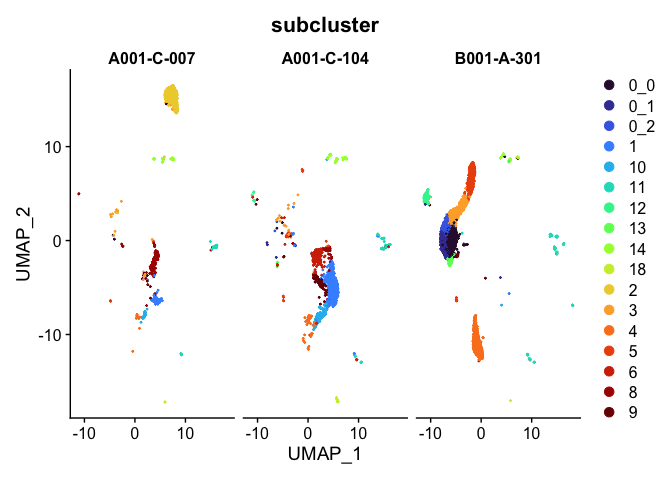<!-- -->

### Plot a subset of cells

Note that the object itself is unchanged by the subsetting operation.

```r
DimPlot(experiment.aggregate,
        group.by = "subcluster",
        reduction = "umap",
        cells = Cells(experiment.aggregate)[experiment.aggregate$orig.ident %in% "A001-C-007"]) +
  scale_color_viridis_d(option = "turbo") +
  ggtitle("A00-C-007 subcluster")
```

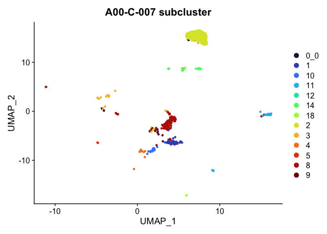<!-- -->

## Save the Seurat object and download the next Rmd file

```r
# set the finalcluster to subcluster
experiment.aggregate$finalcluster <- experiment.aggregate$subcluster
# save object
saveRDS(experiment.aggregate, file="scRNA_workshop_4.rds")
download.file("https://raw.githubusercontent.com/ucdavis-bioinformatics-training/2023-June-Single-Cell-RNA-Seq-Analysis/main/data_analysis/scRNA_Workshop-PART5.Rmd", "scRNA_Workshop-PART5.Rmd")
```

## Session Information

```r
sessionInfo()
```

<div class='r_output'> R version 4.1.0 (2021-05-18)
 Platform: x86_64-apple-darwin17.0 (64-bit)
 Running under: macOS Big Sur 10.16

 Matrix products: default
 BLAS:   /Library/Frameworks/R.framework/Versions/4.1/Resources/lib/libRblas.dylib
 LAPACK: /Library/Frameworks/R.framework/Versions/4.1/Resources/lib/libRlapack.dylib

 locale:
 [1] en_US.UTF-8/en_US.UTF-8/en_US.UTF-8/C/en_US.UTF-8/en_US.UTF-8

 attached base packages:
 [1] stats     graphics  grDevices utils     datasets  methods   base     

 other attached packages:
 [1] ggplot2_3.4.2      dplyr_1.1.2        tidyr_1.3.0        kableExtra_1.3.4  
 [5] SeuratObject_4.1.3 Seurat_4.3.0      

 loaded via a namespace (and not attached):
   [1] Rtsne_0.16             colorspace_2.1-0       deldir_1.0-9          
   [4] ellipsis_0.3.2         ggridges_0.5.4         rstudioapi_0.14       
   [7] spatstat.data_3.0-1    farver_2.1.1           leiden_0.4.3          
  [10] listenv_0.9.0          ggrepel_0.9.3          fansi_1.0.4           
  [13] xml2_1.3.4             codetools_0.2-19       splines_4.1.0         
  [16] cachem_1.0.8           knitr_1.43             polyclip_1.10-4       
  [19] jsonlite_1.8.5         ica_1.0-3              cluster_2.1.4         
  [22] png_0.1-8              uwot_0.1.14            shiny_1.7.4           
  [25] sctransform_0.3.5      spatstat.sparse_3.0-1  compiler_4.1.0        
  [28] httr_1.4.6             Matrix_1.5-4.1         fastmap_1.1.1         
  [31] lazyeval_0.2.2         limma_3.50.3           cli_3.6.1             
  [34] later_1.3.1            htmltools_0.5.5        tools_4.1.0           
  [37] igraph_1.5.0           gtable_0.3.3           glue_1.6.2            
  [40] RANN_2.6.1             reshape2_1.4.4         Rcpp_1.0.10           
  [43] scattermore_1.2        jquerylib_0.1.4        vctrs_0.6.3           
  [46] ape_5.7-1              svglite_2.1.1          nlme_3.1-162          
  [49] spatstat.explore_3.2-1 progressr_0.13.0       lmtest_0.9-40         
  [52] spatstat.random_3.1-5  xfun_0.39              stringr_1.5.0         
  [55] globals_0.16.2         rvest_1.0.3            mime_0.12             
  [58] miniUI_0.1.1.1         lifecycle_1.0.3        irlba_2.3.5.1         
  [61] goftest_1.2-3          future_1.32.0          MASS_7.3-60           
  [64] zoo_1.8-12             scales_1.2.1           promises_1.2.0.1      
  [67] spatstat.utils_3.0-3   parallel_4.1.0         RColorBrewer_1.1-3    
  [70] yaml_2.3.7             reticulate_1.30        pbapply_1.7-0         
  [73] gridExtra_2.3          sass_0.4.6             stringi_1.7.12        
  [76] highr_0.10             systemfonts_1.0.4      rlang_1.1.1           
  [79] pkgconfig_2.0.3        matrixStats_1.0.0      evaluate_0.21         
  [82] lattice_0.21-8         ROCR_1.0-11            purrr_1.0.1           
  [85] tensor_1.5             labeling_0.4.2         patchwork_1.1.2       
  [88] htmlwidgets_1.6.2      cowplot_1.1.1          tidyselect_1.2.0      
  [91] parallelly_1.36.0      RcppAnnoy_0.0.20       plyr_1.8.8            
  [94] magrittr_2.0.3         R6_2.5.1               generics_0.1.3        
  [97] DBI_1.1.3              withr_2.5.0            pillar_1.9.0          
 [100] fitdistrplus_1.1-11    survival_3.5-5         abind_1.4-5           
 [103] sp_1.6-1               tibble_3.2.1           future.apply_1.11.0   
 [106] KernSmooth_2.23-21     utf8_1.2.3             spatstat.geom_3.2-1   
 [109] plotly_4.10.2          rmarkdown_2.22         viridis_0.6.3         
 [112] grid_4.1.0             data.table_1.14.8      webshot_0.5.4         
 [115] digest_0.6.31          xtable_1.8-4           httpuv_1.6.11         
 [118] munsell_0.5.0          viridisLite_0.4.2      bslib_0.5.0
</div>