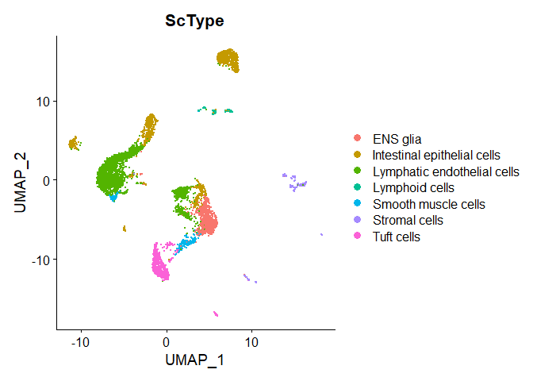
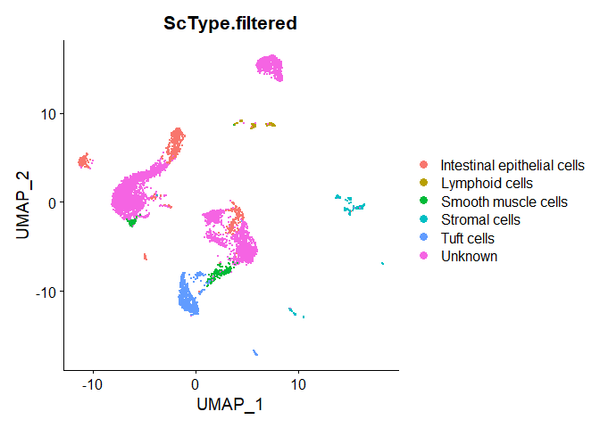

<script>
function buildQuiz(myq, qc){
  // variable to store the HTML output
  const output = [];

  // for each question...
  myq.forEach(
    (currentQuestion, questionNumber) => {

      // variable to store the list of possible answers
      const answers = [];

      // and for each available answer...
      for(letter in currentQuestion.answers){

        // ...add an HTML radio button
        answers.push(
          `<label>
            <input type="radio" name="question${questionNumber}" value="${letter}">
            ${letter} :
            ${currentQuestion.answers[letter]}
          </label><br/>`
        );
      }

      // add this question and its answers to the output
      output.push(
        `<div class="question"> ${currentQuestion.question} </div>
        <div class="answers"> ${answers.join('')} </div><br/>`
      );
    }
  );

  // finally combine our output list into one string of HTML and put it on the page
  qc.innerHTML = output.join('');
}

function showResults(myq, qc, rc){

  // gather answer containers from our quiz
  const answerContainers = qc.querySelectorAll('.answers');

  // keep track of user's answers
  let numCorrect = 0;

  // for each question...
  myq.forEach( (currentQuestion, questionNumber) => {

    // find selected answer
    const answerContainer = answerContainers[questionNumber];
    const selector = `input[name=question${questionNumber}]:checked`;
    const userAnswer = (answerContainer.querySelector(selector) || {}).value;

    // if answer is correct
    if(userAnswer === currentQuestion.correctAnswer){
      // add to the number of correct answers
      numCorrect++;

      // color the answers green
      answerContainers[questionNumber].style.color = 'lightgreen';
    }
    // if answer is wrong or blank
    else{
      // color the answers red
      answerContainers[questionNumber].style.color = 'red';
    }
  });

  // show number of correct answers out of total
  rc.innerHTML = `${numCorrect} out of ${myq.length}`;
}
</script>

# Part 5: Enrichment, Model-Based DE, and Cell-Type Identification


## Load libraries

```r
library(Seurat)
library(limma)
library(topGO)
library(HGNChelper)
library(dplyr)
```

## Load the Seurat object

```r
experiment.merged <- readRDS("scRNA_workshop_4.rds")
experiment.merged
```

<div class='r_output'> An object of class Seurat 
 11292 features across 6312 samples within 1 assay 
 Active assay: RNA (11292 features, 7012 variable features)
  3 dimensional reductions calculated: pca, tsne, umap
</div>
```r
Idents(experiment.merged) <- "finalcluster"
```

# 1. Gene Ontology (GO) Enrichment of Genes Expressed in a Cluster
[Gene Ontology](http://geneontology.org/docs/ontology-documentation/) provides a controlled vocabulary for describing gene products.  Here we use enrichment analysis to identify GO terms that are overrepresented among the gene expressed in cells in a given cluster. 


```r
cluster10 <- subset(experiment.merged, idents = '10')
expr <- as.matrix(GetAssayData(cluster10))

# Select genes that are expressed > 0 in at least half of cells
n.gt.0 <- apply(expr, 1, function(x)length(which(x > 0)))
expressed.genes <- rownames(expr)[which(n.gt.0/ncol(expr) >= 0.5)]
all.genes <- rownames(expr)

# define geneList as 1 if gene is in expressed.genes, 0 otherwise
geneList <- ifelse(all.genes %in% expressed.genes, 1, 0)
names(geneList) <- all.genes

# Create topGOdata object
	GOdata <- new("topGOdata",
		ontology = "BP", # use biological process ontology
		allGenes = geneList,
		geneSelectionFun = function(x)(x == 1),
              annot = annFUN.org, mapping = "org.Hs.eg.db", ID = "symbol")
# Test for enrichment using Fisher's Exact Test
	resultFisher <- runTest(GOdata, algorithm = "elim", statistic = "fisher")
	GenTable(GOdata, Fisher = resultFisher, topNodes = 20, numChar = 60)
```

<div class='r_output'>         GO.ID                                                            Term Annotated Significant Expected  Fisher
 1  GO:0030644                          intracellular chloride ion homeostasis         8           4     0.32 0.00015
 2  GO:0030050                          vesicle transport along actin filament        15           5     0.59 0.00020
 3  GO:0030036                                 actin cytoskeleton organization       462          40    18.19 0.00020
 4  GO:0051660                        establishment of centrosome localization         9           4     0.35 0.00025
 5  GO:0006895                                     Golgi to endosome transport        17           5     0.67 0.00039
 6  GO:0045053                            protein retention in Golgi apparatus         5           3     0.20 0.00057
 7  GO:0032534                              regulation of microvillus assembly         5           3     0.20 0.00057
 8  GO:0043268                  positive regulation of potassium ion transport        19           5     0.75 0.00068
 9  GO:0035176                                                 social behavior        19           5     0.75 0.00068
 10 GO:0009653                              anatomical structure morphogenesis      1495          96    58.87 0.00093
 11 GO:0030155                                     regulation of cell adhesion       473          33    18.62 0.00096
 12 GO:2000650 negative regulation of sodium ion transmembrane transporter ...         6           3     0.24 0.00111
 13 GO:0000381        regulation of alternative mRNA splicing, via spliceosome        42           7     1.65 0.00114
 14 GO:0090630                                   activation of GTPase activity        82          10     3.23 0.00135
 15 GO:1904908 negative regulation of maintenance of mitotic sister chromat...         2           2     0.08 0.00155
 16 GO:0048669                       collateral sprouting in absence of injury         2           2     0.08 0.00155
 17 GO:0042060                                                   wound healing       262          21    10.32 0.00155
 18 GO:0007163                   establishment or maintenance of cell polarity       160          15     6.30 0.00158
 19 GO:0045944       positive regulation of transcription by RNA polymerase II       791          48    31.15 0.00158
 20 GO:0040018            positive regulation of multicellular organism growth        14           4     0.55 0.00173
</div>* Annotated: number of genes (out of all.genes) that are annotated with that GO term
* Significant: number of genes that are annotated with that GO term and meet our criteria for "expressed"
* Expected: Under random chance, number of genes that would be expected to be annotated with that GO term and meeting our criteria for "expressed"
* Fisher: (Raw) p-value from Fisher's Exact Test

## Quiz 1

<div id="quiz1" class="quiz"></div>
<button id="submit1">Submit Quiz</button>
<div id="results1" class="output"></div>
<script>
quizContainer1 = document.getElementById('quiz1');
resultsContainer1 = document.getElementById('results1');
submitButton1 = document.getElementById('submit1');

myQuestions1 = [
  {
    question: "What GO term is most significantly enriched for genes expressed in cluster 10?",
    answers: {
      a: "intracellular chloride ion homeostasis",
      b: "cytoplasmic translation",
      c: "protein folding",
      d: "ribosomal large subunit biogenesis"
    },
    correctAnswer: "a"
  },
  {
    question: "How many genes annotated with the top GO term are expressed in cluster 10?",
    answers: {
      a: "8",
      b: "0.32",
      c: "0",
      d: "4"
    },
    correctAnswer: "d"
  },
  {
    question: "How many expressed genes would be expected to be annotated with the top GO term under random chance?",
    answers: {
      a: "8",
      b: "0.32",
      c: "0",
      d: "4"
    },
    correctAnswer: "b"
  }
];

buildQuiz(myQuestions1, quizContainer1);
submitButton1.addEventListener('click', function() {showResults(myQuestions1, quizContainer1, resultsContainer1);});
</script>

# 2. Model-based DE analysis in limma
[limma](https://bioconductor.org/packages/release/bioc/html/limma.html) is an R package for differential expression analysis of bulk RNASeq and microarray data.  We apply it here to single cell data.

Limma can be used to fit any linear model to expression data and is useful for analyses that go beyond two-group comparisons.  A detailed tutorial of model specification in limma is available [here](https://ucdavis-bioinformatics-training.github.io/2021-June-RNA-Seq-Analysis/data_analysis/DE_Analysis_mm_with_quizzes) and in the [limma User's Guide](https://www.bioconductor.org/packages/devel/bioc/vignettes/limma/inst/doc/usersguide.pdf).


```r
# filter genes to those expressed in at least 10% of cells
keep <- rownames(expr)[which(n.gt.0/ncol(expr) >= 0.1)]
expr2 <- expr[keep,]

# Set up "design matrix" with statistical model
cluster10$proper.ident <- make.names(cluster10$orig.ident)
mm <- model.matrix(~0 + proper.ident + S.Score + G2M.Score + percent_MT + nFeature_RNA, data = cluster10[[]])
head(mm)
```

<div class='r_output'>                             proper.identA001.C.007 proper.identA001.C.104 proper.identB001.A.301     S.Score   G2M.Score percent_MT nFeature_RNA
 AAGCCATCAAGACCTT_A001-C-007                      1                      0                      0  0.06496555 -0.07473751  0.4904632         1253
 AAGTTCGGTACCTATG_A001-C-007                      1                      0                      0  0.01208720 -0.03974145  0.5266623         1127
 AATGAAGTCAGCGTCG_A001-C-007                      1                      0                      0  0.11081470  0.07119225  1.0507881         1262
 ACAGAAATCCAGCTCT_A001-C-007                      1                      0                      0 -0.04751440 -0.06997775  0.6423123         1610
 ACGGTTACAAATCGGG_A001-C-007                      1                      0                      0 -0.02654739  0.13670266  0.7633588         1899
 AGAGAGCGTTCTCCTG_A001-C-007                      1                      0                      0 -0.08564181  0.36355846  0.3964321          780
</div>
```r
tail(mm)
```

<div class='r_output'>                             proper.identA001.C.007 proper.identA001.C.104 proper.identB001.A.301     S.Score   G2M.Score percent_MT nFeature_RNA
 TTGCCTGTCCGCGATG_A001-C-104                      0                      1                      0 -0.06933278 -0.02305915  0.3658218         2207
 TTGGGATTCGTTCCCA_A001-C-104                      0                      1                      0 -0.06606713 -0.09091689  0.4091653         1547
 TTGTTTGCACTACGGC_A001-C-104                      0                      1                      0  0.10614897  0.16666296  0.5232806         4131
 TTTCAGTTCGCACTCT_A001-C-104                      0                      1                      0 -0.09860144 -0.06928261  1.8292683         1291
 TTTGTTGTCGAGATGG_A001-C-104                      0                      1                      0  0.53662508 -0.01783252  1.1442709         3158
 GACTCAACACACACGC_B001-A-301                      0                      0                      1  0.05115791 -0.10329846  0.1606426          973
</div>
```r
# Fit model in limma
fit <- lmFit(expr2, mm)
head(coef(fit))
```

<div class='r_output'>          proper.identA001.C.007 proper.identA001.C.104 proper.identB001.A.301     S.Score  G2M.Score percent_MT  nFeature_RNA
 C1orf159             0.09035597             0.05713314            -0.12377511 -0.04907108  0.2390908  0.0265014  1.507975e-04
 SDF4                 0.37198100             0.48933012             0.18564080  0.02277449  0.7557869 -0.2090015 -7.724535e-05
 CCNL2                0.45862277             0.30595382             1.86485404  0.44929124 -0.6053252  0.1915253  2.435578e-04
 MIB2                 0.03562615             0.16762967            -0.09454838 -0.11151005 -0.4005421 -0.1667042  8.803433e-05
 CDK11B               0.57768924            -0.17984772            -0.19687762 -0.61947055  0.1419469  0.2500343  2.087001e-04
 SLC35E2B             0.03496575             0.07970405            -0.04265325 -0.38532142  0.2340181  0.1238448  6.849378e-05
</div>
```r
# Test 'B001-A-301' - 'A001-C-007'
contr <- makeContrasts(proper.identB001.A.301 - proper.identA001.C.007, levels = colnames(coef(fit)))
fit2 <- contrasts.fit(fit, contrasts = contr)
fit2 <- eBayes(fit2)
out <- topTable(fit2, n = Inf, sort.by = "P")
head(out, 30)
```

<div class='r_output'>             logFC   AveExpr        t      P.Value    adj.P.Val         B
 UTP6     2.771737 0.1647313 5.555220 9.135633e-08 0.0004364092 7.4033275
 S100PBP  2.812186 0.2142075 5.015554 1.197360e-06 0.0028598939 5.0912200
 ALG14    2.210138 0.1503340 4.767290 3.675731e-06 0.0048251558 4.0869951
 ZNF525   2.425630 0.1652124 4.745937 4.040323e-06 0.0048251558 4.0024512
 TXNL4A   2.089932 0.1416849 4.628829 6.750082e-06 0.0064490285 3.5440387
 CMSS1    2.166560 0.1630744 4.398707 1.800823e-05 0.0114155254 2.6696461
 FAM204A  2.180902 0.1590753 4.371382 2.018435e-05 0.0114155254 2.5681911
 WDTC1    2.198629 0.1694821 4.332526 2.371794e-05 0.0114155254 2.4247952
 ADAMTSL1 3.418667 0.4165572 4.315208 2.547738e-05 0.0114155254 2.3612183
 NMRAL1   2.292548 0.1813030 4.307704 2.627798e-05 0.0114155254 2.3337349
 TCP11L1  2.202365 0.1649595 4.307625 2.628654e-05 0.0114155254 2.3334459
 ZNF43    2.319958 0.1859967 4.205410 3.990650e-05 0.0158861114 1.9629628
 LNX2     2.752712 0.2984931 4.156446 4.861261e-05 0.0174846771 1.7880754
 KLHL36   2.021210 0.1583305 4.128697 5.432365e-05 0.0174846771 1.6897099
 PROX1    2.292479 0.1760185 4.104031 5.993316e-05 0.0174846771 1.6027298
 CRKL     2.137632 0.1798690 4.095706 6.194832e-05 0.0174846771 1.5734680
 ZNF3     2.254016 0.1913725 4.079704 6.600427e-05 0.0174846771 1.5173672
 IRF3     2.718407 0.3001289 4.060982 7.107132e-05 0.0174846771 1.4519605
 CDK18    2.162366 0.1708365 4.060577 7.118518e-05 0.0174846771 1.4505452
 RXRA     2.056970 0.1731630 4.050718 7.400472e-05 0.0174846771 1.4162056
 MED17    2.159188 0.1828195 4.041080 7.686377e-05 0.0174846771 1.3827025
 TTC7A    2.201710 0.1728635 4.026694 8.132775e-05 0.0176592125 1.3328189
 ZNF480   2.271793 0.2030146 4.011207 8.640911e-05 0.0179467969 1.2792824
 RBL1     2.208890 0.2095978 3.971884 1.007047e-04 0.0200444376 1.1441201
 SARS     2.384320 0.2063039 3.945727 1.114307e-04 0.0209300889 1.0548315
 NFU1     1.973533 0.1593605 3.940006 1.139172e-04 0.0209300889 1.0353696
 RAB22A   2.100397 0.2068305 3.914924 1.254551e-04 0.0221962542 0.9503174
 PPIL4    2.205829 0.2056979 3.895878 1.349488e-04 0.0230232310 0.8860400
 ADPGK    2.013676 0.1634801 3.881872 1.423612e-04 0.0234503229 0.8389417
 RNF13    2.170378 0.1892707 3.850945 1.601209e-04 0.0249376083 0.7354474
</div>
### Output columns:
* logFC: log fold change (since we are working with Seurat's natural log transformed data, will be natural log fold change)
* AveExpr: Average expression across all cells in expr2
* t: logFC divided by its standard error
* P.Value: Raw p-value (based on t) from test that logFC differs from 0
* adj.P.Val: Benjamini-Hochberg false discovery rate adjusted p-value
* B: log-odds that gene is DE 

## Quiz 2

<div id="quiz2" class="quiz"></div>
<button id="submit2">Submit Quiz</button>
<div id="results2" class="output"></div>
<script>
quizContainer2 = document.getElementById('quiz2');
resultsContainer2 = document.getElementById('results2');
submitButton2 = document.getElementById('submit2');

myQuestions2 = [
  {
    question: "How many genes have adj.P.Val < 0.05?",
    answers: {
      a: "457",
      b: "131",
      c: "0",
      d: "100"
    },
    correctAnswer: "a"
  },
  {
    question: "How many genes are significantly (adj.P.Val < 0.05) downregulated in B001-A-301 relative to A001-C-007?",
    answers: {
      a: "273",
      b: "65",
      c: "0",
      d: "24"
    },
    correctAnswer: "a"
  },
  {
    question: "Revise the code to test 'A001-C-007' - 'A001-C-104'.  How many genes are differentially expressed between these groups? (adj.P.Val < 0.05)?  (Hint: ?makeContrasts)",
    answers: {
      a: "0",
      b: "21",
      c: "283",
      d: "27"
    },
    correctAnswer: "b"
  }
];

buildQuiz(myQuestions2, quizContainer2);
submitButton2.addEventListener('click', function() {showResults(myQuestions2, quizContainer2, resultsContainer2);});
</script>

# Cell type identification with ScType
[ScType](https://www.nature.com/articles/s41467-022-28803-w) assigns our clusters from Seurat to a cell type based on a hierarchical external database.

The database supplied with the package is human but users can supply their own data.  

More details are available on [Github](https://github.com/IanevskiAleksandr/sc-type):

Source ScType functions from Github:

```r
# load gene set preparation function
source("https://raw.githubusercontent.com/IanevskiAleksandr/sc-type/master/R/gene_sets_prepare.R")
# load cell type annotation function
source("https://raw.githubusercontent.com/IanevskiAleksandr/sc-type/master/R/sctype_score_.R")
```

Read in marker database:

```r
# DB file
db_ = "https://raw.githubusercontent.com/IanevskiAleksandr/sc-type/master/ScTypeDB_full.xlsx";
tissue = "Intestine" # e.g. Immune system,Pancreas,Liver,Eye,Kidney,Brain,Lung,Adrenal,Heart,Intestine,Muscle,Placenta,Spleen,Stomach,Thymus 

# prepare gene sets
gs_list = gene_sets_prepare(db_, tissue)
```

Let's take a look at the structure of the marker database:

```r
head(gs_list)
```

<div class='r_output'> $gs_positive
 $gs_positive$Erythroblasts
  [1] "AHSP"   "ALAS2"  "GYPA"   "HBA1"   "HBA2"   "HBB"    "HBG1"   "HBG2"   "HBM"    "HBZ"    "HEMGN"  "MIR144" "MYL4"   "SLC4A1" "SPTA1" 
 
 $gs_positive$`Chromaffin cells`
  [1] "ARX"     "ASIC5"   "CCK"     "CRYBA2"  "FEV"     "KCNH6"   "MLN"     "NEUROD1" "NKX2-2"  "ONECUT3" "PAX4"    "PCSK1"   "SST"     "SSTR5"  
 
 $gs_positive$`Smooth muscle cells`
  [1] "ACTG2"     "ANO1"      "CHRDL2"    "CNN1"      "DES"       "FBXL22"    "FRMD6-AS2" "GREM2"     "MYH11"     "OVCH2"     "TACR2"     "TAGLN"     "WIF1"     
 
 $gs_positive$`Myeloid cells`
  [1] "C1QB"     "C1QC"     "DCANP1"   "CD163"    "CD207"    "DNASE1L3" "HCAR3"    "IL1B"     "LILRB2"   "LILRB5"   "P2RY13"   "RPL32P1"  "VSIG4"   
 
 $gs_positive$`Lymphoid cells`
  [1] "CCR4"   "CD247"  "GZMA"   "GZMK"   "ICOS"   "IL17A"  "LTA"    "NCR2"   "SH2D1A" "TRDC"   "TRGC1"  "VPREB1"
 
 $gs_positive$`Intestinal epithelial cells`
  [1] "ALPI"      "ARL14"     "LEXM"      "CA7"       "DEFB1"     "EGFR-AS1"  "HMGN1P20"  "LINC00955" "TRIM31"    "UNC5CL"   
 
 $gs_positive$`ENS glia`
  [1] "BCAN"     "CDH19"    "COL20A1"  "FOXD3"    "GPR12"    "MPZ"      "PLP1"     "PTPRZ1"   "RLBP1"    "SERPINA3" "SOX10"    "SOX2"     "SOX2-OT"  "TFAP2A"  
 
 $gs_positive$`ENS neurons`
  [1] "CEND1"     "DRGX"      "GAL"       "GCGR"      "GRP"       "HECW1-IT1" "IQCJ"      "NEFL"      "PDIA2"     "PHOX2A"    "SLC18A3"   "STMN4"     "TTC9B"    
 
 $gs_positive$`Vascular endothelial cells`
  [1] "APLNR"   "BTNL9"   "CLEC3B"  "ESAM"    "ESM1"    "FLT1"    "GJA5"    "GPIHBP1" "LHX6"    "MMRN2"   "NOTCH4"  "PRND"    "SOX17"  
 
 $gs_positive$`Stromal cells`
 [1] "CXCL14" "FZD10"  "ITGA11" "MMP27"  "MSC"    "PDGFRA"
 
 $gs_positive$`Mesothelial cells`
  [1] "BNC1"     "C21orf62" "C3"       "CEMP1"    "CRB2"     "DSC3"     "HAS1"     "KLK11"    "PHYHIP"   "PTPRQ"    "TGM1"     "TNNT1"    "WNT10A"   "WT1"     
 
 $gs_positive$`Lymphatic endothelial cells`
  [1] "ABCA4"     "ART5"      "CCL21"     "GPR1"      "LINC00636" "MPP7"      "PLIN5"     "STAB2"     "TBX1"      "TP63"      "TSPEAR"   
 
 
 $gs_negative
 $gs_negative$Erythroblasts
 character(0)
 
 $gs_negative$`Chromaffin cells`
 character(0)
 
 $gs_negative$`Smooth muscle cells`
 character(0)
 
 $gs_negative$`Myeloid cells`
 character(0)
 
 $gs_negative$`Lymphoid cells`
 character(0)
 
 $gs_negative$`Intestinal epithelial cells`
 character(0)
 
 $gs_negative$`ENS glia`
 character(0)
 
 $gs_negative$`ENS neurons`
 character(0)
 
 $gs_negative$`Vascular endothelial cells`
 character(0)
 
 $gs_negative$`Stromal cells`
 character(0)
 
 $gs_negative$`Mesothelial cells`
 character(0)
 
 $gs_negative$`Lymphatic endothelial cells`
 character(0)
</div>
Let's add a cell type and associated markers (markers from https://panglaodb.se/markers.html?cell_type=%27Tuft%20cells%27#google_vignette):

```r
gs_list$gs_positive$`Tuft cells` <- c("SUCNR1", "FABP1", "POU2F3", "SIGLECF", "CDHR2", "AVIL", "ESPN", "LRMP", "TRPM5", "DCLK1", "TAS1R3", "SOX9", "TUBB5", "CAMK2B", "GNAT3", "IL25", "PLCB2", "GFI1B", "ATOH1", "CD24A", "ASIC5", "KLF3", "KLF6", "DRD3", "NRADD", "GNG13", "NREP", "RGS2", "RAC2", "PTGS1", "IRF7", "FFAR3", "ALOX5", "TSLP", "IL4RA", "IL13RA1", "IL17RB", "PTPRC")
gs_list$gs_negative$`Tuft cells` <- NULL
```


```r
# get cell-type by cell matrix
scale.data <- GetAssayData(experiment.merged, "scale")
es.max = sctype_score(scRNAseqData = scale.data, scaled = TRUE, 
                      gs = gs_list$gs_positive, gs2 = gs_list$gs_negative) 
# cell type scores for first cell
es.max[,1]
```

<div class='r_output'>         Smooth muscle cells              Lymphoid cells Intestinal epithelial cells                    ENS glia  Vascular endothelial cells               Stromal cells Lymphatic endothelial cells                  Tuft cells 
                  -0.3240119                  -0.1071450                  -0.4512850                  -0.1365531                  -0.1035601                  -0.1551877                   2.1424191                   0.6259383
</div>
We will derive a cluster-level score by summing the cell level scores within each cluster

```r
tmp <- lapply(sort(unique(experiment.merged$finalcluster)), function(cl, nkeep = 3){
  es.max.cl <- sort(rowSums(es.max[, experiment.merged$finalcluster == cl]), decreasing = TRUE)
  out <- head(data.frame(finalcluster = cl, ScType = names(es.max.cl), scores = es.max.cl, ncells = sum(experiment.merged$finalcluster == cl)), nkeep)
  out$rank <- 1:nkeep
  return(out)
})
cL_results.top <- do.call("rbind", tmp)
cL_results.top1 <- subset(cL_results.top, rank == 1)
```

Merge ScType cluster-level results with Seurat object

```r
tmp <- data.frame(cell = colnames(experiment.merged), finalcluster = experiment.merged$finalcluster)
tmp <- left_join(tmp, cL_results.top1, by = "finalcluster")
experiment.merged$ScType <- tmp$ScType
```


```r
DimPlot(experiment.merged, group.by = "ScType")
```

<!-- -->

The ScType developer suggests that assignments with a score less than (number of cells in cluster)/4 are low confidence and should be set to unknown:

```r
tmp <- data.frame(cell = colnames(experiment.merged), finalcluster = experiment.merged$finalcluster)
tmp <- left_join(tmp, cL_results.top1, by = "finalcluster")
# set assignments with scores less than ncells/4 to unknown
tmp$ScType.filtered <- ifelse(tmp$scores < tmp$ncells/4, "Unknown", tmp$ScType)
experiment.merged$ScType.filtered <- tmp$ScType.filtered
DimPlot(experiment.merged, group.by = "ScType.filtered")
```

<!-- -->

## Get the next Rmd file

```r
download.file("https://raw.githubusercontent.com/ucdavis-bioinformatics-training/2022-December-Single-Cell-RNA-Seq-Analysis/main/data_analysis/scRNA_Workshop-PART6.Rmd", "scRNA_Workshop-PART6.Rmd")
```

                 
## Session Information

```r
sessionInfo()
```

<div class='r_output'> R version 4.3.1 (2023-06-16 ucrt)
 Platform: x86_64-w64-mingw32/x64 (64-bit)
 Running under: Windows 10 x64 (build 19045)
 
 Matrix products: default
 
 
 locale:
 [1] LC_COLLATE=English_United States.utf8  LC_CTYPE=English_United States.utf8    LC_MONETARY=English_United States.utf8 LC_NUMERIC=C                           LC_TIME=English_United States.utf8    
 
 time zone: America/Los_Angeles
 tzcode source: internal
 
 attached base packages:
 [1] stats4    stats     graphics  grDevices utils     datasets  methods   base     
 
 other attached packages:
  [1] org.Hs.eg.db_3.17.0  dplyr_1.1.2          HGNChelper_0.8.1     topGO_2.52.0         SparseM_1.81         GO.db_3.17.0         AnnotationDbi_1.62.1 IRanges_2.34.0       S4Vectors_0.38.1     Biobase_2.60.0       graph_1.78.0         BiocGenerics_0.46.0  limma_3.56.2         SeuratObject_4.1.3   Seurat_4.3.0        
 
 loaded via a namespace (and not attached):
   [1] RColorBrewer_1.1-3      rstudioapi_0.14         jsonlite_1.8.5          magrittr_2.0.3          spatstat.utils_3.0-3    farver_2.1.1            rmarkdown_2.22          zlibbioc_1.46.0         vctrs_0.6.3             ROCR_1.0-11             memoise_2.0.1           spatstat.explore_3.2-1  RCurl_1.98-1.12         htmltools_0.5.5         sass_0.4.6              sctransform_0.3.5       parallelly_1.36.0       KernSmooth_2.23-21     
  [19] bslib_0.5.0             htmlwidgets_1.6.2       ica_1.0-3               plyr_1.8.8              plotly_4.10.2           zoo_1.8-12              cachem_1.0.8            igraph_1.5.0            mime_0.12               lifecycle_1.0.3         pkgconfig_2.0.3         Matrix_1.5-4.1          R6_2.5.1                fastmap_1.1.1           GenomeInfoDbData_1.2.10 fitdistrplus_1.1-11     future_1.32.0           shiny_1.7.4            
  [37] digest_0.6.31           colorspace_2.1-0        patchwork_1.1.2         tensor_1.5              irlba_2.3.5.1           RSQLite_2.3.1           labeling_0.4.2          progressr_0.13.0        fansi_1.0.4             spatstat.sparse_3.0-1   httr_1.4.6              polyclip_1.10-4         abind_1.4-5             compiler_4.3.1          withr_2.5.0             bit64_4.0.5             DBI_1.1.3               highr_0.10             
  [55] MASS_7.3-60             tools_4.3.1             lmtest_0.9-40           zip_2.3.0               httpuv_1.6.11           future.apply_1.11.0     goftest_1.2-3           glue_1.6.2              nlme_3.1-162            promises_1.2.0.1        grid_4.3.1              Rtsne_0.16              cluster_2.1.4           reshape2_1.4.4          generics_0.1.3          gtable_0.3.3            spatstat.data_3.0-1     tidyr_1.3.0            
  [73] data.table_1.14.8       XVector_0.40.0          sp_1.6-1                utf8_1.2.3              spatstat.geom_3.2-1     RcppAnnoy_0.0.20        ggrepel_0.9.3           RANN_2.6.1              pillar_1.9.0            stringr_1.5.0           later_1.3.1             splines_4.3.1           lattice_0.21-8          bit_4.0.5               survival_3.5-5          deldir_1.0-9            tidyselect_1.2.0        Biostrings_2.68.1      
  [91] miniUI_0.1.1.1          pbapply_1.7-0           knitr_1.43              gridExtra_2.3           scattermore_1.2         xfun_0.39               matrixStats_1.0.0       stringi_1.7.12          lazyeval_0.2.2          yaml_2.3.7              evaluate_0.21           codetools_0.2-19        tibble_3.2.1            cli_3.6.1               uwot_0.1.14             xtable_1.8-4            reticulate_1.30         munsell_0.5.0          
 [109] jquerylib_0.1.4         GenomeInfoDb_1.36.0     Rcpp_1.0.10             globals_0.16.2          spatstat.random_3.1-5   png_0.1-8               parallel_4.3.1          ellipsis_0.3.2          blob_1.2.4              ggplot2_3.4.2           bitops_1.0-7            listenv_0.9.0           viridisLite_0.4.2       scales_1.2.1            ggridges_0.5.4          openxlsx_4.2.5.2        crayon_1.5.2            leiden_0.4.3           
 [127] purrr_1.0.1             rlang_1.1.1             KEGGREST_1.40.0         cowplot_1.1.1
</div>