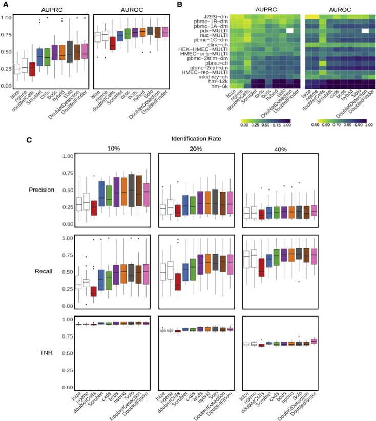
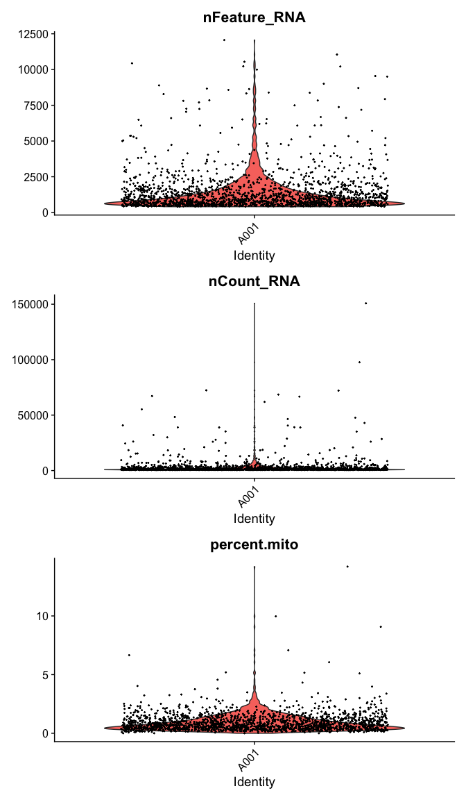
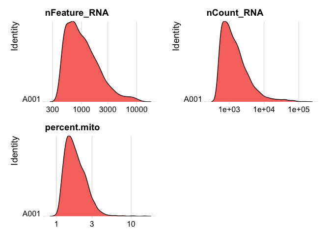
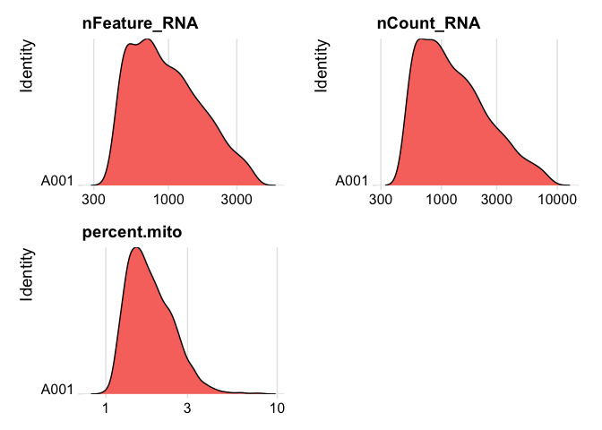
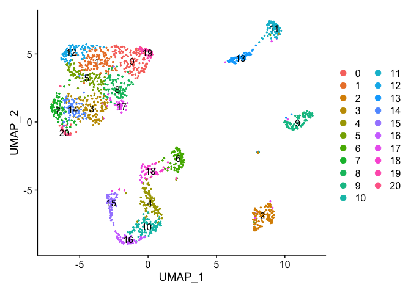
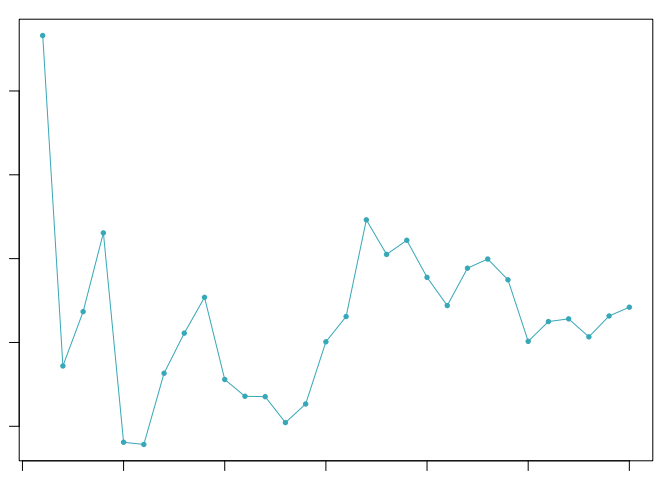

Last Updated: June 19, 2023

# Part 6: Add Doublet Detection

Doublets are cells that appear to be, but are not, real cells. There are two major types of doublets: heterotypic and homotypic. Heterotypic doublets are formed by cells with distinct transcriptional profiles. Homotypic doublets are formed by cells with similar transcriptional profiles. Heterotypic doublets are relatively easier to detect compared with homotypic doublets. Depending on the protocols used to barcode single cells/nuclei, doublet rates vary significantly and it can reach as high as 40%.

Experimental strategies have been developed to reduce the doublet rate, such as [cell hashing](https://genomebiology.biomedcentral.com/articles/10.1186/s13059-018-1603-1), and [MULTI-Seq](https://www.nature.com/articles/s41592-019-0433-8). However, these techniques require extra steps in sample preparation which leads to extra costs, time and they do not guarantee to remove all doublets.

Naturally, removing doublets _in silico_ is very appealing and there have been many tools/methods developed to achieve this: [DoubletFinder](https://www.cell.com/cell-systems/pdfExtended/S2405-4712(19)30073-0), DoubletDetection(https://github.com/JonathanShor/DoubletDetection), [DoubletDecon](https://www.sciencedirect.com/science/article/pii/S2211124719312860), [demuxlet](https://www.nature.com/articles/nbt.4042), among others.

<p align = "center">

</p>

<p align = "right" style="font-family:Times;font-size:12px;">
Xi, etc., Cell Systems, 2021, https://www.sciencedirect.com/science/article/pii/S2405471220304592
</p>


## Doublet detection with DoubletFinder

[DoubletFinder](https://github.com/chris-mcginnis-ucsf/DoubletFinder) takes fully pre-processed data from Seurat (NormalizeData, FindVariableGenes, ScaleData, RunPCA and RunTSNE) as input and the process should be done for each sample individually. The input data should be processed to remove low-quality cell clusters first.

We are going to run DoubletFinder on sample _A001-C-007_.

We start each markdown document with installing/loading needed libraries for R:


```r
# must install DoubletFinder
if (!any(rownames(installed.packages()) == "DoubletFinder")){
  remotes::install_github('chris-mcginnis-ucsf/DoubletFinder')
}

library(DoubletFinder)

# must have Seurat
library(Seurat)
library(kableExtra)
library(ggplot2)
```


### Setup the experiment folder and data info

```r
experiment_name = "Colon Cancer"
dataset_loc <- "./"
ids <- c("A001-C-007", "A001-C-104", "B001-A-301")
```


## Load the Cell Ranger Matrix Data and create the base Seurat object.
This section is done the same way as in __scRNA_Workshop-PART1.Rmd__

Seurat provides a function `Read10X` and `Read10X_h5` to read in 10X data folder. First we read in data from each individual sample folder. 

Later, we initialize the Seurat object (`CreateSeuratObject`) with the raw (non-normalized data). Keep all cells with at least 200 detected genes. Also extracting sample names, calculating and adding in the metadata mitochondrial percentage of each cell. Adding in the metadata batchid and cell cycle. Finally, saving the raw Seurat object.

## Load the Cell Ranger Matrix Data (hdf5 file) and create the base Seurat object.

```r
d10x.data <- lapply(ids[1], function(i){
  d10x <- Read10X_h5(file.path(dataset_loc, i, "outs","filtered_feature_bc_matrix.h5"))
  colnames(d10x) <- paste(sapply(strsplit(colnames(d10x),split="-"),'[[',1L),i,sep="-")
  d10x
})
names(d10x.data) <- ids[1]

str(d10x.data)
```

```
## List of 1
##  $ A001-C-007:Formal class 'dgCMatrix' [package "Matrix"] with 6 slots
##   .. ..@ i       : int [1:2482307] 60 145 216 237 238 247 258 285 290 298 ...
##   .. ..@ p       : int [1:1797] 0 1549 2236 2703 3241 4013 4642 5748 6285 7444 ...
##   .. ..@ Dim     : int [1:2] 36601 1796
##   .. ..@ Dimnames:List of 2
##   .. .. ..$ : chr [1:36601] "MIR1302-2HG" "FAM138A" "OR4F5" "AL627309.1" ...
##   .. .. ..$ : chr [1:1796] "AAACCCAAGTTATGGA-A001-C-007" "AAACCCACAACGCCCA-A001-C-007" "AAACCCACAGAAGTTA-A001-C-007" "AAACCCAGTCAGTCCG-A001-C-007" ...
##   .. ..@ x       : num [1:2482307] 1 1 1 1 1 1 1 1 1 1 ...
##   .. ..@ factors : list()
```

If you don't have the needed hdf5 libraries you can read in the matrix files like such


```r
d10x.data <- sapply(ids[1], function(i){
  d10x <- Read10X(file.path(dataset_loc, i, "/outs","filtered_feature_bc_matrix"))
  colnames(d10x) <- paste(sapply(strsplit(colnames(d10x), split="-"), '[[', 1L), i, sep="-")
  d10x
})
names(d10x.data) <- ids[1]
```


### Create the Seurat object

Filter criteria: remove genes that do not occur in a minimum of 0 cells and remove cells that don't have a minimum of 200 features/genes


```r
experiment.data <- CreateSeuratObject(
  d10x.data[[1]],
  project = "A001-C-007",
  min.cells = 0,
  min.features = 200,
  names.field = 2,
  names.delim = "\\-")
```

### The percentage of reads that map to the mitochondrial genome

* Low-quality / dying cells often exhibit extensive mitochondrial contamination.
* We calculate mitochondrial QC metrics with the PercentageFeatureSet function, which calculates the percentage of counts originating from a set of features.
* We use the set of all genes, in mouse these genes can be identified as those that begin with 'mt', in human data they begin with MT.


```r
experiment.data$percent.mito <- PercentageFeatureSet(experiment.data, pattern = "^MT-")
summary(experiment.data$percent.mito)
```

```
##    Min. 1st Qu.  Median    Mean 3rd Qu.    Max. 
##  0.0000  0.4192  0.7047  0.9086  1.1840 14.2037
```

Violin plot of 1) number of genes, 2) number of UMI and 3) percent mitochondrial genes

```r
VlnPlot(
  experiment.data,
  features = c("nFeature_RNA", "nCount_RNA","percent.mito"),
  ncol = 1, pt.size = 0.3)
```

<!-- -->

plot ridge plots of the same data


```r
RidgePlot(experiment.data, features=c("nFeature_RNA","nCount_RNA", "percent.mito"), log=T, ncol = 2)
```

<!-- -->

### Cell filtering

We use the information above to filter out cells. Here we choose those that have percent mitochondrial genes max of 8%, unique UMI counts under 1,000 or greater than 12,000 and contain at least 400 features within them.


```r
table(experiment.data$orig.ident)
```

```
## 
## A001 
## 1796
```

```r
experiment.data <- subset(experiment.data, percent.mito <= 8)

experiment.data <- subset(experiment.data, nFeature_RNA >= 400 & nFeature_RNA <= 4000)

experiment.data <- subset(experiment.data, nCount_RNA >= 500 & nCount_RNA <= 12000)

experiment.data
```

```
## An object of class Seurat 
## 36601 features across 1712 samples within 1 assay 
## Active assay: RNA (36601 features, 0 variable features)
```

```r
table(experiment.data$orig.ident)
```

```
## 
## A001 
## 1712
```

<br>

Lets se the ridge plots now after filtering

```r
RidgePlot(experiment.data, features=c("nFeature_RNA","nCount_RNA", "percent.mito"), log=T, ncol = 2)
```

<!-- -->

<br>


```r
experiment.data <- NormalizeData(experiment.data)
experiment.data <- FindVariableFeatures(experiment.data, selection.method = "vst", nfeatures = 2000)
experiment.data <- ScaleData(experiment.data)
experiment.data <- RunPCA(experiment.data)
experiment.data <- FindNeighbors(experiment.data, reduction="pca", dims = 1:20)
experiment.data <- FindClusters(
    object = experiment.data,
    resolution = seq(0.25,4,0.5),
    verbose = FALSE
)
experiment.data <- RunUMAP(experiment.data, dims=1:20)
DimPlot(object = experiment.data, pt.size=0.5, reduction = "umap", label = T)
```

<!-- -->


```r
sweep.res <- paramSweep_v3(experiment.data, PCs = 1:20, sct = FALSE)
```

```
## [1] "Creating artificial doublets for pN = 5%"
## [1] "Creating Seurat object..."
## [1] "Normalizing Seurat object..."
## [1] "Finding variable genes..."
## [1] "Scaling data..."
## [1] "Running PCA..."
## [1] "Calculating PC distance matrix..."
## [1] "Defining neighborhoods..."
## [1] "Computing pANN across all pK..."
## [1] "pK = 0.01..."
## [1] "pK = 0.02..."
## [1] "pK = 0.03..."
## [1] "pK = 0.04..."
## [1] "pK = 0.05..."
## [1] "pK = 0.06..."
## [1] "pK = 0.07..."
## [1] "pK = 0.08..."
## [1] "pK = 0.09..."
## [1] "pK = 0.1..."
## [1] "pK = 0.11..."
## [1] "pK = 0.12..."
## [1] "pK = 0.13..."
## [1] "pK = 0.14..."
## [1] "pK = 0.15..."
## [1] "pK = 0.16..."
## [1] "pK = 0.17..."
## [1] "pK = 0.18..."
## [1] "pK = 0.19..."
## [1] "pK = 0.2..."
## [1] "pK = 0.21..."
## [1] "pK = 0.22..."
## [1] "pK = 0.23..."
## [1] "pK = 0.24..."
## [1] "pK = 0.25..."
## [1] "pK = 0.26..."
## [1] "pK = 0.27..."
## [1] "pK = 0.28..."
## [1] "pK = 0.29..."
## [1] "pK = 0.3..."
## [1] "Creating artificial doublets for pN = 10%"
## [1] "Creating Seurat object..."
## [1] "Normalizing Seurat object..."
## [1] "Finding variable genes..."
## [1] "Scaling data..."
## [1] "Running PCA..."
## [1] "Calculating PC distance matrix..."
## [1] "Defining neighborhoods..."
## [1] "Computing pANN across all pK..."
## [1] "pK = 0.01..."
## [1] "pK = 0.02..."
## [1] "pK = 0.03..."
## [1] "pK = 0.04..."
## [1] "pK = 0.05..."
## [1] "pK = 0.06..."
## [1] "pK = 0.07..."
## [1] "pK = 0.08..."
## [1] "pK = 0.09..."
## [1] "pK = 0.1..."
## [1] "pK = 0.11..."
## [1] "pK = 0.12..."
## [1] "pK = 0.13..."
## [1] "pK = 0.14..."
## [1] "pK = 0.15..."
## [1] "pK = 0.16..."
## [1] "pK = 0.17..."
## [1] "pK = 0.18..."
## [1] "pK = 0.19..."
## [1] "pK = 0.2..."
## [1] "pK = 0.21..."
## [1] "pK = 0.22..."
## [1] "pK = 0.23..."
## [1] "pK = 0.24..."
## [1] "pK = 0.25..."
## [1] "pK = 0.26..."
## [1] "pK = 0.27..."
## [1] "pK = 0.28..."
## [1] "pK = 0.29..."
## [1] "pK = 0.3..."
## [1] "Creating artificial doublets for pN = 15%"
## [1] "Creating Seurat object..."
## [1] "Normalizing Seurat object..."
## [1] "Finding variable genes..."
## [1] "Scaling data..."
## [1] "Running PCA..."
## [1] "Calculating PC distance matrix..."
## [1] "Defining neighborhoods..."
## [1] "Computing pANN across all pK..."
## [1] "pK = 0.01..."
## [1] "pK = 0.02..."
## [1] "pK = 0.03..."
## [1] "pK = 0.04..."
## [1] "pK = 0.05..."
## [1] "pK = 0.06..."
## [1] "pK = 0.07..."
## [1] "pK = 0.08..."
## [1] "pK = 0.09..."
## [1] "pK = 0.1..."
## [1] "pK = 0.11..."
## [1] "pK = 0.12..."
## [1] "pK = 0.13..."
## [1] "pK = 0.14..."
## [1] "pK = 0.15..."
## [1] "pK = 0.16..."
## [1] "pK = 0.17..."
## [1] "pK = 0.18..."
## [1] "pK = 0.19..."
## [1] "pK = 0.2..."
## [1] "pK = 0.21..."
## [1] "pK = 0.22..."
## [1] "pK = 0.23..."
## [1] "pK = 0.24..."
## [1] "pK = 0.25..."
## [1] "pK = 0.26..."
## [1] "pK = 0.27..."
## [1] "pK = 0.28..."
## [1] "pK = 0.29..."
## [1] "pK = 0.3..."
## [1] "Creating artificial doublets for pN = 20%"
## [1] "Creating Seurat object..."
## [1] "Normalizing Seurat object..."
## [1] "Finding variable genes..."
## [1] "Scaling data..."
## [1] "Running PCA..."
## [1] "Calculating PC distance matrix..."
## [1] "Defining neighborhoods..."
## [1] "Computing pANN across all pK..."
## [1] "pK = 0.01..."
## [1] "pK = 0.02..."
## [1] "pK = 0.03..."
## [1] "pK = 0.04..."
## [1] "pK = 0.05..."
## [1] "pK = 0.06..."
## [1] "pK = 0.07..."
## [1] "pK = 0.08..."
## [1] "pK = 0.09..."
## [1] "pK = 0.1..."
## [1] "pK = 0.11..."
## [1] "pK = 0.12..."
## [1] "pK = 0.13..."
## [1] "pK = 0.14..."
## [1] "pK = 0.15..."
## [1] "pK = 0.16..."
## [1] "pK = 0.17..."
## [1] "pK = 0.18..."
## [1] "pK = 0.19..."
## [1] "pK = 0.2..."
## [1] "pK = 0.21..."
## [1] "pK = 0.22..."
## [1] "pK = 0.23..."
## [1] "pK = 0.24..."
## [1] "pK = 0.25..."
## [1] "pK = 0.26..."
## [1] "pK = 0.27..."
## [1] "pK = 0.28..."
## [1] "pK = 0.29..."
## [1] "pK = 0.3..."
## [1] "Creating artificial doublets for pN = 25%"
## [1] "Creating Seurat object..."
## [1] "Normalizing Seurat object..."
## [1] "Finding variable genes..."
## [1] "Scaling data..."
## [1] "Running PCA..."
## [1] "Calculating PC distance matrix..."
## [1] "Defining neighborhoods..."
## [1] "Computing pANN across all pK..."
## [1] "pK = 0.01..."
## [1] "pK = 0.02..."
## [1] "pK = 0.03..."
## [1] "pK = 0.04..."
## [1] "pK = 0.05..."
## [1] "pK = 0.06..."
## [1] "pK = 0.07..."
## [1] "pK = 0.08..."
## [1] "pK = 0.09..."
## [1] "pK = 0.1..."
## [1] "pK = 0.11..."
## [1] "pK = 0.12..."
## [1] "pK = 0.13..."
## [1] "pK = 0.14..."
## [1] "pK = 0.15..."
## [1] "pK = 0.16..."
## [1] "pK = 0.17..."
## [1] "pK = 0.18..."
## [1] "pK = 0.19..."
## [1] "pK = 0.2..."
## [1] "pK = 0.21..."
## [1] "pK = 0.22..."
## [1] "pK = 0.23..."
## [1] "pK = 0.24..."
## [1] "pK = 0.25..."
## [1] "pK = 0.26..."
## [1] "pK = 0.27..."
## [1] "pK = 0.28..."
## [1] "pK = 0.29..."
## [1] "pK = 0.3..."
## [1] "Creating artificial doublets for pN = 30%"
## [1] "Creating Seurat object..."
## [1] "Normalizing Seurat object..."
## [1] "Finding variable genes..."
## [1] "Scaling data..."
## [1] "Running PCA..."
## [1] "Calculating PC distance matrix..."
## [1] "Defining neighborhoods..."
## [1] "Computing pANN across all pK..."
## [1] "pK = 0.01..."
## [1] "pK = 0.02..."
## [1] "pK = 0.03..."
## [1] "pK = 0.04..."
## [1] "pK = 0.05..."
## [1] "pK = 0.06..."
## [1] "pK = 0.07..."
## [1] "pK = 0.08..."
## [1] "pK = 0.09..."
## [1] "pK = 0.1..."
## [1] "pK = 0.11..."
## [1] "pK = 0.12..."
## [1] "pK = 0.13..."
## [1] "pK = 0.14..."
## [1] "pK = 0.15..."
## [1] "pK = 0.16..."
## [1] "pK = 0.17..."
## [1] "pK = 0.18..."
## [1] "pK = 0.19..."
## [1] "pK = 0.2..."
## [1] "pK = 0.21..."
## [1] "pK = 0.22..."
## [1] "pK = 0.23..."
## [1] "pK = 0.24..."
## [1] "pK = 0.25..."
## [1] "pK = 0.26..."
## [1] "pK = 0.27..."
## [1] "pK = 0.28..."
## [1] "pK = 0.29..."
## [1] "pK = 0.3..."
```

```r
sweep.stats <- summarizeSweep(sweep.res, GT = FALSE)
bcmvn <- find.pK(sweep.stats)
```

<!-- -->

```
## NULL
```

```r
pK.set <- unique(sweep.stats$pK)[1]
pK.set <- bcmvn$pK[which(bcmvn$BCmetric == max(bcmvn$BCmetric))]
```
<br>


```r
nExp_poi <- round(0.08*nrow(experiment.data@meta.data))
```


```r
experiment.data <- doubletFinder_v3(experiment.data, PCs = 1:20, pN = 0.25, pK = as.numeric(as.character(pK.set)), nExp = nExp_poi, reuse.pANN = FALSE, sct = FALSE)
```

```
## [1] "Creating 571 artificial doublets..."
## [1] "Creating Seurat object..."
## [1] "Normalizing Seurat object..."
## [1] "Finding variable genes..."
## [1] "Scaling data..."
## [1] "Running PCA..."
## [1] "Calculating PC distance matrix..."
## [1] "Computing pANN..."
## [1] "Classifying doublets.."
```

## The following code can be used if literature assisted cell type identification is available


```r
annotations <- experiment.data@meta.data$seurat_clusters
homotypic.prop <- modelHomotypic(annotations)
nExp_poi <- round(0.08*nrow(experiment.data@meta.data))
nExp_poi.adj <- round(nExp_poi*(1-homotypic.prop))
experiment.data <- doubletFinder_v3(experiment.data, PCs = 1:20, pN = 0.25, pK = as.numeric(as.character(pK.set)), nExp = nExp_poi.adj, reuse.pANN = "pANN_0.25_0.02_142", sct = FALSE)
```

## Remove doublets


```r
experiment.data <- subset(experiment.data,  DF.classifications_0.25_0.02_142 == "Singlet")
colnames(experiment.data@meta.data)
sum(experiment.data$DF.classifications_0.25_0.03_137 == "Doublet")
bcmvn
```

## Session Information

```r
sessionInfo()
```

```
## R version 4.2.2 (2022-10-31)
## Platform: x86_64-apple-darwin17.0 (64-bit)
## Running under: macOS Catalina 10.15.7
## 
## Matrix products: default
## BLAS:   /Library/Frameworks/R.framework/Versions/4.2/Resources/lib/libRblas.0.dylib
## LAPACK: /Library/Frameworks/R.framework/Versions/4.2/Resources/lib/libRlapack.dylib
## 
## locale:
## [1] en_US.UTF-8/en_US.UTF-8/en_US.UTF-8/C/en_US.UTF-8/en_US.UTF-8
## 
## attached base packages:
## [1] stats     graphics  grDevices utils     datasets  methods   base     
## 
## other attached packages:
##  [1] ROCR_1.0-11         KernSmooth_2.23-20  fields_14.1        
##  [4] viridis_0.6.2       viridisLite_0.4.1   spam_2.9-1         
##  [7] ggplot2_3.4.0       kableExtra_1.3.4    SeuratObject_4.1.3 
## [10] Seurat_4.3.0        DoubletFinder_2.0.3
## 
## loaded via a namespace (and not attached):
##   [1] systemfonts_1.0.4      plyr_1.8.8             igraph_1.3.5          
##   [4] lazyeval_0.2.2         sp_1.5-1               splines_4.2.2         
##   [7] listenv_0.8.0          scattermore_0.8        digest_0.6.30         
##  [10] htmltools_0.5.3        fansi_1.0.3            magrittr_2.0.3        
##  [13] tensor_1.5             cluster_2.1.4          globals_0.16.2        
##  [16] matrixStats_0.63.0     svglite_2.1.0          spatstat.sparse_3.0-0 
##  [19] colorspace_2.0-3       rvest_1.0.3            ggrepel_0.9.2         
##  [22] xfun_0.35              dplyr_1.0.10           crayon_1.5.2          
##  [25] jsonlite_1.8.4         progressr_0.11.0       spatstat.data_3.0-0   
##  [28] survival_3.4-0         zoo_1.8-11             glue_1.6.2            
##  [31] polyclip_1.10-4        gtable_0.3.1           webshot_0.5.4         
##  [34] leiden_0.4.3           future.apply_1.10.0    maps_3.4.1            
##  [37] abind_1.4-5            scales_1.2.1           DBI_1.1.3             
##  [40] spatstat.random_3.0-1  miniUI_0.1.1.1         Rcpp_1.0.9            
##  [43] xtable_1.8-4           reticulate_1.28        bit_4.0.5             
##  [46] dotCall64_1.0-2        htmlwidgets_1.5.4      httr_1.4.4            
##  [49] RColorBrewer_1.1-3     ellipsis_0.3.2         ica_1.0-3             
##  [52] pkgconfig_2.0.3        farver_2.1.1           sass_0.4.4            
##  [55] uwot_0.1.14            deldir_1.0-6           utf8_1.2.2            
##  [58] tidyselect_1.2.0       labeling_0.4.2         rlang_1.0.6           
##  [61] reshape2_1.4.4         later_1.3.0            munsell_0.5.0         
##  [64] tools_4.2.2            cachem_1.0.6           cli_3.4.1             
##  [67] generics_0.1.3         ggridges_0.5.4         evaluate_0.18         
##  [70] stringr_1.4.1          fastmap_1.1.0          yaml_2.3.6            
##  [73] goftest_1.2-3          knitr_1.41             bit64_4.0.5           
##  [76] fitdistrplus_1.1-8     purrr_0.3.5            RANN_2.6.1            
##  [79] pbapply_1.6-0          future_1.29.0          nlme_3.1-160          
##  [82] mime_0.12              ggrastr_1.0.1          xml2_1.3.3            
##  [85] hdf5r_1.3.7            compiler_4.2.2         rstudioapi_0.14       
##  [88] beeswarm_0.4.0         plotly_4.10.1          png_0.1-8             
##  [91] spatstat.utils_3.0-1   tibble_3.1.8           bslib_0.4.1           
##  [94] stringi_1.7.8          highr_0.9              lattice_0.20-45       
##  [97] Matrix_1.5-3           vctrs_0.5.1            pillar_1.8.1          
## [100] lifecycle_1.0.3        spatstat.geom_3.0-3    lmtest_0.9-40         
## [103] jquerylib_0.1.4        RcppAnnoy_0.0.20       data.table_1.14.6     
## [106] cowplot_1.1.1          irlba_2.3.5.1          httpuv_1.6.6          
## [109] patchwork_1.1.2        R6_2.5.1               promises_1.2.0.1      
## [112] gridExtra_2.3          vipor_0.4.5            parallelly_1.32.1     
## [115] codetools_0.2-18       MASS_7.3-58.1          assertthat_0.2.1      
## [118] withr_2.5.0            sctransform_0.3.5      parallel_4.2.2        
## [121] grid_4.2.2             tidyr_1.2.1            rmarkdown_2.18        
## [124] Rtsne_0.16             spatstat.explore_3.0-5 shiny_1.7.3           
## [127] ggbeeswarm_0.6.0
```
