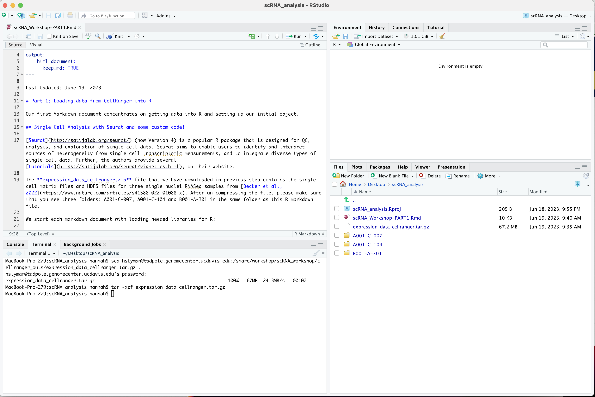

### Create a new RStudio project

Open RStudio and create a new project, for more info see [Using-Projects](https://support.rstudio.com/hc/en-us/articles/200526207-Using-Projects):

*File > New Project > New Directory > New Project*

Name the new directory (e.g. scRNA_analysis), and check "use renv with this project" if present.

Learn more about [renv](https://rstudio.github.io/renv/articles/renv.html).

Run the following commands to set some options and make sure the packages Seurat, ggplot2, dplyr, limma, and topGO are installed (if not install it), and then load them and verify they all loaded correctly.

**In the R console** run the following commands:
```r
if (!requireNamespace("BiocManager", quietly = TRUE)){
    install.packages("BiocManager")
}

if (!any(rownames(installed.packages()) == "rmarkdown")){
  BiocManager::install("rmarkdown")
}

if (!any(rownames(installed.packages()) == "tinytex")){
  BiocManager::install("tinytex")
}

if (!any(rownames(installed.packages()) == "Seurat")){
  BiocManager::install("Seurat")
}

if (!any(rownames(installed.packages()) == "hdf5r")){
  BiocManager::install("hdf5r")
}

if (!any(rownames(installed.packages()) == "knitr")){
  BiocManager::install("knitr")
}

if (!any(rownames(installed.packages()) == "kableExtra")){
  BiocManager::install("kableExtra")
}

if (!any(rownames(installed.packages()) == "ggplot2")){
  BiocManager::install("ggplot2")
}

if (!any(rownames(installed.packages()) == "dplyr")){
  BiocManager::install("dplyr")
}
if (!any(rownames(installed.packages()) == "tidyr")){
  BiocManager::install("tidyr")
}

if (!any(rownames(installed.packages()) == "viridis")){
  BiocManager::install("viridis")
}

if (!any(rownames(installed.packages()) == "reshape2")){
  BiocManager::install("reshape2")
}

if (!any(rownames(installed.packages()) == "biomaRt")){
  BiocManager::install("biomaRt")
}

if (!any(rownames(installed.packages()) == "org.Hs.eg.db")){
  BiocManager::install("org.Hs.eg.db")
}

if (!any(rownames(installed.packages()) == "limma")){
  BiocManager::install("limma")
}

if (!any(rownames(installed.packages()) == "topGO")){
  BiocManager::install("topGO")
}

if (!any(rownames(installed.packages()) == "remotes")){
  utils::install.packages("remotes")
}

if (!any(rownames(installed.packages()) == "ape")){
  utils::install.packages("ape")
}

if (!any(rownames(installed.packages()) == "DoubletFinder")){
  remotes::install_github('chris-mcginnis-ucsf/DoubletFinder')
}

if (!any(rownames(installed.packages()) == "openxlsx")){
  BiocManager::install("openxlsx")
}

if (!any(rownames(installed.packages()) == "HGNChelper")){
  BiocManager::install("HGNChelper")
}

## All of these should now load without error.

library(rmarkdown)
library(tinytex)
library(Seurat)
library(hdf5r)
library(knitr)
library(kableExtra)
library(ggplot2)
library(dplyr)
library(tidyr)
library(viridis)
library(reshape2)
library(biomaRt)
library(limma)
library(topGO)
library(org.Hs.eg.db)
library(openxlsx)
library(HGNChelper)

sessionInfo()
```

### Download the template Markdown workshop document PART1 and open it.

In the R console run the following command to download part 1 of data analysis
```r
download.file("https://raw.githubusercontent.com/ucdavis-bioinformatics-training/2023-June-Single-Cell-RNA-Seq-Analysis/main/data_analysis/scRNA_Workshop-PART1.Rmd", "scRNA_Workshop-PART1.Rmd")
```

### Download the data for the workshop, extract it.

In Rstudio, navigate to the terminal tab (next to the console). This gives you access to a bash terminal. Run the following code:

```bash
scp username@tadpole.genomecenter.ucdavis.edu:/share/workshop/scRNA_workshop/cellranger_outs/expression_data_cellranger.tar.gz ./
tar -xzf expression_data_cellranger.tar.gz
```
**Some Windows users may need to use Filezilla/WinSCP to download the file instead.**

When the download and extraction are complete, you should see three folders: A001-C-007, A001-C-104 and B001-A-301. Make sure "scRNA_Workshop-PART1.Rmd" file is in the same location.

### Edit the file YAML portion

Please open the downloaded "scRNA_Workshop-PART1.Rmd" in RStudio. The top YAML (YAML ain't markup language) portion of the doc tells RStudio how to parse the document.

<pre><code>---
title: "Introduction to Single Cell RNAseq Part 1"
author: your_name
date: current_date
output:
    html_notebook: default
    html_document: default
---</code></pre>


Your RStudio should look something like this




Now spend a few minutes navigating through our data. How may samples are there? Find the hdf5 file and the matrix files.
