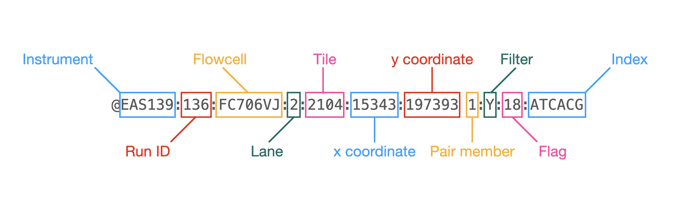
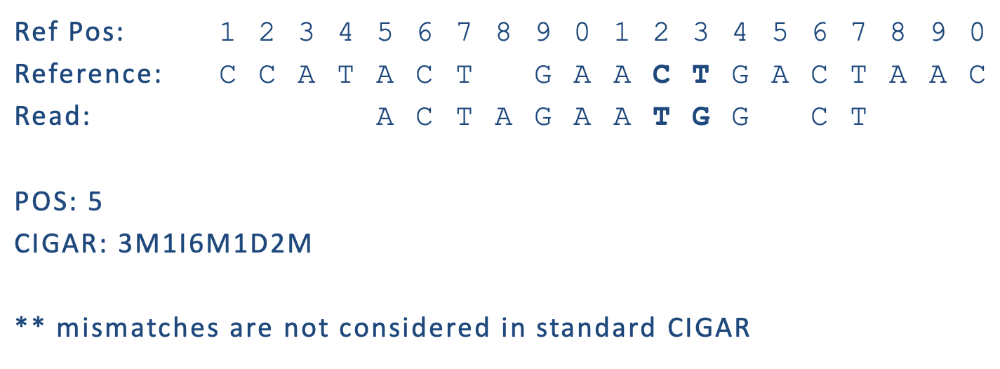

# Files and File Types

The primary file types you'll see related to DNA sequence analysis are:

* [fasta](#fasta)
* [fastq](#fastq)
* [gtf/gff](#Annotation-based-file-types)
* [sam/bam/cram](#Alignment-based-file-types)

## Sequence based file types
Sequence based files first started out as fasta with paired qual files (Sanger and 454). As Illumina sequencing and quality scores grew more common, the fastq file became the default output from DNA sequencers. These days additional file types are being used, including fast5 by Oxford Nanopore and 'unmapped' bam files by Pacific Biosciences.

### fasta
The fasta format uses the '>' to indicate a new sequence followed by the name of the sequence on the same line. The following line(s) are the DNA sequence, and may be split on multiple lines (wrapped), until the next '>' is reached. Genome and transcriptome files are most often in fasta format.

Qual files are rarely used these days and so are not discussed.

### fastq
fastq files combine the sequence and quality scores into a single file. Each sequence must have 4 lines: header, sequence, historical '+', and quality.

#### Header
Each header line is unique, containing all of the technical information from the sequencer that identifies a single read.

Casava 1.8 read name convention:

`@EAS139:136:FC706VJ:2:2104:15343:197393 1:Y:18:ATCACG`

* **EAS139** the unique instrument name
* **136** the run id
* **FC706VJ** the flowcell id
* **2** flowcell lane
* **2104** tile number within the flowcell lane
* **15343** x-coordinate of the cluster within the tile
* **197393** y-coordinate of the cluster within the tile
* **1** first or second in pair (paired-end or mate-pair reads only)
* **Y** Y if the read fails filter (read is bad), N otherwise
* **18** 0 when none of the control bits are on, otherwise it is an even number
* **ATCACG** index sequence. In some recent versions, this is replaced by a number identifying the sample.

### Quality Scores
Quality scores are paired 1 to 1 with sequence characters.

Each quality character has a numerical value associated with it ([ASCII value](https://en.wikipedia.org/wiki/ASCII)).

In Illumina 1.8+ you subtract 33 from the ascii value associated with the quality character to get the quality score.

## Annotation based file types

### Gene Transfer Format (GTF) / Gene Feature Format (GFF)

Describes feature (ex. gene) locations within a sequence file (ex. genome).

The GFF (General Feature Format) format consists of one line per feature, each containing 9 columns of data (fields). The GTF (General Transfer Format) is identical to GFF version 2. The GTF file format tends to have stricter requirements and expectations on how feature descriptions are formated.

Fields must be tab-separated and all fields must contain a value; “empty” fields should be denoted with a ‘.’ rather than a space or no character.

Columns:
* Seqname: Name of the sequence chromosome
* Source: the program, or database, that generated the feature
* Feature: feature type name, (e.g. gene, exon, cds, etc.)
* Start: start position of the feature, sequences begin at 1
* End: stop position of the feature, sequences begin at 1
* Score: a floating point value (e.g. 0.01)
* Strand: Defined as ‘+’ (forward),or ‘-’ (reverse)
* Frame: One of ‘0’, ‘1’, ‘2’, ‘0’ represents the first base of a codon.
* Attribute: A semicolon-separated list of tag-value pairs, providing additional information about each feature.

#### Sources
* [Ensembl genomes](http://ensemblgenomes.org/) and annotation at [Biomart](http://www.ensembl.org/biomart/martview/)
* Human/mouse: [GENCODE](https://www.gencodegenes.org/) (uses Ensembl IDs), may need some manipulation to work with certain software.
* [NCBI genomes](http://www.ncbi.nlm.nih.gov/genome/)
* Many species or field-specific databases (e.g. Phytozome, Patric, VectorBase, FlyBase, WormBase)

## Alignment based file types: SAM, BAM, and CRAM

SAM (Sequence Alignment/Map) format is the unified format for storing read alignments to a reference sequence (consistent since Sept. 2011). SAM format [specifications](http://samtools.github.io/hts-specs/SAMv1.pdf) and common software for interacting with the format is managed and maintained by the [HTSlib project](http://www.htslib.org/)

BAM and CRAM format are compressed SAMs (binary, non human-readable). The SAM format contains two regions: the header, and the alignments.

### SAM header section

The header section of a SAM file contains information about how the alignments in the file were produced. The header will describe the reference (e.g. genome) to which sequences were aligned, and may include software version and parameters, library prep and sequencer details, miscellaneous comments, and more.

Each line in this section starts with ‘@’ followed a two-letter code describing the type of data stored on the line (e.g. "SQ" for "sequence"). Lines are tab-delimited and, with the exception of comment lines, each data field follows a ‘TAG:VALUE’ format where TAG is another two-character string (e.g. "SN" for "sequence name") that defines the format and content of VALUE (e.g. "Chr1").

The following tags are required:

* @HD Header (must be first line)
  * VN SAM format version
* @SQ Reference sequence dictionary
  * SN Unique reference sequence name
  * LN Reference sequence length
* @RG Read group
  * ID* Unique read group (e.g. library) identifier

Many more tags are detailed in the [specifications](http://samtools.github.io/hts-specs/SAMv1.pdf).

### SAM alignment section

The alignment section consists of 11 tab-delimited fields:

|:-- |:----- |:------------------- |
|1 |QNAME | query template name |
|2 |FLAG | bitwise flag |
|3 |RNAME | reference sequence name |
|4 |POS | 1-based leftmost mapping position |
|5 |MAPQ  | mapping quality |
|6|CIGAR  | CIGAR string |
|7 |RNEXT | reference name of mate |
|8 |PNEXT  | mapping position of mate |
|9 |TLEN | observed template length |
|10 |SEQ | sequence |
|11 |QUAL | ASCII of Phred-scaled base quality |

**QNAME: Query name**  
Read IDs are truncated at first whitespace (spaces / tabs), which can make them non-unique. Illumina reads with older IDs have trailing “/1” and “/2” stripped, while reads with newer IDs have second block stripped. Read pair number and quality filter pass / fail status are encoded in the next field.

`@FCC6889ACXX:5:1101:8446:45501#CGATGTATC/1` becomes `@FCC6889ACXX:5:1101:8446:45501`  
`@HISEQ:153:H8ED7ADXX:1:1101:1368:2069 1:N:0:ATCACG` becomes `@HISEQ:153:H8ED7ADXX:1:1101:1368:2069`

**FLAG: Alignment flags**

The alignment flag encodes information about the alignment in bitwise [format](http://samtools.github.io/hts-specs/SAMtags.pdf). This flag allows users to filter alignments based on a number of criteria using software like samtools.

If interpreting the SAM flag seems a little overwhelming, you can use a [flag decoding tool](https://broadinstitute.github.io/picard/explain-flags.html).

**RNAME: reference sequence name**  
The reference sequence name identifies the sequence to which the query (e.g. read) is mapped. This unique identifier comes from fasta header and matches a @SQ field in the SAM header section.

**POS: 1-based leftmost position of (post-clipping) aligned read**  

**MAPQ: mapping quality (phred scaled)**  
MAPQ, contains the "phred-scaled posterior probability that the mapping position" is wrong.   
In a probabilistic view, each read alignment is an estimate of the true alignment and is therefore also a random variable. It can be wrong. The error probability is scaled in the Phred. For example, given 1000 read alignments with mapping quality being 30, one of them will be incorrectly mapped to the wrong location on average.  
A value 255 indicates that the mapping quality is not available.

MAPQ explained:
The calculation of mapping qualities is simple, but this simple calculation considers many of the factors below:
* The repeat structure of the reference. Reads falling in repetitive regions usually get very low mapping quality.
* The base quality of the read. Low quality means the observed read sequence is possibly wrong, and wrong sequence may lead to a wrong alignment.
* The sensitivity of the alignment algorithm. The true hit is more likely to be missed by an algorithm with low sensitivity, which also causes mapping errors.
* Paired end or not. Reads mapped in proper pairs are more likely to be correct.

When you see a read alignment with a mapping quality of 30 or greater, it usually implies:
* The overall base quality of the read is good.
* The best alignment has few mismatches.
* The read has just one ‘good’ hit on the reference, which means the current alignment is still the best even if one or two bases are actually mutations, or sequencing errors.

_In practice however, each mapping application seems to compute the MAPQ in their own way._

**CIGAR: Compact Idiosyncratic Gapped Alignment Report (CIGAR)**  
The CIGAR string is used to calculate how a sequence aligns to the reference. Format: [0-9][MIDNSHP][0-9][MIDNSHP]... where M = match (or mismatch), I/D = insertion / deletion, N = skipped bases on reference (splicing), S/H = soft / hard clip (hard clipped bases no longer appear in the sequence field), P = padding.

e.g. “100M” means that all 100 bases in the read align to bases in the reference.

* “Consumes query” and “consumes reference” indicate whether the CIGAR operation causes the alignment to step along the query sequence and the reference sequence respectively.
* H can only be present as the first and/or last operation.
* S may only have H operations between them and the ends of the CIGAR string.
* For mRNA-to-genome alignment, an N operation represents an intron. For other types of alignments, the interpretation of N is not defined.
* Sum of lengths of the M/I/S/=/X operations shall equal the length of SEQ.

**RNEXT: reference sequence name of the primary alignment of the next read in the template.**  
For the last read, the next read is the first read in the template. If @SQ header lines are present, RNEXT (if not ‘\*’ or ‘=’) must be present in one of the SQ-SN tag. This field is set as ‘\*’ when the information is unavailable, and set as ‘=’ if RNEXT is identical RNAME. If not ‘=’ and the next read in the template has one primary mapping (see also bit 0x100 in FLAG), this field is identical to RNAME at the primary line of the next read. If RNEXT is ‘*’, no assumptions can be made on PNEXT and bit 0x20.

**PNEXT: 1-based position of the primary alignment of the next read in the template.**  
This field equals POS at the primary alignment of the next read. If PNEXT is 0, no assumptions can be made on RNEXT and bit 0x20. Set as 0 when the information is unavailable.

**TLEN: The signed observed Template length.**  
If all segments are mapped to the same reference, the unsigned observed template length equals the number of bases from the leftmost mapped base to the rightmost mapped base. The leftmost segment has a plus sign and the rightmost has a minus sign. The sign of segments in the middle is undefined. It is set as 0 for single-segment template or when the information is unavailable.

**SEQ: segment sequence**  
The sequence that was aligned. If hard clipping occurred, only the aligned portion is represented, if soft clipping occurred, the original sequence is present.

**QUAL: segment quality scores**  
The quality scores of the sequence that was aligned. If hard clipping occurred, only the aligned portion is represented, if soft clipping occurred, the original sequence is present.

### Compression: BAM and CRAM

BAMs are compressed SAMs. They are binary, and not human-readable. BAM files can be indexed to allow rapid extraction of information, so alignment viewers do not need to uncompress the whole BAM file in order to look at information for a particular coordinate range, somewhere in the file.

Indexing your BAM file, mybam.bam, will create an index file, mybam.bam.bai, which is needed (in addition to the BAM file) by viewers and some downstream tools.

CRAM is an even more compressed SAM/BAM file and has the following major objectives:
1. Significantly better lossless compression than BAM
2. Full compatibility with BAM
3. Effortless transition to CRAM from using BAM files
4. Support for controlled loss of BAM data

CRAM files are also indexed and produce .cram.crai index files.
